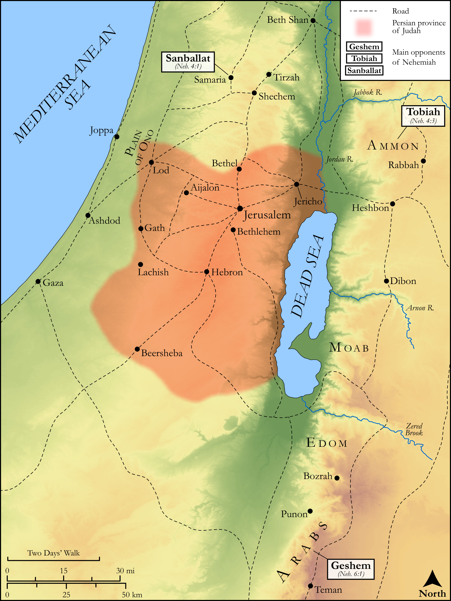

# Biblica Open Bible Maps

## License Information

Biblica Open Bible Maps, © 2023–2025 Biblica, Inc. This work is licensed under Creative Commons Attribution-ShareAlike 4.0 International (<a href="https://creativecommons.org/licenses/by-sa/4.0/">https://creativecommons.org/licenses/by-sa/4.0/</a>). More Information: <a href="https://docs.google.com/document/d/1Pp44yZ0Zdnd59vJHTrt2rPYq0SppfX5rZbPBt6mz37U/edit?tab=t.0#heading=h.oev9aj1ksvk2">https://docs.google.com/document/d/1Pp44yZ0Zdnd59vJHTrt2rPYq0SppfX5rZbPBt6mz37U/edit?tab=t.0#heading=h.oev9aj1ksvk2</a>

--------------------------------

## Historical: Opposition to the Rebuilding of Jerusalem (id: OT166)

### Image Content

[link](images/OT166.png)

Original: [Historical: Opposition to the Rebuilding of Jerusalem](https://drive.google.com/open?id=1tYXf8057gvyaXHuvoCh3ZbcD7wh9AslC&usp=drive_copy)

* **Associated Passages:** Nehemiah 4:1-6:19

* **Associated ACAI Concepts:** LORD (ID: `deity:Lord`); Fear (ID: `keyterm:Fear`); Sanballat (ID: `person:Sanballat`); Tobiah (ID: `person:Tobiah.2`); Jews (ID: `group:Jews`); Tribe of Judah (ID: `group:Judah`); Judah (ID: `person:Judah.4`); Vine (ID: `flora:Vine`); Jerusalem (ID: `place:Jerusalem`); Geshem (ID: `person:Geshem`); Grain (ID: `flora:Grain`); Money (ID: `realia:Money`); House (ID: `realia:House`); Arabians (ID: `group:Arabia`); Ammon (ID: `place:Ammon`); To Sin (ID: `keyterm:Sin`); Ammonites (ID: `group:Ammon`); Arabia (ID: `place:Arabia`); Spear (ID: `realia:Spear`); Ono (ID: `place:Ono`); Shecaniah (ID: `person:Shecaniah.8`); Mehetabel (ID: `person:Mehetabel.2`); Shemaiah (ID: `person:Shemaiah.19`); Noadiah (ID: `person:Noadiah.2`); Berechiah (ID: `person:Berechiah.5`); Arah (ID: `person:Arah.3`); Meshullam (ID: `person:Meshullam.12`); Delaiah (ID: `person:Delaiah.4`); Jehohanan (ID: `person:Jehohanan.6`); Weapons (ID: `realia:Weapons`)
