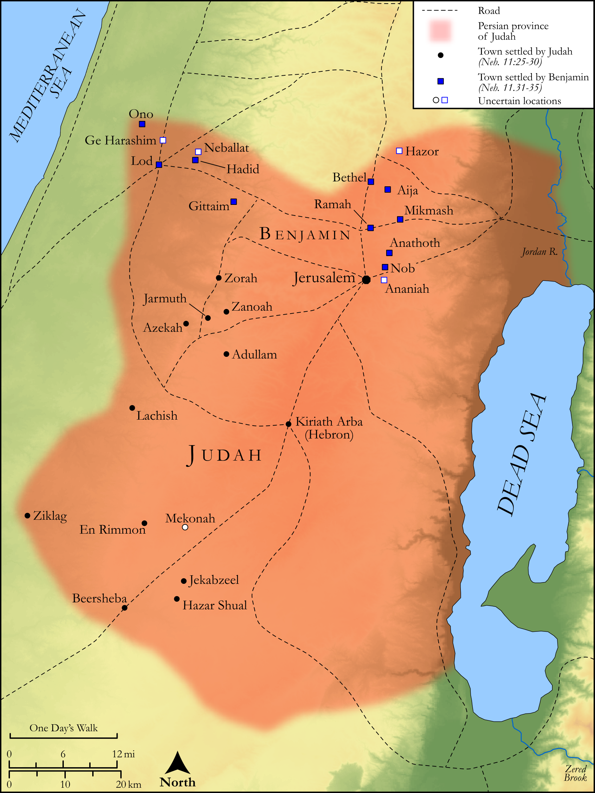

# Biblica Open Bible Maps

## License Information

Biblica Open Bible Maps, © 2023–2025 Biblica, Inc. This work is licensed under Creative Commons Attribution-ShareAlike 4.0 International (<a href="https://creativecommons.org/licenses/by-sa/4.0/">https://creativecommons.org/licenses/by-sa/4.0/</a>). More Information: <a href="https://docs.google.com/document/d/1Pp44yZ0Zdnd59vJHTrt2rPYq0SppfX5rZbPBt6mz37U/edit?tab=t.0#heading=h.oev9aj1ksvk2">https://docs.google.com/document/d/1Pp44yZ0Zdnd59vJHTrt2rPYq0SppfX5rZbPBt6mz37U/edit?tab=t.0#heading=h.oev9aj1ksvk2</a>

--------------------------------

## Historical: The Resettlement of Judah (id: OT167)

### Image Content

[link](images/OT167.png)

Original: [Historical: The Resettlement of Judah](https://drive.google.com/open?id=1NxyOWMmO61TDyU-6-qXSv7YAVL0Nh8cR&usp=drive_copy)

* **Associated Passages:** Nehemiah 11:1-36

* **Associated ACAI Concepts:** Tribe of Levi (ID: `group:Levi`); Levi (ID: `person:Levi.3`); Jerusalem (ID: `place:Jerusalem`); Judah (ID: `person:Judah.4`); Tribe of Judah (ID: `group:Judah`); Tribe of Benjamin (ID: `group:Benjamin`); Benjamin (ID: `person:Benjamin`); House (ID: `realia:House`); LORD (ID: `deity:Lord`); Beersheba (ID: `place:Beersheba`); Perez (ID: `person:Perez`); Israel (ID: `person:Israel`); Jachin (ID: `person:Jachin.2`); Hadid (ID: `place:Hadid`); Zichri (ID: `person:Zichri.5`); Seraiah (ID: `person:Seraiah.2`); Joiarib (ID: `person:Joiarib.3`); Meshezabel (ID: `person:Meshezabel.3`); Jozabad (ID: `person:Jozabad.10`); Maasai (ID: `person:Maasai`); Shabbethai (ID: `person:Shabbethai.3`); Talmon (ID: `person:Talmon`); Gittaim (ID: `place:Gittaim`); Neballat (ID: `place:Neballat`); Shemaiah (ID: `person:Shemaiah.6`); Jeshaiah (ID: `person:Jeshaiah.6`); Kolaiah (ID: `person:Kolaiah`); Gabbai (ID: `person:Gabbai`); Uzzi (ID: `person:Uzzi.5`); Bani (ID: `person:Bani.10`); Pashhur (ID: `person:Pashhur`); Maaseiah (ID: `person:Maaseiah.15`); Beth-pelet (ID: `place:Beth-pelet`); Shiloni (ID: `group:Shiloni`); Uzziah (ID: `person:Uzziah.5`); Bakbukiah (ID: `person:Bakbukiah`); Ai (ID: `place:Ai`); Mica (ID: `person:Mica`); Hazor (ID: `place:Hazor.4`); Mica (ID: `person:Mica.3`); Hazaiah (ID: `person:Hazaiah`); Hashabiah (ID: `person:Hashabiah.9`); Zichri (ID: `person:Zichri.11`); Adaiah (ID: `person:Adaiah.7`); Sallu (ID: `person:Sallu.3`); Obadiah (ID: `person:Obadiah.5`); Bunni (ID: `person:Bunni.3`); Meconah (ID: `place:Meconah`); Zechariah (ID: `person:Zechariah.24`); Malchijah (ID: `person:Malchijah.2`); Shemaiah (ID: `person:Shemaiah.5`); Joel (ID: `person:Joel.13`); Azekah (ID: `place:Azekah`); Joiarib (ID: `person:Joiarib`); Baruch (ID: `person:Baruch.3`); Adaiah (ID: `person:Adaiah.3`); Sallai (ID: `person:Sallai`); Ziha (ID: `person:Ziha.2`); Galal (ID: `person:Galal.2`); Jeroham (ID: `person:Jeroham.4`); Zadok (ID: `person:Zadok.4`); Pelaliah (ID: `person:Pelaliah`); Meshillemith (ID: `person:Meshillemith`); Jedaiah (ID: `person:Jedaiah.3`); Col-hozeh (ID: `person:Col-hozeh.2`); Shallum (ID: `person:Shallum.7`); Amzi (ID: `person:Amzi.2`); Ge-harashim (ID: `place:Ge-harashim`); Zabdiel (ID: `person:Zabdiel.2`); Azrikam (ID: `person:Azrikam.3`); Zanoah (ID: `place:Zanoah`); Maaseiah (ID: `person:Maaseiah.14`); Ithiel (ID: `person:Ithiel`); Ananiah (ID: `place:Ananiah`); Haggedolim (ID: `person:Haggedolim`); Adiel (ID: `person:Adiel.2`); Pethahiah (ID: `person:Pethahiah.4`); Zechariah (ID: `person:Zechariah.25`); Lod (ID: `place:Lod`); Joed (ID: `person:Joed`); Pedaiah (ID: `person:Pedaiah.6`); Mattaniah (ID: `person:Mattaniah.9`); Gishpa (ID: `person:Gishpa`); Athaiah (ID: `person:Athaiah`); Meshullam (ID: `person:Meshullam.7`); Zeboim (ID: `place:Zeboim`); Meshullam (ID: `person:Meshullam.17`); Mahalalel (ID: `person:Mahalalel.2`); Zechariah (ID: `person:Zechariah.23`); Dibon (ID: `place:Dibon.2`); Shephatiah (ID: `person:Shephatiah.8`); Hashabiah (ID: `person:Hashabiah.2`); Asaph (ID: `person:Asaph.3`); Hasshub (ID: `person:Hasshub`); Immer (ID: `person:Immer`); Jeshua (ID: `place:Jeshua`); Jeduthun (ID: `person:Jeduthun.2`); Mattaniah (ID: `person:Mattaniah`); Judah (ID: `person:Judah.6`); Hassenuah (ID: `person:Hassenuah`); Amariah (ID: `person:Amariah.8`); Ono (ID: `place:Ono`); Valley of Hinnom (ID: `place:HinnomValley`); Ziklag (ID: `place:Ziklag`); Zerahiah (ID: `person:Zerahiah`); Ain (ID: `place:Ain.2`); Zorah (ID: `place:Zorah`); Moladah (ID: `place:Moladah`); Solomon (ID: `person:Solomon`); Ramah (ID: `place:Ramah.2`); Jekabzeel (ID: `place:Jekabzeel`); Akkub (ID: `person:Akkub.2`); Lachish (ID: `place:Lachish`); Jarmuth (ID: `place:Jarmuth`); Ophel (ID: `place:Ophel`); Hazar-shual (ID: `place:Hazar-shual`); Bethel (ID: `place:Bethel`); Anathoth (ID: `place:Anathoth`); Geba (ID: `place:Geba`); Michmash (ID: `place:Michmash`); To Cause to Possess (ID: `keyterm:Possess`); Asaph (ID: `person:Asaph.2`); Zerah (ID: `person:Zerah.3`); Nob (ID: `place:Nob`); Hebron (ID: `place:Hebron`); Bless (ID: `keyterm:Bless`); Meraioth (ID: `person:Meraioth`); Adullam (ID: `place:Adullam`); Lot (ID: `keyterm:Lot`); Hilkiah (ID: `person:Hilkiah.2`)
