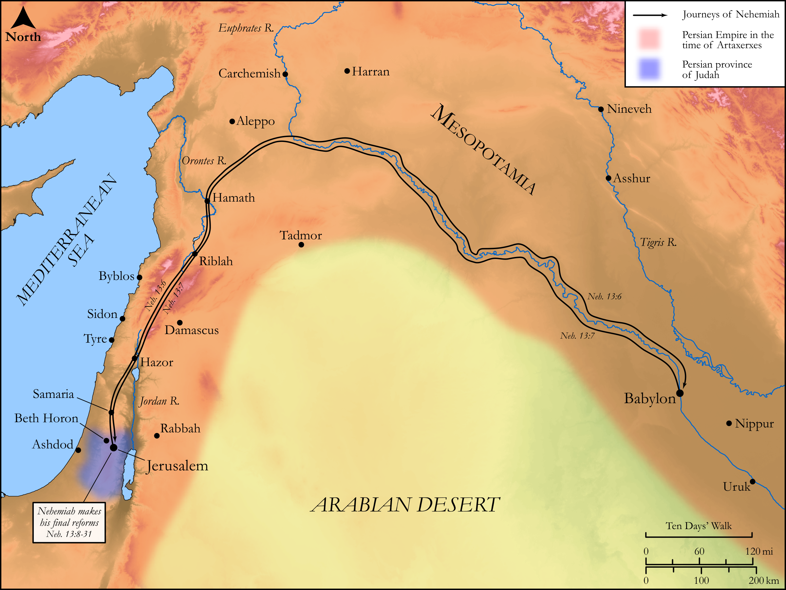

# Biblica Open Bible Maps

## License Information

Biblica Open Bible Maps, © 2023–2025 Biblica, Inc. This work is licensed under Creative Commons Attribution-ShareAlike 4.0 International (https://creativecommons.org/licenses/by-sa/4.0/). More Information: https://docs.google.com/document/d/1Pp44yZ0Zdnd59vJHTrt2rPYq0SppfX5rZbPBt6mz37U/edit?tab=t.0#heading=h.oev9aj1ksvk2

--------------------------------

## Historical: Nehemiah’s Final Reforms (id: OT168)

### Image Content

[link](images/OT168.png)

Original: [Historical: Nehemiah’s Final Reforms](https://drive.google.com/open?id=19sPFFnRUyH03LB4lkb1RgK9bWD0UXQtJ&usp=drive_copy)

* **Associated Passages:** Nehemiah 13:1-31

* **Associated ACAI Concepts:** LORD (ID: `deity:Lord`); Sabbath (ID: `keyterm:Sabbath`); Tribe of Levi (ID: `group:Levi`); Jerusalem (ID: `place:Jerusalem`); Levi (ID: `person:Levi.3`); House (ID: `realia:House`); Israel (ID: `person:Israel`); Tribe of Judah (ID: `group:Judah`); Judah (ID: `person:Judah.4`); Tobiah (ID: `person:Tobiah.2`); Pure (ID: `keyterm:Pure`); Eliashib (ID: `person:Eliashib.9`); Vine (ID: `flora:Vine`); Ashdod (ID: `place:Ashdod`); Offering (ID: `keyterm:Offering`); Ammon (ID: `place:Ammon`); To Dishonor (ID: `keyterm:Dishonor`); Kindness (ID: `keyterm:Kindness`); Moab (ID: `place:Moab`); Eliashib (ID: `person:Eliashib.8`); Pedaiah (ID: `person:Pedaiah.7`); Zadok (ID: `person:Zadok.8`); Zaccur (ID: `person:Zaccur.8`); Hanan (ID: `person:Hanan.8`); Mattaniah (ID: `person:Mattaniah.10`); Shelemiah (ID: `person:Shelemiah.5`); Horonites (ID: `group:Horonites`); Joiada (ID: `person:Joiada.2`); Olive Oil (ID: `realia:OliveOil`); Olive Tree (ID: `flora:OliveTree`); Grain (ID: `flora:Grain`); Must (ID: `realia:Must`); Frankincense (ID: `flora:Frankincense`); Mule (ID: `fauna:Mule`); Anointing Oil (ID: `realia:AnointingOil`); Babylon (ID: `place:Babylon`); Holy (ID: `keyterm:Holy`); Well-Established (ID: `keyterm:BeFirm`); Jews (ID: `group:Jews`); Perceive (ID: `keyterm:Perceive`); Swear (ID: `keyterm:Swear`); Priesthood (ID: `keyterm:Priesthood`); Tyrians (ID: `group:Tyre`); Balaam (ID: `person:Balaam`); Ammonites (ID: `group:Ammon`); Be Unfaithful (ID: `keyterm:Unfaithful`); Moses (ID: `person:Moses`); Bless (ID: `keyterm:Bless`); Tyre (ID: `place:Tyre`); Love (ID: `keyterm:Love`); Sanballat (ID: `person:Sanballat`); Artaxerxes (ID: `person:Artaxerxes`); Defilement (ID: `keyterm:Defilement`); To Sin (ID: `keyterm:Sin`); Solomon (ID: `person:Solomon`); Covenant (ID: `keyterm:Covenant`); Instruction (ID: `keyterm:Instruction`); Donkey (ID: `fauna:Donkey`); Wine (ID: `realia:Wine`); Winepress (ID: `realia:Winepress`); Fig (ID: `flora:Fig`); Fish (ID: `fauna:Fish`); Scroll (ID: `realia:Scroll`)
