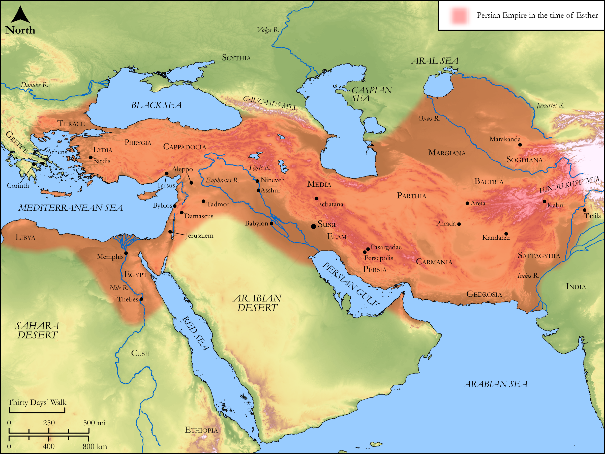

# Biblica Open Bible Maps

## License Information

Biblica Open Bible Maps, © 2023–2025 Biblica, Inc. This work is licensed under Creative Commons Attribution-ShareAlike 4.0 International (<a href="https://creativecommons.org/licenses/by-sa/4.0/">https://creativecommons.org/licenses/by-sa/4.0/</a>). More Information: <a href="https://docs.google.com/document/d/1Pp44yZ0Zdnd59vJHTrt2rPYq0SppfX5rZbPBt6mz37U/edit?tab=t.0#heading=h.oev9aj1ksvk2">https://docs.google.com/document/d/1Pp44yZ0Zdnd59vJHTrt2rPYq0SppfX5rZbPBt6mz37U/edit?tab=t.0#heading=h.oev9aj1ksvk2</a>

--------------------------------

## Historical: The Persian Empire in the time of Esther (id: OT169)

### Image Content

[link](images/OT169.png)

Original: [Historical: The Persian Empire in the time of Esther](https://drive.google.com/open?id=1tvUVC_BjAwls2DH_VpANFTLStSTF3nVj&usp=drive_copy)

* **Associated Passages:** Esther 1:1-10:3

* **Associated ACAI Concepts:** Mordecai (ID: `person:Mordecai.2`); Haman (ID: `person:Haman`); Esther (ID: `person:Esther`); Jews (ID: `group:Jews`); Ahasuerus (ID: `person:Ahasuerus`); Susa (ID: `place:Susa`); Vashti (ID: `person:Vashti`); Hammedatha (ID: `person:Hammedatha`); Favor (ID: `keyterm:Favor`); Agagites (ID: `group:Agag`); Persia (ID: `place:Persia`); Agag (ID: `person:Agag.2`); House (ID: `realia:House`); Scroll (ID: `realia:Scroll`); Hathach (ID: `person:Hathach`); Media (ID: `place:Media`); Love (ID: `keyterm:Love`); Vine (ID: `flora:Vine`); Horse (ID: `fauna:Horse`); Wine (ID: `realia:Wine`); Hegai (ID: `person:Hegai`); Zeresh (ID: `person:Zeresh`); Memucan (ID: `person:Memucan`); Peace (ID: `keyterm:IntactState`); Servants (ID: `group:GenericServants`); Sackcloth (ID: `realia:Sackcloth`); Crown (ID: `realia:Crown`); Money (ID: `realia:Money`); Teresh (ID: `person:Teresh`); India (ID: `place:India`)
