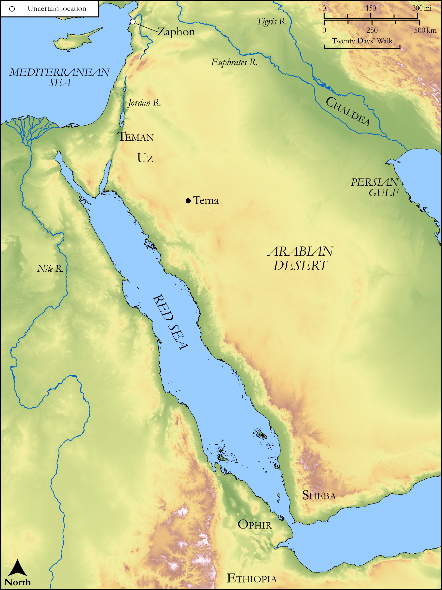

# Biblica Open Bible Maps

## License Information

Biblica Open Bible Maps, © 2023–2025 Biblica, Inc. This work is licensed under Creative Commons Attribution-ShareAlike 4.0 International (<a href="https://creativecommons.org/licenses/by-sa/4.0/">https://creativecommons.org/licenses/by-sa/4.0/</a>). More Information: <a href="https://docs.google.com/document/d/1Pp44yZ0Zdnd59vJHTrt2rPYq0SppfX5rZbPBt6mz37U/edit?tab=t.0#heading=h.oev9aj1ksvk2">https://docs.google.com/document/d/1Pp44yZ0Zdnd59vJHTrt2rPYq0SppfX5rZbPBt6mz37U/edit?tab=t.0#heading=h.oev9aj1ksvk2</a>

--------------------------------

## Wisdom & Prophets: Job (id: OT171)

### Image Content

[link](images/OT171.png)

Original: [Wisdom \& Prophets: Job](https://drive.google.com/file/d/1kM-5MeHaFP7IgKHOXk4tu1S1MOS070EL/view?usp=drive_link)

* **Associated Passages:** Job 1:1-42:17

* **Associated ACAI Concepts:** LORD (ID: `deity:Lord`); Job (ID: `person:Job`); Perceive (ID: `keyterm:Perceive`); Strength (ID: `keyterm:Strength`); Ability (ID: `keyterm:Ability`); Be (Or Show Oneself) Just (ID: `keyterm:Just`); Fear (ID: `keyterm:Fear`); Passion (ID: `keyterm:Ardour`); To Sin (ID: `keyterm:Sin`); Hell (ID: `place:Hell`); Mischief (ID: `keyterm:Mischief`); Hope (ID: `keyterm:Hope`); Understanding (ID: `keyterm:Understanding`); Rebel (ID: `keyterm:Rebel`); Satan (ID: `deity:Satan`); Intention (ID: `keyterm:Intention`); Believe In (ID: `keyterm:BelieveIn`); Bless (ID: `keyterm:Bless`); Counsel (ID: `keyterm:Counsel`); Elihu (Friend of Job). (ID: `person:Elihu.5`); Eliphaz (ID: `person:Eliphaz.2`); To Declare Guilty (ID: `keyterm:DeclareGuilty`); Bildad (ID: `person:Bildad`); Temanites (ID: `group:Teman`); Terror (ID: `keyterm:Terror`); Decree (ID: `keyterm:Decree`); Exempt (ID: `keyterm:Exempt`); Teman (ID: `place:Teman`); Safety (ID: `keyterm:Safety`); Shuhites (ID: `group:Shuhites`)
