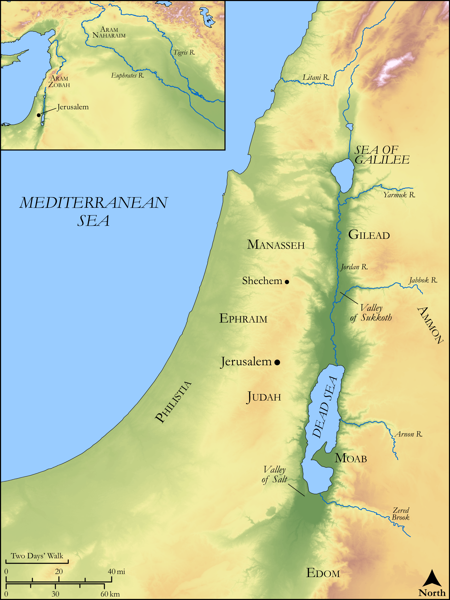

# Biblica Open Bible Maps

## License Information

Biblica Open Bible Maps, © 2023–2025 Biblica, Inc. This work is licensed under Creative Commons Attribution-ShareAlike 4.0 International (https://creativecommons.org/licenses/by-sa/4.0/). More Information: https://docs.google.com/document/d/1Pp44yZ0Zdnd59vJHTrt2rPYq0SppfX5rZbPBt6mz37U/edit?tab=t.0#heading=h.oev9aj1ksvk2

--------------------------------

## Wisdom & Prophets: Psalms 60 and 108 (id: OT172)

### Image Content

[link](images/OT172.png)

Original: [Wisdom \& Prophets: Psalms 60 and 108](https://drive.google.com/file/d/1VolwM5f1pBkBmr-05gQYcuYyeere0pE6/view?usp=drive_link)

* **Associated Passages:** Psalms 60:1-14; Psalms 108:1-14

* **Associated ACAI Concepts:** LORD (ID: `deity:Lord`); Edom (ID: `place:Edom`); Philistia (ID: `place:Philistine`); Tribe of Ephraim (ID: `group:Ephraim`); Tribe of Judah (ID: `group:Judah`); Judah (ID: `person:Judah.4`); Salvation (ID: `keyterm:Salvation`); Shechem (ID: `place:Shechem`); Manasseh (ID: `person:Manasseh`); Tribe of Manasseh (ID: `group:Manasseh`); Moab (ID: `place:Moab`); Gilead (ID: `place:Gilead`); Succoth (ID: `place:Succoth`); Ephraim (ID: `person:Ephraim`); Cooking Pot (ID: `realia:CookingPot`); Helmet (ID: `realia:Helmet`); Rod (ID: `realia:Rod`); Glory (ID: `keyterm:Glory`); Truth (ID: `keyterm:Truth`); David (ID: `person:David`); Kindness (ID: `keyterm:Kindness`); Fear (ID: `keyterm:Fear`); Testimony (ID: `keyterm:Witness.2`); Vine (ID: `flora:Vine`); Fortification (ID: `realia:Fortification`); Wine (ID: `realia:Wine`); Standard (ID: `realia:Standard`); Lyre (ID: `realia:Lyre`); Lily (ID: `flora:Lily`); Lute (ID: `realia:Lute`)
