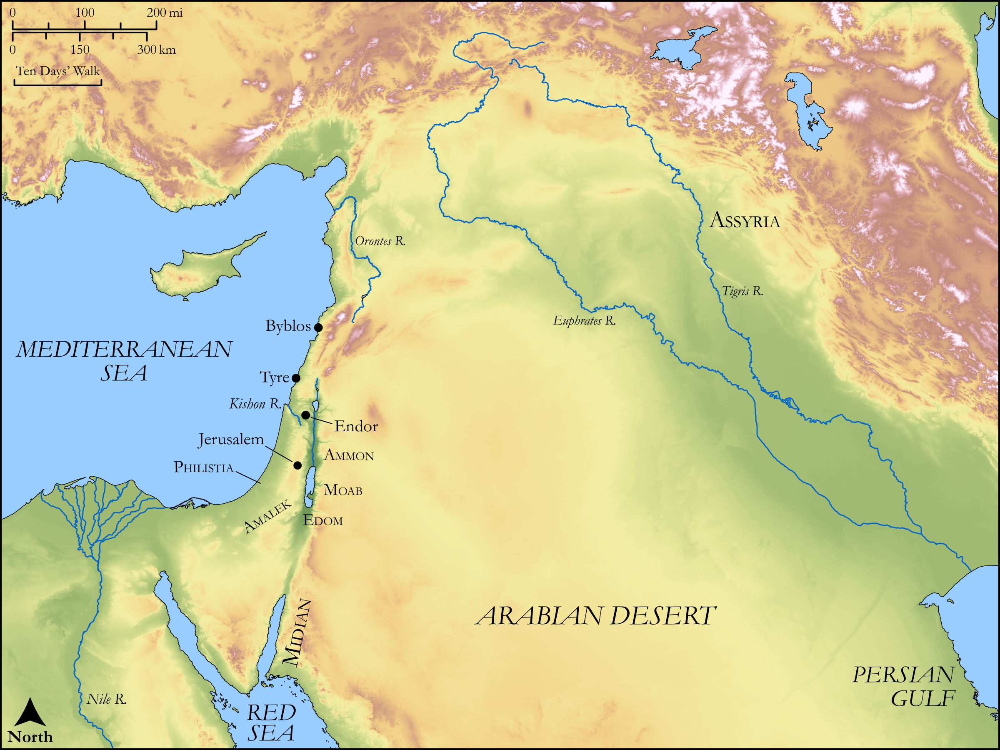

# Biblica Open Bible Maps

## License Information

Biblica Open Bible Maps, © 2023–2025 Biblica, Inc. This work is licensed under Creative Commons Attribution-ShareAlike 4.0 International (<a href="https://creativecommons.org/licenses/by-sa/4.0/">https://creativecommons.org/licenses/by-sa/4.0/</a>). More Information: <a href="https://docs.google.com/document/d/1Pp44yZ0Zdnd59vJHTrt2rPYq0SppfX5rZbPBt6mz37U/edit?tab=t.0#heading=h.oev9aj1ksvk2">https://docs.google.com/document/d/1Pp44yZ0Zdnd59vJHTrt2rPYq0SppfX5rZbPBt6mz37U/edit?tab=t.0#heading=h.oev9aj1ksvk2</a>

--------------------------------

## Wisdom & Prophets: Psalm 83 (id: OT173)

### Image Content

[link](images/OT173.png)

Original: [Wisdom \& Prophets: Psalm 83](https://drive.google.com/file/d/1K448AooMPnXskbUZ6mDvjUB6mmI0RM7X/view?usp=drive_link)

* **Associated Passages:** Psalms 83:1-19

* **Associated ACAI Concepts:** LORD (ID: `deity:Lord`); Sisera (ID: `person:Sisera`); Zeeb (ID: `person:Zeeb`); Assyria (ID: `place:Assyria`); Zalmunna (ID: `person:Zalmunna`); Jabin (ID: `person:Jabin.2`); Zebah (ID: `person:Zebah`); Crafty (ID: `keyterm:Crafty`); Hagri (ID: `person:Hagri`); Ishmael (ID: `person:Ishmael`); Dispossess (ID: `keyterm:Dispossess`); Ishmaelites (ID: `group:Ishmael`); Gebal (ID: `place:Gebal`); Edom (ID: `place:Edom`); Amalek (ID: `place:Amalek`); Covenant (ID: `keyterm:Covenant`); Kishon (ID: `place:Kishon`); Ammon (ID: `place:Ammon`); Philistia (ID: `place:Philistine`); Endor (ID: `place:En-dor`); Oreb (ID: `person:Oreb`); Moab (ID: `place:Moab`); Lot (ID: `person:Lot`); Tyre (ID: `place:Tyre`); Israel (ID: `person:Israel`); Midian (ID: `place:Midian`); Sandalwood (ID: `flora:Sandalwood`); Thistle (ID: `flora:Thistle`)
