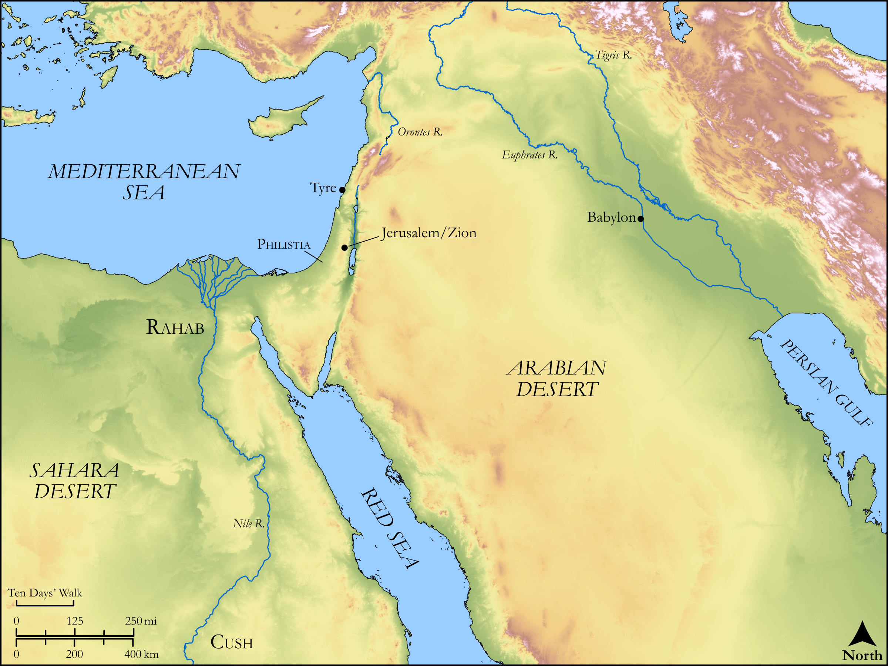

# Biblica Open Bible Maps

## License Information

Biblica Open Bible Maps, © 2023–2025 Biblica, Inc. This work is licensed under Creative Commons Attribution-ShareAlike 4.0 International (<a href="https://creativecommons.org/licenses/by-sa/4.0/">https://creativecommons.org/licenses/by-sa/4.0/</a>). More Information: <a href="https://docs.google.com/document/d/1Pp44yZ0Zdnd59vJHTrt2rPYq0SppfX5rZbPBt6mz37U/edit?tab=t.0#heading=h.oev9aj1ksvk2">https://docs.google.com/document/d/1Pp44yZ0Zdnd59vJHTrt2rPYq0SppfX5rZbPBt6mz37U/edit?tab=t.0#heading=h.oev9aj1ksvk2</a>

--------------------------------

## Wisdom & Prophets: Psalm 87 (id: OT174)

### Image Content

[link](images/OT174.png)

Original: [Wisdom \& Prophets: Psalm 87](https://drive.google.com/file/d/1pEO2yYQZGM6pNLBeHhOB41LnK7lgVDMJ/view?usp=drive_link)

* **Associated Passages:** Psalms 87:1-7

* **Associated ACAI Concepts:** LORD (ID: `deity:Lord`); Jerusalem (ID: `place:Jerusalem`); Korah (ID: `person:Korah.3`); Israel (ID: `person:Israel`); Love (ID: `keyterm:Love`); Egypt (ID: `place:Egypt`); Psalm (ID: `keyterm:Psalm`); Babylon (ID: `place:Babylon`); Philistia (ID: `place:Philistine`); Cush (ID: `place:Cush.2`); Tyre (ID: `place:Tyre`); Foundation (ID: `realia:Foundation`)
