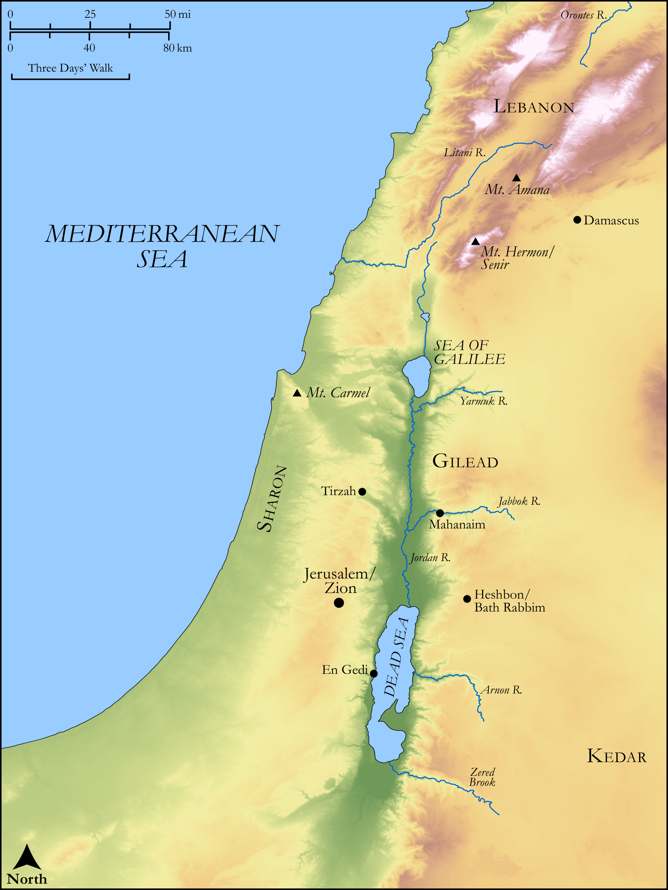

# Biblica Open Bible Maps

## License Information

Biblica Open Bible Maps, © 2023–2025 Biblica, Inc. This work is licensed under Creative Commons Attribution-ShareAlike 4.0 International (https://creativecommons.org/licenses/by-sa/4.0/). More Information: https://docs.google.com/document/d/1Pp44yZ0Zdnd59vJHTrt2rPYq0SppfX5rZbPBt6mz37U/edit?tab=t.0#heading=h.oev9aj1ksvk2

--------------------------------

## Wisdom & Prophets: Song of Songs (id: OT175)

### Image Content

[link](images/OT175.png)

Original: [Wisdom \& Prophets: Song of Songs](https://drive.google.com/file/d/1m2jb0mu4Dwj7vgH_UAU4j4I3mNRSOnQm/view?usp=drive_link)

* **Associated Passages:** Song of Songs 1:1-8:14

* **Associated ACAI Concepts:** Love (ID: `keyterm:Love`); Jerusalem (ID: `place:Jerusalem`); Solomon (ID: `person:Solomon`); Lebanon (ID: `place:Lebanon`); Swear (ID: `keyterm:Swear`); Vine (ID: `flora:Vine`); Wine (ID: `realia:Wine`); Lily (ID: `flora:Lily`); Balsam Tree (ID: `flora:BalsamTree`); Dove (ID: `fauna:Dove`); Myrrh (ID: `flora:Myrrh`); Gazelle (ID: `fauna:Gazelle`); Pomegranate (ID: `flora:Pomegranate`); Flock (ID: `fauna:Flock`); Goat (ID: `fauna:Goat`); Deer (ID: `fauna:Deer`); House (ID: `realia:House`); Apple (ID: `flora:AppleTree`); Money (ID: `realia:Money`); Veil (ID: `realia:Veil`); Mount Hermon (ID: `place:HermonMount`); Gilead (ID: `place:Gilead`); Fairness (ID: `keyterm:Fairness`); Henna (ID: `flora:Henna`); Nard (ID: `flora:Nard`); Standard (ID: `realia:Standard`); Sheep (ID: `fauna:Lamb`); Cedar (ID: `flora:Cedar`); Tower (ID: `realia:Tower`); Frankincense (ID: `flora:Frankincense`)
