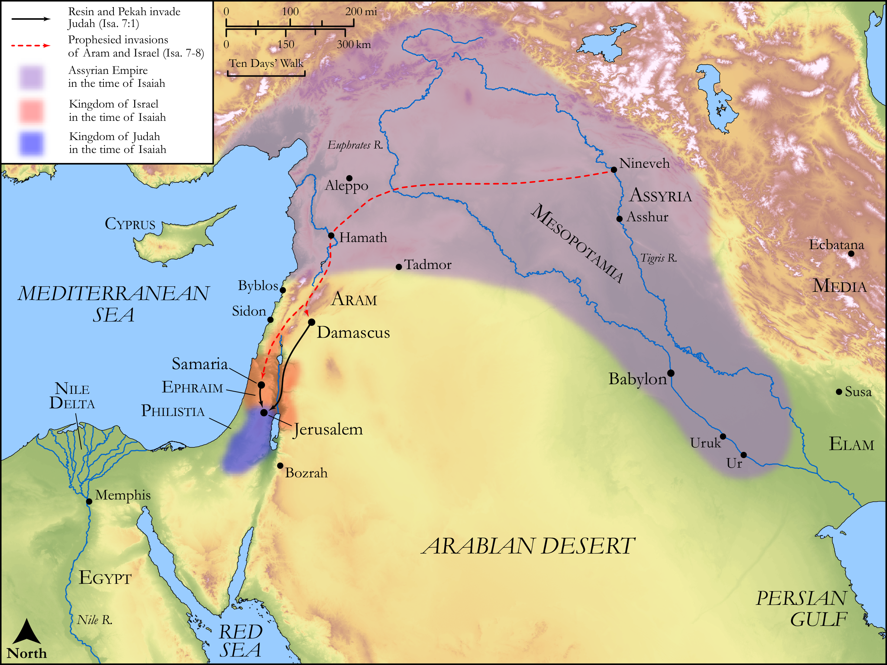

# Biblica Open Bible Maps

## License Information

Biblica Open Bible Maps, © 2023–2025 Biblica, Inc. This work is licensed under Creative Commons Attribution-ShareAlike 4.0 International (https://creativecommons.org/licenses/by-sa/4.0/). More Information: https://docs.google.com/document/d/1Pp44yZ0Zdnd59vJHTrt2rPYq0SppfX5rZbPBt6mz37U/edit?tab=t.0#heading=h.oev9aj1ksvk2

--------------------------------

## Wisdom & Prophets: Isaiah Prophesies the Fall of Israel (id: OT176)

### Image Content

[link](images/OT176.png)

Original: [Wisdom \& Prophets: Isaiah Prophesies the Fall of Israel](https://drive.google.com/file/d/1rGNC5N4ch_bEMVZ8TGqbSdGLzidYASnR/view?usp=drive_link)

* **Associated Passages:** Isaiah 7:1-8:23

* **Associated ACAI Concepts:** LORD (ID: `deity:Lord`); Remaliah (ID: `person:Remaliah`); Tribe of Ephraim (ID: `group:Ephraim`); Assyria (ID: `place:Assyria`); Ephraim (ID: `person:Ephraim`); Rezin (ID: `person:Rezin`); Ahaz (ID: `person:Ahaz`); Israel (ID: `person:Israel`); Tribe of Judah (ID: `group:Judah`); Judah (ID: `person:Judah.4`); Fear (ID: `keyterm:Fear`); Brier (ID: `flora:Brier`); Jerusalem (ID: `place:Jerusalem`); Maher-shalal-hash-baz (ID: `person:Maher-shalal-hash-baz`); Well-Established (ID: `keyterm:BeFirm`); Damascus (ID: `place:Damascus`); Jesus (ID: `person:Jesus.2`); David (ID: `person:David`); Samaria (ID: `place:Samaria`); Instruction (ID: `keyterm:Instruction`); Euphrates River (ID: `place:Euphrates`); Isaiah (ID: `person:Isaiah`); Launderer’s Field (ID: `place:WashersField`); Uriah (ID: `person:Uriah.3`); Shear-jashub (ID: `person:Shear-jashub`); Tabeal (ID: `person:Tabeal`); Jeberechiah (ID: `person:Jeberechiah`); Zechariah (ID: `person:Zechariah.29`); Necromancer (ID: `keyterm:Spirit`); Holy (ID: `keyterm:Holy`); Glory (ID: `keyterm:Glory`); Arrow (ID: `keyterm:Arrow`); Symbol (ID: `keyterm:Example`); Egypt (ID: `place:Egypt`); Believe In (ID: `keyterm:BelieveIn`); Uzziah (ID: `person:Uzziah`); Hell (ID: `place:Hell`); Pekah (ID: `person:Pekah`); Siloam (ID: `place:Siloam`); Counsel (ID: `keyterm:Counsel`); Jotham (ID: `person:Jotham.2`); Trap (ID: `realia:Trap`); Cattle (ID: `fauna:Bull`); Hoe (ID: `realia:Hoe`); Stylus (ID: `realia:Stylus`); Fly (ID: `fauna:Fly`); Razor (ID: `realia:Razor`); Flock (ID: `fauna:Flock`); Bee (ID: `fauna:Bee`); Vine (ID: `flora:Vine`); Molten Image (ID: `realia:MoltenImage`); Sandalwood (ID: `flora:Sandalwood`); Tablet (ID: `realia:Tablet`); Money (ID: `realia:Money`); Goat (ID: `fauna:Goat`); Arrow (ID: `realia:Arrow`); Sheep (ID: `fauna:Lamb`); Bow (ID: `realia:Bow`)
