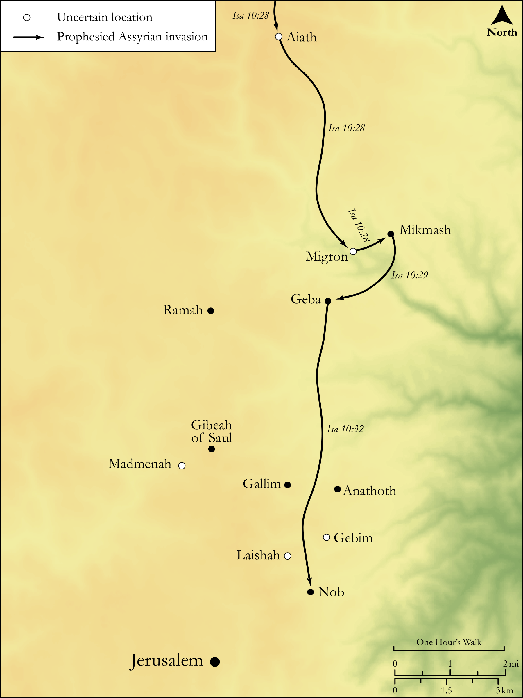

# Biblica Open Bible Maps

## License Information

Biblica Open Bible Maps, © 2023–2025 Biblica, Inc. This work is licensed under Creative Commons Attribution-ShareAlike 4.0 International (https://creativecommons.org/licenses/by-sa/4.0/). More Information: https://docs.google.com/document/d/1Pp44yZ0Zdnd59vJHTrt2rPYq0SppfX5rZbPBt6mz37U/edit?tab=t.0#heading=h.oev9aj1ksvk2

--------------------------------

## Wisdom & Prophets: The Prophesied Attack on Jerusalem (id: OT177)

### Image Content

[link](images/OT177.png)

Original: [Wisdom \& Prophets: The Prophesied Attack on Jerusalem](https://drive.google.com/file/d/1RRMCWu80dY4-q0rnYPUDDajenTqDH2rQ/view?usp=drive_link)

* **Associated Passages:** Isaiah 10:1-34

* **Associated ACAI Concepts:** LORD (ID: `deity:Lord`); Jerusalem (ID: `place:Jerusalem`); Israel (ID: `person:Israel`); Glory (ID: `keyterm:Glory`); Assyria (ID: `place:Assyria`); Samaria (ID: `place:Samaria`); Woe (ID: `keyterm:Woe.2`); Sandalwood (ID: `flora:Sandalwood`); Rod (ID: `realia:Rod`); Egypt (ID: `place:Egypt`); Idol (ID: `keyterm:Idol`); Holy (ID: `keyterm:Holy`); Migron (ID: `place:Migron`); Calneh (ID: `place:Calneh`); Ai (ID: `place:Ai`); Carchemish (ID: `place:Carchemish`); Gallim (ID: `place:Gallim`); Laishah (ID: `place:Laishah`); Visitation (ID: `keyterm:Visitation`); Nob (ID: `place:Nob`); Gebim (ID: `place:Gebim`); Madmenah (ID: `place:Madmenah`); Oreb (ID: `person:Oreb`); Image (ID: `realia:Image`); Staff (ID: `realia:Staff`); Mighty One (ID: `keyterm:MightyOne`); Geba (ID: `place:Geba`); Truth (ID: `keyterm:Truth`); Appoint (ID: `keyterm:Appoint`); Assyrians (ID: `group:Assyria`); Michmash (ID: `place:Michmash`); Damascus (ID: `place:Damascus`); Lebanon (ID: `place:Lebanon`); Mighty (ID: `keyterm:Mighty`); Ramah (ID: `place:Ramah.2`); Hamath (ID: `place:Hamath`); Perceive (ID: `keyterm:Perceive`); Saul (ID: `person:Saul.2`); Mischief (ID: `keyterm:Mischief`); Fear (ID: `keyterm:Fear`); Ability (ID: `keyterm:Ability`); Strength (ID: `keyterm:Strength`); Decree (ID: `keyterm:Decree`); Gibeah (ID: `place:Gibeah.2`); Midian (ID: `place:Midian`); Anathoth (ID: `place:Anathoth`); Arpad (ID: `place:Arpad`); Axe (ID: `realia:Axe`); Whip (ID: `realia:Whip`); Saw (ID: `realia:Saw`); Brier (ID: `flora:Brier`); Yoke (ID: `realia:Yoke`); Graven Image (ID: `realia:GravenImage`)
