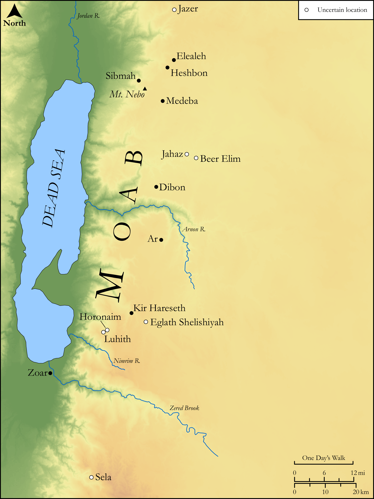

# Biblica Open Bible Maps

## License Information

Biblica Open Bible Maps, © 2023–2025 Biblica, Inc. This work is licensed under Creative Commons Attribution-ShareAlike 4.0 International (https://creativecommons.org/licenses/by-sa/4.0/). More Information: https://docs.google.com/document/d/1Pp44yZ0Zdnd59vJHTrt2rPYq0SppfX5rZbPBt6mz37U/edit?tab=t.0#heading=h.oev9aj1ksvk2

--------------------------------

## Wisdom & Prophets: Prophecy Against Moab (id: OT179)

### Image Content

[link](images/OT179.png)

Original: [Wisdom \& Prophets: Prophecy Against Moab](https://drive.google.com/file/d/1BCYR3qc5s-4xoUTH-Jodzv8xpjAK7Eui/view?usp=drive_link)

* **Associated Passages:** Isaiah 15:1-16:14

* **Associated ACAI Concepts:** Moab (ID: `place:Moab`); Vine (ID: `flora:Vine`); Kir (ID: `place:Kir`); Heshbon (ID: `place:Heshbon`); Sibmah (ID: `place:Sibmah`); Elealeh (ID: `place:Elealeh`); LORD (ID: `deity:Lord`); Jazer (ID: `place:Jazer`); Dibon (ID: `place:Dibon`); Stone Pine (ID: `flora:Pine`); High Place (ID: `realia:HighPlace`); Brook of the Willows (ID: `place:BrookOfTheWillows`); Medeba (ID: `place:Medeba`); Bajith (ID: `place:Bajith`); Waters of Nimrim (ID: `place:Nimrim`); Zoar (ID: `place:Zoar`); Beer-elim (ID: `place:Beer-elim`); Eglaim (ID: `place:Eglaim`); Horonaim (ID: `place:Horonaim`); Luhith (ID: `place:Luhith`); Nebo (ID: `place:Nebo`); Jahaz (ID: `place:Jahaz`); Sela (ID: `place:Sela`); Dimon (ID: `place:Dibon.3`); Jerusalem (ID: `place:Jerusalem`); Truth (ID: `keyterm:Truth`); Glory (ID: `keyterm:Glory`); Complete (ID: `keyterm:Complete`); David (ID: `person:David`); Ar (ID: `place:Ar`); Utterance (ID: `keyterm:Utterance`); Counsel (ID: `keyterm:Counsel`); Kindness (ID: `keyterm:Kindness`); Arnon (ID: `place:Arnon`); Grass (ID: `flora:Grass`); Willow (ID: `flora:Willow`); Wine (ID: `realia:Wine`); Sheep (ID: `fauna:Lamb`); Raisin Cake (ID: `realia:RaisinCake`); Lute (ID: `realia:Lute`); Sackcloth (ID: `realia:Sackcloth`); House (ID: `realia:House`); Green Vegetation (ID: `flora:GreenVegetation`); Poplar (ID: `flora:Poplar`); Winepress (ID: `realia:Winepress`); Lion (ID: `fauna:Lion`)
