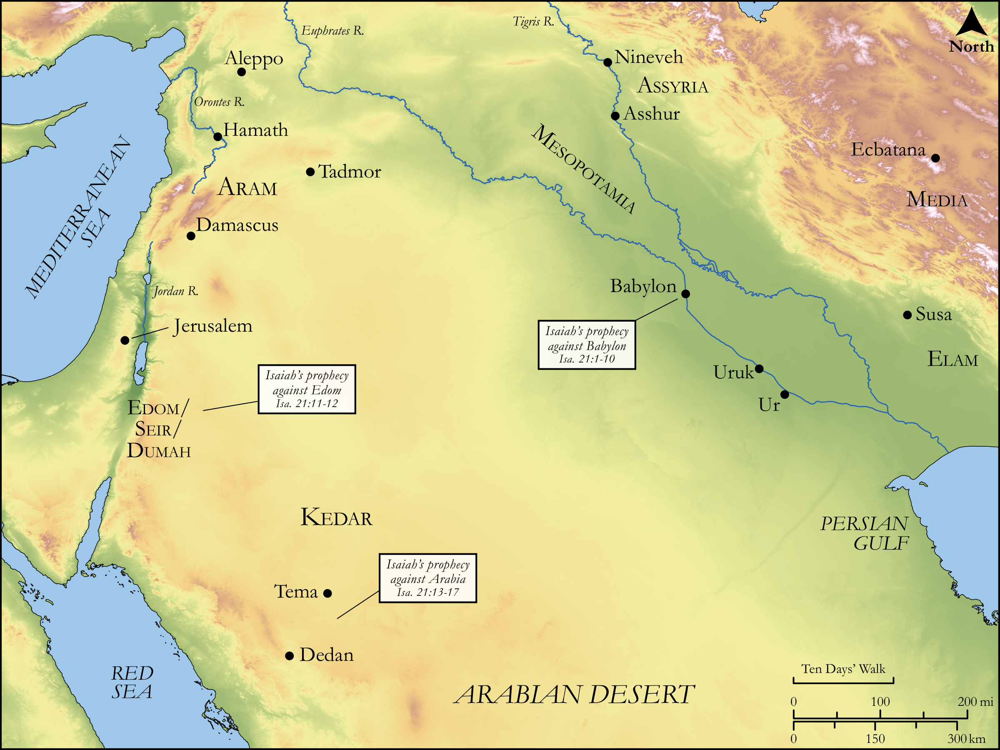

# Biblica Open Bible Maps

## License Information

Biblica Open Bible Maps, © 2023–2025 Biblica, Inc. This work is licensed under Creative Commons Attribution-ShareAlike 4.0 International (<a href="https://creativecommons.org/licenses/by-sa/4.0/">https://creativecommons.org/licenses/by-sa/4.0/</a>). More Information: <a href="https://docs.google.com/document/d/1Pp44yZ0Zdnd59vJHTrt2rPYq0SppfX5rZbPBt6mz37U/edit?tab=t.0#heading=h.oev9aj1ksvk2">https://docs.google.com/document/d/1Pp44yZ0Zdnd59vJHTrt2rPYq0SppfX5rZbPBt6mz37U/edit?tab=t.0#heading=h.oev9aj1ksvk2</a>

--------------------------------

## Wisdom & Prophets: Prophesies against Babylon, Edom, and Arabia (id: OT181)

### Image Content

[link](images/OT181.png)

Original: [Wisdom \& Prophets: Prophesies against Babylon, Edom, and Arabia](https://drive.google.com/file/d/18dRusWwdWGCtHWgaC3zNc2yY6WcFHkYh/view?usp=drive_link)

* **Associated Passages:** Isaiah 21:1-17

* **Associated ACAI Concepts:** LORD (ID: `deity:Lord`); Utterance (ID: `keyterm:Utterance`); A Lookout (ID: `person:Lookout`); Israel (ID: `person:Israel`); Kedar (ID: `person:Kedar`); Bow (ID: `realia:Bow`); Tema (ID: `place:Tema`); Dumah (ID: `place:Dumah`); Dedanites (ID: `group:Dedan`); Arabia (ID: `place:Arabia`); Media (ID: `place:Media`); Dedan (ID: `place:Dedan`); Elam (ID: `place:Elam`); Smear (ID: `keyterm:Smear`); Glory (ID: `keyterm:Glory`); Fear (ID: `keyterm:Fear`); Babylon (ID: `place:Babylon`); Seir (ID: `place:Seir`); Negev (ID: `place:Negeb`); Rug (ID: `realia:Rug`); Small Shield (ID: `realia:SmallShield`); Sword (ID: `realia:Sword`); Graven Image (ID: `realia:GravenImage`); Threshing Floor (ID: `realia:ThreshingFloor`); Sandalwood (ID: `flora:Sandalwood`); Lion (ID: `fauna:Lion`); Camel (ID: `fauna:Camel`); Donkey (ID: `fauna:Donkey`)
