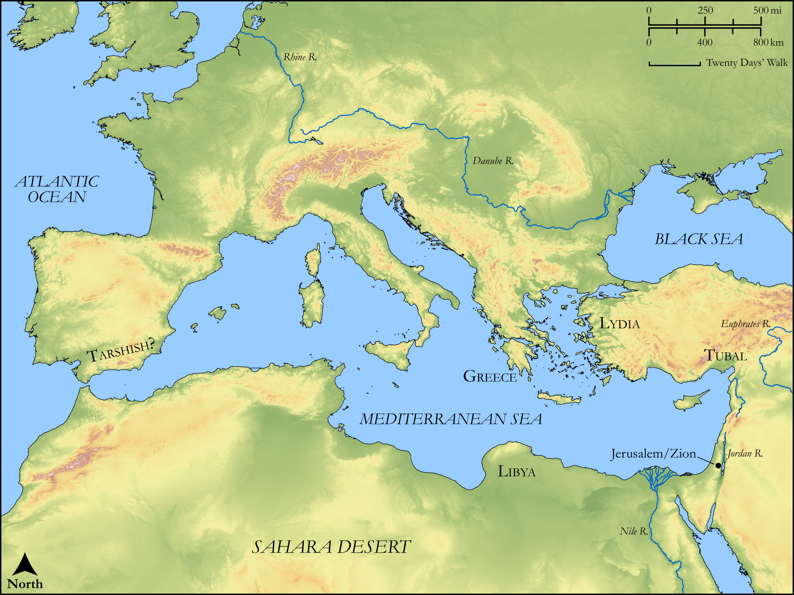

# Biblica Open Bible Maps

## License Information

Biblica Open Bible Maps, © 2023–2025 Biblica, Inc. This work is licensed under Creative Commons Attribution-ShareAlike 4.0 International (https://creativecommons.org/licenses/by-sa/4.0/). More Information: https://docs.google.com/document/d/1Pp44yZ0Zdnd59vJHTrt2rPYq0SppfX5rZbPBt6mz37U/edit?tab=t.0#heading=h.oev9aj1ksvk2

--------------------------------

## Wisdom & Prophets: The Gathering of Nations (id: OT186)

### Image Content

[link](images/OT186.png)

Original: [Wisdom \& Prophets: The Gathering of Nations](https://drive.google.com/file/d/1tUfDVPPjDmFLqm9C06JSEpbXVmqmbGGR/view?usp=drive_link)

* **Associated Passages:** Isaiah 66:1-24

* **Associated ACAI Concepts:** LORD (ID: `deity:Lord`); Jerusalem (ID: `place:Jerusalem`); Glory (ID: `keyterm:Glory`); Pure (ID: `keyterm:Pure`); Offering (ID: `keyterm:Offering`); Gentiles (ID: `group:Gentile`); Pig (ID: `fauna:Pig`); Jackal (ID: `fauna:Jackal`); House (ID: `realia:House`); Chariot (ID: `realia:Chariot`); Tubal (ID: `place:Tubal`); Greece (ID: `place:Greece`); Tarshish (ID: `place:Tarshish`); Israelites (ID: `group:Israel`); Word of the Lord (ID: `keyterm:WordOfTheLord`); Bless (ID: `keyterm:Bless`); Levi (ID: `person:Levi.3`); Love (ID: `keyterm:Love`); Lud (ID: `person:Lud`); New Moon Festival (ID: `keyterm:NewMoonFestival`); Peace (ID: `keyterm:IntactState`); Put (ID: `place:Put`); Mischief (ID: `keyterm:Mischief`); Rebel (ID: `keyterm:Rebel`); Tribe of Levi (ID: `group:Levi`); Israel (ID: `person:Israel`); Detested Thing (ID: `keyterm:DetestedThing`); Holy (ID: `keyterm:Holy`); Sabbath (ID: `keyterm:Sabbath`); Bring Honor and Glory on Oneself (ID: `keyterm:BringHonorAndGloryOnOneself`); Mouse (ID: `fauna:Mouse`); Grass (ID: `flora:Grass`); Sheep (ID: `fauna:Lamb`); Bow (ID: `realia:Bow`); Dog (ID: `fauna:Dog`); Wagon (ID: `realia:Wagon`); Horse (ID: `fauna:Horse`); Worm (ID: `fauna:Maggot`); Cattle (ID: `fauna:Bull`); Green Vegetation (ID: `flora:GreenVegetation`); Mule (ID: `fauna:Mule`); Camel (ID: `fauna:Camel`); Throne (ID: `realia:Throne`); Frankincense (ID: `flora:Frankincense`); Sword (ID: `realia:Sword`)
