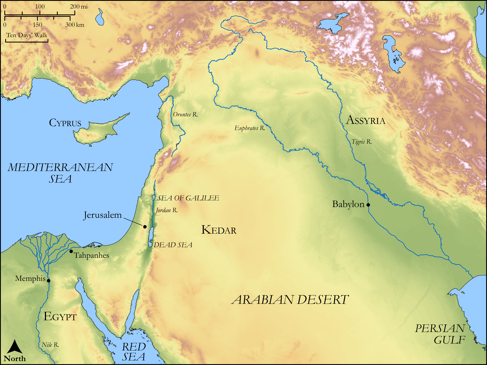

# Biblica Open Bible Maps

## License Information

Biblica Open Bible Maps, © 2023–2025 Biblica, Inc. This work is licensed under Creative Commons Attribution-ShareAlike 4.0 International (https://creativecommons.org/licenses/by-sa/4.0/). More Information: https://docs.google.com/document/d/1Pp44yZ0Zdnd59vJHTrt2rPYq0SppfX5rZbPBt6mz37U/edit?tab=t.0#heading=h.oev9aj1ksvk2

--------------------------------

## Wisdom & Prophets: Israel’s Evils (id: OT187)

### Image Content

[link](images/OT187.png)

Original: [Wisdom \& Prophets: Israel’s Evils](https://drive.google.com/file/d/1hWdss48aiiVFc0QD2JiqZM2RtEQtYi2O/view?usp=drive_link)

* **Associated Passages:** Jeremiah 2:1-37

* **Associated ACAI Concepts:** LORD (ID: `deity:Lord`); Israel (ID: `person:Israel`); Word of the Lord (ID: `keyterm:WordOfTheLord`); Egypt (ID: `place:Egypt`); Love (ID: `keyterm:Love`); Assyria (ID: `place:Assyria`); Rebel (ID: `keyterm:Rebel`); Defilement (ID: `keyterm:Defilement`); Baal (ID: `deity:Baal`); Lion (ID: `fauna:Lion`); Tahpanhes (ID: `place:Tahpanhes`); Glory (ID: `keyterm:Glory`); Perceive (ID: `keyterm:Perceive`); Be Blameless (ID: `keyterm:Blameless`); Speak as a Prophet (ID: `keyterm:Speak`); Kedar (ID: `person:Kedar`); Tribe of Judah (ID: `group:Judah`); Memphis (ID: `place:Memphis`); Judah (ID: `person:Judah.4`); Safety (ID: `keyterm:Safety`); To Cause to Possess (ID: `keyterm:Possess`); Truth (ID: `keyterm:Truth`); Exempt (ID: `keyterm:Exempt`); Kindness (ID: `keyterm:Kindness`); Nile River (ID: `place:Nile`); Cyprus (ID: `place:Cyprus`); To Sin (ID: `keyterm:Sin`); Jerusalem (ID: `place:Jerusalem`); Defection (ID: `keyterm:Defection`); Euphrates River (ID: `place:Euphrates`); Passion (ID: `keyterm:Ardour`); Instruction (ID: `keyterm:Instruction`); Wild Donkey (ID: `fauna:WildDonkey`); Soap (ID: `realia:Soap`); Flock (ID: `fauna:Flock`); Vine (ID: `flora:Vine`); Barley (ID: `flora:Barley`); Hammada (ID: `flora:Soap`); Image (ID: `realia:Image`); Goat (ID: `fauna:Goat`); Camel (ID: `fauna:Camel`); Sorghum (ID: `flora:Sorghum`); Sheep (ID: `fauna:Lamb`); Coriander (ID: `flora:Coriander`); Pit (ID: `realia:Pit`); Stone Pine (ID: `flora:Pine`); Yoke (ID: `realia:Yoke`); Wheat (ID: `flora:Wheat`)
