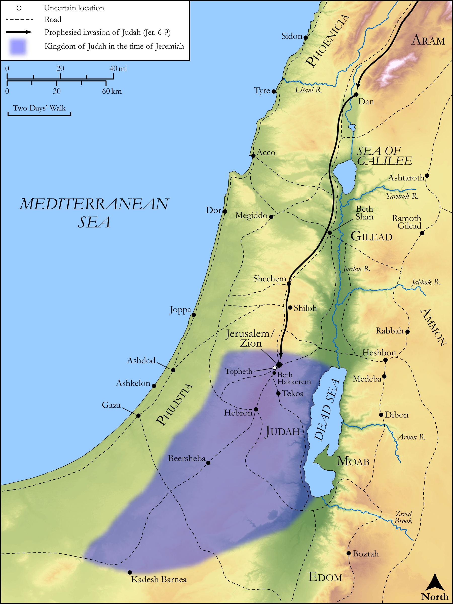

# Biblica Open Bible Maps

## License Information

Biblica Open Bible Maps, © 2023–2025 Biblica, Inc. This work is licensed under Creative Commons Attribution-ShareAlike 4.0 International (<a href="https://creativecommons.org/licenses/by-sa/4.0/">https://creativecommons.org/licenses/by-sa/4.0/</a>). More Information: <a href="https://docs.google.com/document/d/1Pp44yZ0Zdnd59vJHTrt2rPYq0SppfX5rZbPBt6mz37U/edit?tab=t.0#heading=h.oev9aj1ksvk2">https://docs.google.com/document/d/1Pp44yZ0Zdnd59vJHTrt2rPYq0SppfX5rZbPBt6mz37U/edit?tab=t.0#heading=h.oev9aj1ksvk2</a>

--------------------------------

## Wisdom & Prophets: Jerusalem’s Coming Destruction (id: OT188)

### Image Content

[link](images/OT188.png)

Original: [Wisdom \& Prophets: Jerusalem’s Coming Destruction](https://drive.google.com/file/d/1yn1nlw-GonwQSRRjAmNrhn06DeIuqYA7/view?usp=drive_link)

* **Associated Passages:** Jeremiah 6:1-9:25

* **Associated ACAI Concepts:** LORD (ID: `deity:Lord`); Jerusalem (ID: `place:Jerusalem`); Judah (ID: `person:Judah.4`); Tribe of Judah (ID: `group:Judah`); Israel (ID: `person:Israel`); Peace (ID: `keyterm:IntactState`); Word of the Lord (ID: `keyterm:WordOfTheLord`); Offering (ID: `keyterm:Offering`); Appoint (ID: `keyterm:Appoint`); Trust (ID: `keyterm:LeanOn`); House (ID: `realia:House`); Lamentation (ID: `keyterm:Lamentation`); Deceit (ID: `keyterm:Deceit`); Instruction (ID: `keyterm:Instruction`); Slaughtering (ID: `keyterm:Slaughtering`); Valley of Hinnom (ID: `place:HinnomValley`); Ability (ID: `keyterm:Ability`); Baal (ID: `deity:Baal`); Topheth (ID: `place:Topheth`); Perceive (ID: `keyterm:Perceive`); Shiloh (ID: `place:Shiloh`); Egypt (ID: `place:Egypt`); Horse (ID: `fauna:Horse`); Beth-haccherem (ID: `place:Beth-haccherem`); Gilead (ID: `place:Gilead`); Detested Thing (ID: `keyterm:DetestedThing`); Visitation (ID: `keyterm:Visitation`); Defilement (ID: `keyterm:Defilement`); Tribe of Benjamin (ID: `group:Benjamin`); Defection (ID: `keyterm:Defection`)
