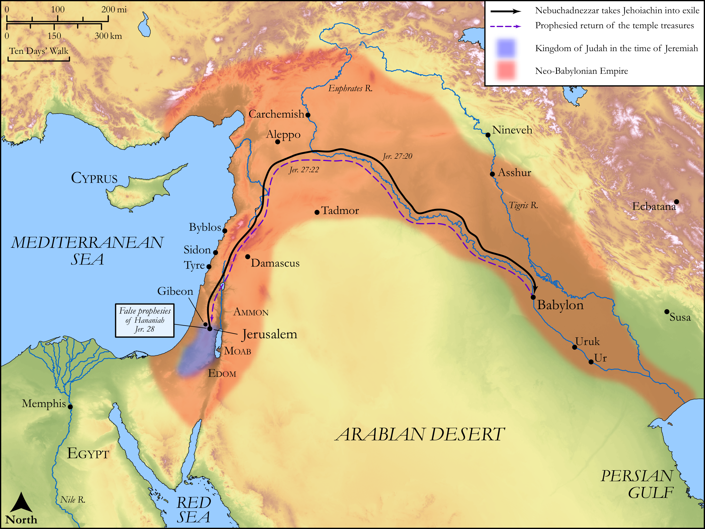

# Biblica Open Bible Maps

## License Information

Biblica Open Bible Maps, © 2023–2025 Biblica, Inc. This work is licensed under Creative Commons Attribution-ShareAlike 4.0 International (<a href="https://creativecommons.org/licenses/by-sa/4.0/">https://creativecommons.org/licenses/by-sa/4.0/</a>). More Information: <a href="https://docs.google.com/document/d/1Pp44yZ0Zdnd59vJHTrt2rPYq0SppfX5rZbPBt6mz37U/edit?tab=t.0#heading=h.oev9aj1ksvk2">https://docs.google.com/document/d/1Pp44yZ0Zdnd59vJHTrt2rPYq0SppfX5rZbPBt6mz37U/edit?tab=t.0#heading=h.oev9aj1ksvk2</a>

--------------------------------

## Wisdom & Prophets: The Yoke of the King of Babylon (id: OT192)

### Image Content

[link](images/OT192.png)

Original: [Wisdom \& Prophets: The Yoke of the King of Babylon](https://drive.google.com/file/d/1idli2iOQG3sE3Yecl-D6EQnj5KtCL_0-/view?usp=drive_link)

* **Associated Passages:** Jeremiah 27:1-28:17

* **Associated ACAI Concepts:** LORD (ID: `deity:Lord`); Babylon (ID: `place:Babylon`); Force to Serve (ID: `keyterm:EnticedToServe`); Hananiah (ID: `person:Hananiah.12`); Tribe of Judah (ID: `group:Judah`); Judah (ID: `person:Judah.4`); Jeremiah (ID: `person:Jeremiah.6`); Speak as a Prophet (ID: `keyterm:Speak`); Nebuchadnezzar (ID: `person:Nebuchadnezzar`); Yoke (ID: `realia:Yoke`); House (ID: `realia:House`); Jerusalem (ID: `place:Jerusalem`); Israel (ID: `person:Israel`); Jehoiakim (ID: `person:Jehoiakim`); Zedekiah (ID: `person:Zedekiah.3`); Jehoiachin (ID: `person:Jehoiachin`); Appoint (ID: `keyterm:Appoint`); Word of the Lord (ID: `keyterm:WordOfTheLord`); Azzur (ID: `person:Azzur.2`); Surely! (ID: `keyterm:Surely`); Trust (ID: `keyterm:LeanOn`); Edom (ID: `place:Edom`); An Angel (ID: `deity:Angel`); Ammon (ID: `place:Ammon`); Sidon (ID: `place:Sidon`); Gibeon (ID: `place:Gibeon`); Truth (ID: `keyterm:Truth`); Complete (ID: `keyterm:Complete`); Moab (ID: `place:Moab`); Tyre (ID: `place:Tyre`); Josiah (ID: `person:Josiah`); Practice Divination (ID: `keyterm:PracticeDivination`); Peace (ID: `keyterm:IntactState`); Strength (ID: `keyterm:Strength`)
