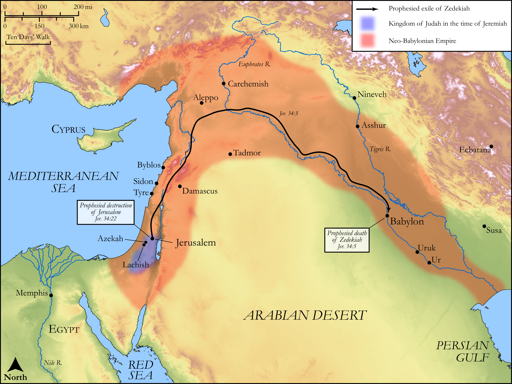

# Biblica Open Bible Maps

## License Information

Biblica Open Bible Maps, © 2023–2025 Biblica, Inc. This work is licensed under Creative Commons Attribution-ShareAlike 4.0 International (https://creativecommons.org/licenses/by-sa/4.0/). More Information: https://docs.google.com/document/d/1Pp44yZ0Zdnd59vJHTrt2rPYq0SppfX5rZbPBt6mz37U/edit?tab=t.0#heading=h.oev9aj1ksvk2

--------------------------------

## Wisdom & Prophets: Prophecy to Zedekiah (id: OT194)

### Image Content

[link](images/OT194.png)

Original: [Wisdom \& Prophets: Prophecy to Zedekiah](https://drive.google.com/file/d/1lp6BJcqDVQ0G8AxXJ5ty_EbGoPnI7lDQ/view?usp=drive_link)

* **Associated Passages:** Jeremiah 34:1-22

* **Associated ACAI Concepts:** LORD (ID: `deity:Lord`); Tribe of Judah (ID: `group:Judah`); Judah (ID: `person:Judah.4`); Babylon (ID: `place:Babylon`); Zedekiah (ID: `person:Zedekiah.3`); Covenant (ID: `keyterm:Covenant`); Jerusalem (ID: `place:Jerusalem`); Jeremiah (ID: `person:Jeremiah.6`); Force to Serve (ID: `keyterm:EnticedToServe`); Israel (ID: `person:Israel`); Word of the Lord (ID: `keyterm:WordOfTheLord`); Hebrews (ID: `group:Hebrews`); Molten Image (ID: `realia:MoltenImage`); Cattle (ID: `fauna:Bull`); Jews (ID: `group:Jews`); Lachish (ID: `place:Lachish`); Alas! (ID: `keyterm:Alas`); Azekah (ID: `place:Azekah`); Peace (ID: `keyterm:IntactState`); Egypt (ID: `place:Egypt`); To Dishonor (ID: `keyterm:Dishonor`); Nebuchadnezzar (ID: `person:Nebuchadnezzar`); House (ID: `realia:House`)
