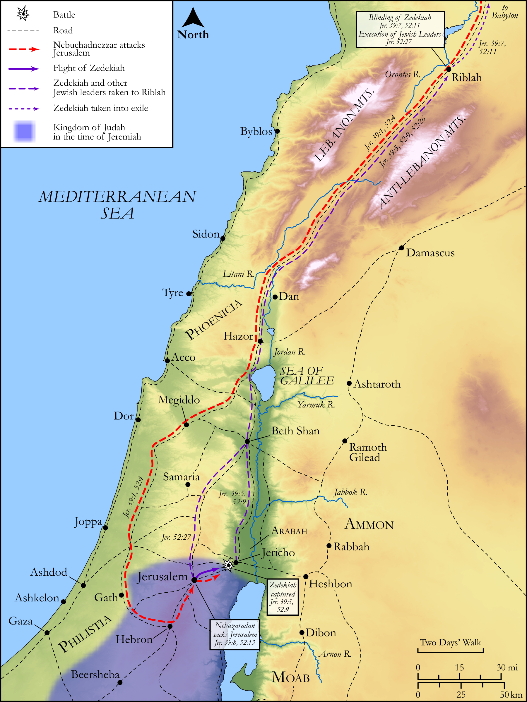

# Biblica Open Bible Maps

## License Information

Biblica Open Bible Maps, © 2023–2025 Biblica, Inc. This work is licensed under Creative Commons Attribution-ShareAlike 4.0 International (https://creativecommons.org/licenses/by-sa/4.0/). More Information: https://docs.google.com/document/d/1Pp44yZ0Zdnd59vJHTrt2rPYq0SppfX5rZbPBt6mz37U/edit?tab=t.0#heading=h.oev9aj1ksvk2

--------------------------------

## Wisdom & Prophets: The Fall of Jerusalem and Zedekiah's Capture (id: OT195)

### Image Content

[link](images/OT195.png)

Original: [Wisdom \& Prophets: The Fall of Jerusalem and Zedekiah's Capture](https://drive.google.com/file/d/1bKQ9JQKzdp-cFq5Lyr2i9htdmF1sqq50/view?usp=drive_link)

* **Associated Passages:** Jeremiah 39:1-18

* **Associated ACAI Concepts:** Babylon (ID: `place:Babylon`); Zedekiah (ID: `person:Zedekiah.3`); Nebuzaradan (ID: `person:Nebuzaradan`); LORD (ID: `deity:Lord`); Tribe of Judah (ID: `group:Judah`); Judah (ID: `person:Judah.4`); Jeremiah (ID: `person:Jeremiah.6`); Nebuchadnezzar (ID: `person:Nebuchadnezzar`); Rab-mag (ID: `person:Rab-mag`); Rab-saris (ID: `person:Rab-saris.2`); Nergal-shar-ezer (ID: `person:Nergal-shar-ezer.2`); Riblah (ID: `place:Riblah.2`); Chaldeans (ID: `group:Chaldea`); Jerusalem (ID: `place:Jerusalem`); Chaldea (ID: `place:Chaldea`); Nebu-sar-sekim (ID: `person:Nebu-sar-sekim`); Nergal-shar-ezer (ID: `person:Nergal-shar-ezer`); Ebed-melech (ID: `person:Ebed-melech`); Samgar (ID: `person:Samgar`); Ahikam (ID: `person:Ahikam`); Nebushazban (ID: `person:Nebushazban`); Shaphan (ID: `person:Shaphan`); Israel (ID: `person:Israel`); Word of the Lord (ID: `keyterm:WordOfTheLord`); Arabah (ID: `place:Arabah`); Hamath (ID: `place:Hamath`); Ethiopia (ID: `place:Ethiopia`); Gedaliah (ID: `person:Gedaliah.2`); Ethiopians (ID: `group:Ethiopia`); Jericho (ID: `place:Jericho`); Trust (ID: `keyterm:LeanOn`); Vine (ID: `flora:Vine`); House (ID: `realia:House`)
