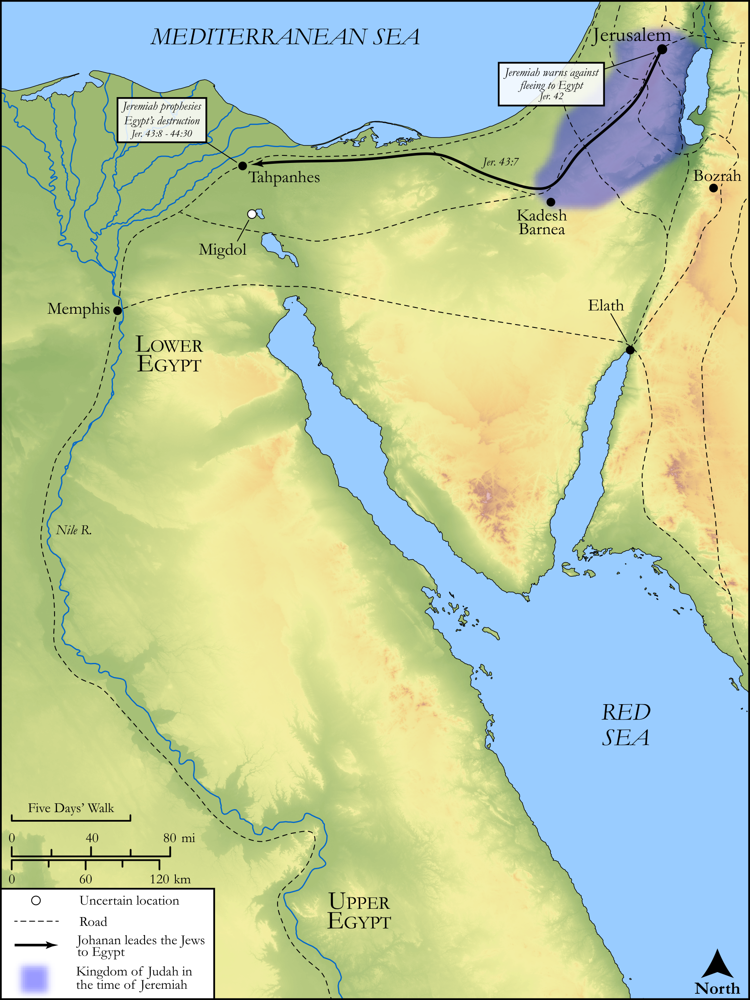

# Biblica Open Bible Maps

## License Information

Biblica Open Bible Maps, © 2023–2025 Biblica, Inc. This work is licensed under Creative Commons Attribution-ShareAlike 4.0 International (<a href="https://creativecommons.org/licenses/by-sa/4.0/">https://creativecommons.org/licenses/by-sa/4.0/</a>). More Information: <a href="https://docs.google.com/document/d/1Pp44yZ0Zdnd59vJHTrt2rPYq0SppfX5rZbPBt6mz37U/edit?tab=t.0#heading=h.oev9aj1ksvk2">https://docs.google.com/document/d/1Pp44yZ0Zdnd59vJHTrt2rPYq0SppfX5rZbPBt6mz37U/edit?tab=t.0#heading=h.oev9aj1ksvk2</a>

--------------------------------

## Wisdom & Prophets: Israelite Refugees in Egypt (id: OT197)

### Image Content

[link](images/OT197.png)

Original: [Wisdom \& Prophets: Israelite Refugees in Egypt](https://drive.google.com/file/d/10OuoAL782YuWnuM1EjJxw5nQSxoFbYB-/view?usp=drive_link)

* **Associated Passages:** Jeremiah 42:1-44:30

* **Associated ACAI Concepts:** LORD (ID: `deity:Lord`); Egypt (ID: `place:Egypt`); Tribe of Judah (ID: `group:Judah`); Judah (ID: `person:Judah.4`); Jeremiah (ID: `person:Jeremiah.6`); Israel (ID: `person:Israel`); Jerusalem (ID: `place:Jerusalem`); Kareah (ID: `person:Kareah`); Johanan (ID: `person:Johanan.5`); Word of the Lord (ID: `keyterm:WordOfTheLord`); Tahpanhes (ID: `place:Tahpanhes`); Offering (ID: `keyterm:Offering`); Babylon (ID: `place:Babylon`); Fear (ID: `keyterm:Fear`); Complete (ID: `keyterm:Complete`); Wine (ID: `realia:Wine`); Hoshaiah (ID: `person:Hoshaiah.2`); Pathros (ID: `place:Pathros`); Plea for Mercy (ID: `keyterm:Supplication`); Jezaniah (ID: `person:Jezaniah`); Baruch (ID: `person:Baruch.4`); Hophra (ID: `person:Hophra`); Nebuchadnezzar (ID: `person:Nebuchadnezzar`); Neriah (ID: `person:Neriah`); Appoint (ID: `keyterm:Appoint`); Instruction (ID: `keyterm:Instruction`); House (ID: `realia:House`); Memphis (ID: `place:Memphis`); Migdol (ID: `place:Migdol`); Force to Serve (ID: `keyterm:EnticedToServe`)
