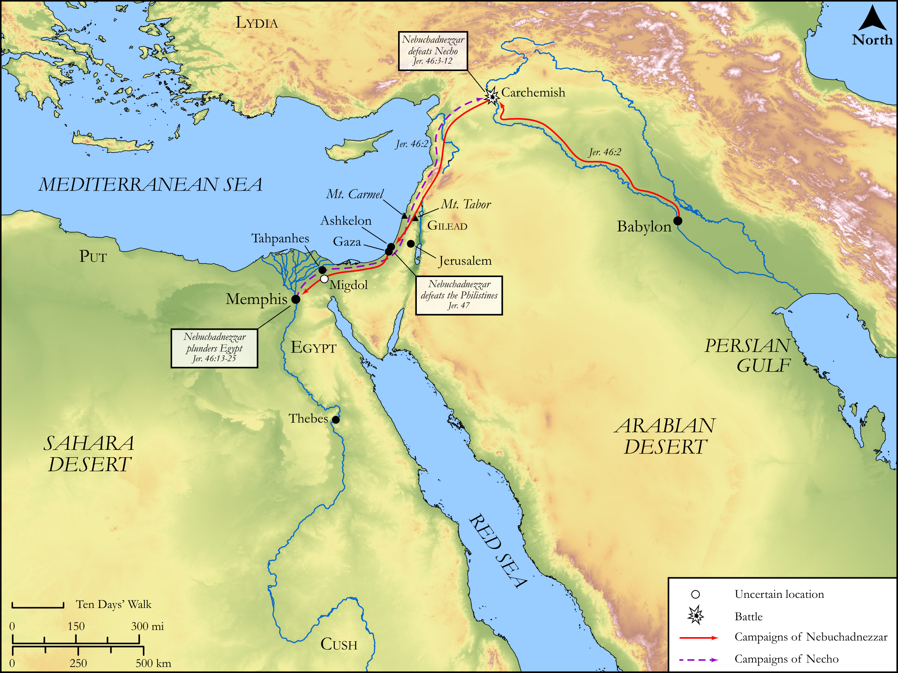

# Biblica Open Bible Maps

## License Information

Biblica Open Bible Maps, © 2023–2025 Biblica, Inc. This work is licensed under Creative Commons Attribution-ShareAlike 4.0 International (https://creativecommons.org/licenses/by-sa/4.0/). More Information: https://docs.google.com/document/d/1Pp44yZ0Zdnd59vJHTrt2rPYq0SppfX5rZbPBt6mz37U/edit?tab=t.0#heading=h.oev9aj1ksvk2

--------------------------------

## Wisdom & Prophets: Prophecy Against the Egyptians and Philistines (id: OT198)

### Image Content

[link](images/OT198.png)

Original: [Wisdom \& Prophets: Prophecy Against the Egyptians and Philistines](https://drive.google.com/file/d/1lkvaoTg1Phi0DRyHOtNGRIvm8TTQ2AM0/view?usp=drive_link)

* **Associated Passages:** Jeremiah 46:1-47:7

* **Associated ACAI Concepts:** LORD (ID: `deity:Lord`); Egypt (ID: `place:Egypt`); Neco (ID: `person:Neco`); Babylon (ID: `place:Babylon`); Israel (ID: `person:Israel`); Jeremiah (ID: `person:Jeremiah.6`); Nebuchadnezzar (ID: `person:Nebuchadnezzar`); Euphrates River (ID: `place:Euphrates`); Horse (ID: `fauna:Horse`); Word of the Lord (ID: `keyterm:WordOfTheLord`); Philistines (ID: `group:Philistine`); Memphis (ID: `place:Memphis`); Philistia (ID: `place:Philistine`); Gaza (ID: `place:Gaza`); Ashkelon (ID: `place:Ashkelon`); Nile River (ID: `place:Nile`); Fear (ID: `keyterm:Fear`); Small Shield (ID: `realia:SmallShield`); Lud (ID: `person:Lud`); Alas! (ID: `keyterm:Alas`); Thebes (ID: `place:Thebes`); Amon (ID: `deity:Amon`); Mighty One (ID: `keyterm:MightyOne`); Pronounce Innocent (ID: `keyterm:PronounceInnocent`); Carchemish (ID: `place:Carchemish`); Molten Image (ID: `realia:MoltenImage`); Chariot (ID: `realia:Chariot`); Cattle (ID: `fauna:Bull`); Sword (ID: `realia:Sword`); Crete (ID: `place:Crete`); Tahpanhes (ID: `place:Tahpanhes`); Gentiles (ID: `group:Gentile`); Slaughtering (ID: `keyterm:Slaughtering`); Carmel (ID: `place:Carmel`); Tribe of Judah (ID: `group:Judah`); Mount Tabor (ID: `place:TaborMount`); Judah (ID: `person:Judah.4`); Sidon (ID: `place:Sidon`); Migdol (ID: `place:Migdol`); Cush (ID: `place:Cush.2`); Josiah (ID: `person:Josiah`); Tyre (ID: `place:Tyre`); Put (ID: `place:Put`); Jehoiakim (ID: `person:Jehoiakim`); Visitation (ID: `keyterm:Visitation`); Gilead (ID: `place:Gilead`); Trust (ID: `keyterm:LeanOn`); Ludim (ID: `group:Ludim`); Appoint (ID: `keyterm:Appoint`); Hophra (ID: `person:Hophra`); Gadfly (ID: `fauna:Gadfly`); Axe (ID: `realia:Axe`); Helmet (ID: `realia:Helmet`); Wagon (ID: `realia:Wagon`); Snake (ID: `fauna:Snake`); Large Shield (ID: `realia:LargeShield`); Sandalwood (ID: `flora:Sandalwood`); Animal Pen (ID: `realia:AnimalPen`); Liquidambar (ID: `flora:Liquidambar`); Sheath (ID: `realia:Sheath`); Spear (ID: `realia:Spear`); Bow (ID: `realia:Bow`); Locust (ID: `fauna:Locust`)
