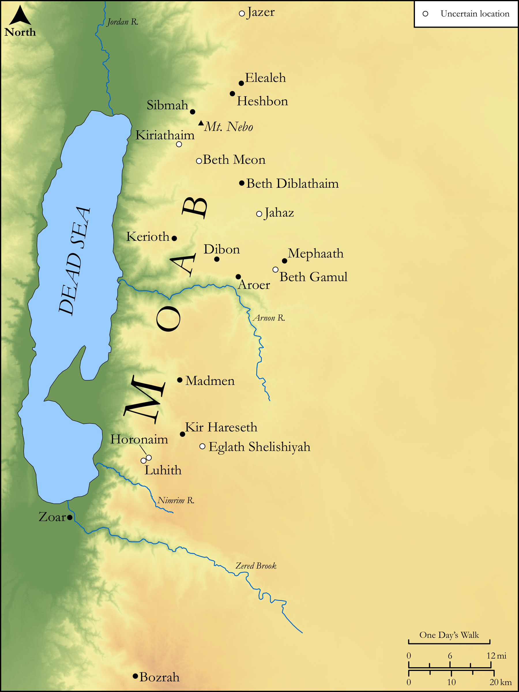

# Biblica Open Bible Maps

## License Information

Biblica Open Bible Maps, © 2023–2025 Biblica, Inc. This work is licensed under Creative Commons Attribution-ShareAlike 4.0 International (<a href="https://creativecommons.org/licenses/by-sa/4.0/">https://creativecommons.org/licenses/by-sa/4.0/</a>). More Information: <a href="https://docs.google.com/document/d/1Pp44yZ0Zdnd59vJHTrt2rPYq0SppfX5rZbPBt6mz37U/edit?tab=t.0#heading=h.oev9aj1ksvk2">https://docs.google.com/document/d/1Pp44yZ0Zdnd59vJHTrt2rPYq0SppfX5rZbPBt6mz37U/edit?tab=t.0#heading=h.oev9aj1ksvk2</a>

--------------------------------

## Wisdom & Prophets: Prophecy Against Moab (id: OT199)

### Image Content

[link](images/OT199.png)

Original: [Wisdom \& Prophets: Prophecy Against Moab](https://drive.google.com/file/d/1mCgkS9tygT-gTOPcCZWjIId6Kg5EANTj/view?usp=drive_link)

* **Associated Passages:** Jeremiah 48:1-47

* **Associated ACAI Concepts:** Moab (ID: `place:Moab`); LORD (ID: `deity:Lord`); Kiriathaim (ID: `place:Kiriathaim`); Chemosh (ID: `deity:Chemosh`); Horonaim (ID: `place:Horonaim`); Heshbon (ID: `place:Heshbon`); Israel (ID: `person:Israel`); Jahaz (ID: `place:Jahaz`); Nebo (ID: `place:Nebo`); Dibon (ID: `place:Dibon`); Kir (ID: `place:Kir`); Sea of Jazer (ID: `place:JazerSea`); Beth-diblathaim (ID: `place:Beth-diblathaim`); Sibmah (ID: `place:Sibmah`); Holon (ID: `place:Holon.2`); Mephaath (ID: `place:Mephaath`); Luhith (ID: `place:Luhith`); Baal-meon (ID: `place:Baal-meon`); Waters of Nimrim (ID: `place:Nimrim`); Jazer (ID: `place:Jazer`); Beth-gamul (ID: `place:Beth-gamul`); Madmen (ID: `place:Madmen`); Zoar (ID: `place:Zoar`); Deceit (ID: `keyterm:Deceit`); Woe (ID: `keyterm:Woe.2`); Woe (ID: `keyterm:Woe`); Bethel (ID: `place:Bethel`); Trust (ID: `keyterm:LeanOn`); Visitation (ID: `keyterm:Visitation`); Glory (ID: `keyterm:Glory`); Aroer (ID: `place:Aroer.2`); Bezer (ID: `place:Bezer`); Elealeh (ID: `place:Elealeh`); Safety (ID: `keyterm:Safety`); Sihon (ID: `person:Sihon`); Arnon (ID: `place:Arnon`); Horn (ID: `keyterm:Horn`); To Curse (ID: `keyterm:Curse`); Strength (ID: `keyterm:Strength`); Wine (ID: `realia:Wine`); Vine (ID: `flora:Vine`); Trap (ID: `realia:Trap`); Phoenician Juniper (ID: `flora:JuniperTree`); Sword (ID: `realia:Sword`); Flute (ID: `realia:Flute`); Sheep (ID: `fauna:Lamb`); Winepress (ID: `realia:Winepress`); Stone Pine (ID: `flora:Pine`); Staff (ID: `realia:Staff`); Fortress (ID: `realia:Fortress`); Rod (ID: `realia:Rod`); Dove (ID: `fauna:Dove`); Wild Donkey (ID: `fauna:WildDonkey`); Sackcloth (ID: `realia:Sackcloth`); High Place (ID: `realia:HighPlace`); Vulture (ID: `fauna:Vulture`); Clay Jar (ID: `realia:ClayJar`)
