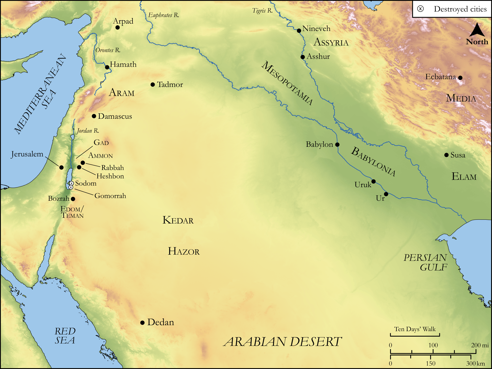

# Biblica Open Bible Maps

## License Information

Biblica Open Bible Maps, © 2023–2025 Biblica, Inc. This work is licensed under Creative Commons Attribution-ShareAlike 4.0 International (https://creativecommons.org/licenses/by-sa/4.0/). More Information: https://docs.google.com/document/d/1Pp44yZ0Zdnd59vJHTrt2rPYq0SppfX5rZbPBt6mz37U/edit?tab=t.0#heading=h.oev9aj1ksvk2

--------------------------------

## Wisdom & Prophets: Prophecies Against Ammon and Others (id: OT200)

### Image Content

[link](images/OT200.png)

Original: [Wisdom \& Prophets: Prophecies Against Ammon and Others](https://drive.google.com/file/d/1XgajippBjZB_yW6x-j4oKSSETNjMo09z/view?usp=drive_link)

* **Associated Passages:** Jeremiah 49:1-39

* **Associated ACAI Concepts:** LORD (ID: `deity:Lord`); Edom (ID: `place:Edom`); Elam (ID: `place:Elam`); Ammon (ID: `place:Ammon`); Hazor (ID: `place:Hazor.5`); Ammonites (ID: `group:Ammon`); Damascus (ID: `place:Damascus`); Counsel (ID: `keyterm:Counsel`); Bozrah (ID: `place:Bozrah.2`); Teman (ID: `place:Teman`); Babylon (ID: `place:Babylon`); Israel (ID: `person:Israel`); Edomites (ID: `group:Edom`); Nebuchadnezzar (ID: `person:Nebuchadnezzar`); Dispossess (ID: `keyterm:Dispossess`); Trust (ID: `keyterm:LeanOn`); Molech (ID: `deity:Molech`); Appoint (ID: `keyterm:Appoint`); Ai (ID: `place:Ai.2`); Kedar (ID: `person:Kedar`); Flock (ID: `fauna:Flock`); Camel (ID: `fauna:Camel`); Goat (ID: `fauna:Goat`); Vulture (ID: `fauna:Vulture`); Ben-hadad (ID: `person:Ben-hadad`); Dedan (ID: `place:Dedan`); Zedekiah (ID: `person:Zedekiah.3`); Word of the Lord (ID: `keyterm:WordOfTheLord`); Perceive (ID: `keyterm:Perceive`); Swear (ID: `keyterm:Swear`); Be Blameless (ID: `keyterm:Blameless`); Gomorrah (ID: `place:Gomorrah`); Ability (ID: `keyterm:Ability`); Tribe of Judah (ID: `group:Judah`); Jeremiah (ID: `person:Jeremiah.6`); Judah (ID: `person:Judah.4`); Safety (ID: `keyterm:Safety`); Hamath (ID: `place:Hamath`); Red Sea (ID: `place:RedSea`); Arpad (ID: `place:Arpad`); Gad (ID: `person:Gad`); Sodom (ID: `place:Sodom`); Jordan River (ID: `place:Jordan`); Heshbon (ID: `place:Heshbon`); Goat Hair Strips (ID: `realia:GoatHairStrips`); Sheepfold (ID: `realia:Sheepfold`); Cattails (ID: `flora:Cattails`); Lion (ID: `fauna:Lion`); Jackal (ID: `fauna:Jackal`); Sackcloth (ID: `realia:Sackcloth`); Sheep (ID: `fauna:Lamb`); Tent (ID: `realia:Tent`); Bow (ID: `realia:Bow`); Linen Strips (ID: `realia:LinenStrips`)
