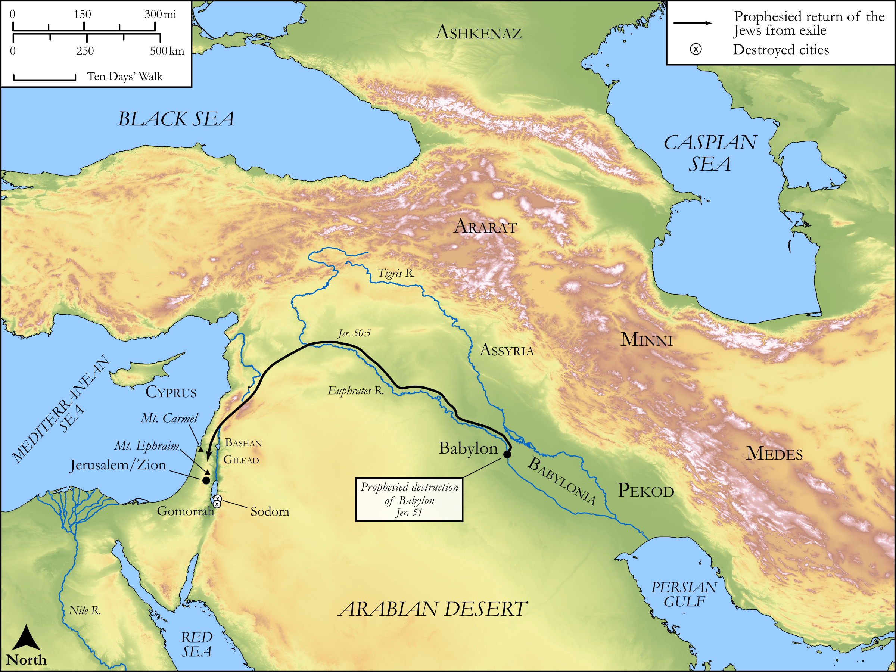

# Biblica Open Bible Maps

## License Information

Biblica Open Bible Maps, © 2023–2025 Biblica, Inc. This work is licensed under Creative Commons Attribution-ShareAlike 4.0 International (https://creativecommons.org/licenses/by-sa/4.0/). More Information: https://docs.google.com/document/d/1Pp44yZ0Zdnd59vJHTrt2rPYq0SppfX5rZbPBt6mz37U/edit?tab=t.0#heading=h.oev9aj1ksvk2

--------------------------------

## Wisdom & Prophets: Prophecy Against Babylon (id: OT201)

### Image Content

[link](images/OT201.png)

Original: [Wisdom \& Prophets: Prophecy Against Babylon](https://drive.google.com/file/d/1yWOqZYW5SbmbSVYyfGv3dHAhSP22OYFv/view?usp=drive_link)

* **Associated Passages:** Jeremiah 50:1-51:64

* **Associated ACAI Concepts:** Babylon (ID: `place:Babylon`); LORD (ID: `deity:Lord`); Israel (ID: `person:Israel`); Chaldea (ID: `place:Chaldea`); Appoint (ID: `keyterm:Appoint`); Chaldeans (ID: `group:Chaldea`); Jerusalem (ID: `place:Jerusalem`); Jeremiah (ID: `person:Jeremiah.6`); Judah (ID: `person:Judah.4`); Tribe of Judah (ID: `group:Judah`); Holy (ID: `keyterm:Holy`); Sheep (ID: `fauna:Lamb`); Bow (ID: `realia:Bow`); Flock (ID: `fauna:Flock`); Horse (ID: `fauna:Horse`); Goat (ID: `fauna:Goat`); To Sin (ID: `keyterm:Sin`); Arrow (ID: `keyterm:Arrow`); Graven Image (ID: `realia:GravenImage`); Seraiah (ID: `person:Seraiah.8`); Bel (ID: `deity:Bel`); To Cause to Possess (ID: `keyterm:Possess`); Medes (ID: `group:Mede`); Medan (ID: `person:Medan`); Assyria (ID: `place:Assyria`); Visitation (ID: `keyterm:Visitation`); Passion (ID: `keyterm:Ardour`); Nebuchadnezzar (ID: `person:Nebuchadnezzar`); Lion (ID: `fauna:Lion`); Standard (ID: `realia:Standard`)
