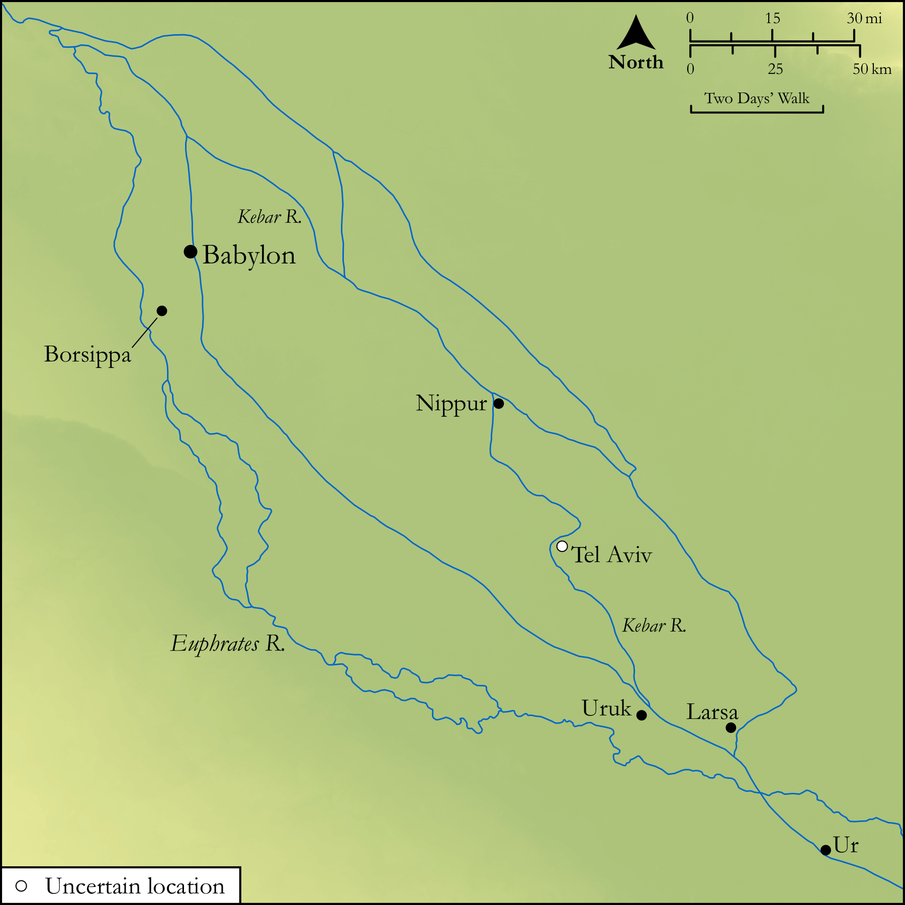

# Biblica Open Bible Maps

## License Information

Biblica Open Bible Maps, © 2023–2025 Biblica, Inc. This work is licensed under Creative Commons Attribution-ShareAlike 4.0 International (https://creativecommons.org/licenses/by-sa/4.0/). More Information: https://docs.google.com/document/d/1Pp44yZ0Zdnd59vJHTrt2rPYq0SppfX5rZbPBt6mz37U/edit?tab=t.0#heading=h.oev9aj1ksvk2

--------------------------------

## Wisdom & Prophets: Ezekiel’s Vision by the Kebar (id: OT202)

### Image Content

[link](images/OT202.png)

Original: [Wisdom \& Prophets: Ezekiel’s Vision by the Kebar](https://drive.google.com/file/d/1Rhm-KF_1cqdbwtEDeENa78kdwS5NNyUR/view?usp=drive_link)

* **Associated Passages:** Ezekiel 1:1-3:27

* **Associated ACAI Concepts:** LORD (ID: `deity:Lord`); Israel (ID: `person:Israel`); Kebar (ID: `place:Chebar`); Wagon (ID: `realia:Wagon`); Fear (ID: `keyterm:Fear`); Glory (ID: `keyterm:Glory`); Scroll (ID: `realia:Scroll`); Word of the Lord (ID: `keyterm:WordOfTheLord`); To Sin (ID: `keyterm:Sin`); Passion (ID: `keyterm:Ardour`); Ezekiel (ID: `person:Ezekiel`); Rebel (ID: `keyterm:Rebel`); Vision (ID: `keyterm:Vision`); Tel-abib (ID: `place:Tel-abib`); Buzi (ID: `person:Buzi`); Lamentation (ID: `keyterm:Lamentation`); Chaldeans (ID: `group:Chaldea`); Jehoiachin (ID: `person:Jehoiachin`); Bless (ID: `keyterm:Bless`); Chaldea (ID: `place:Chaldea`); Cattle (ID: `fauna:Bull`); Wheel (ID: `realia:Wheel`); Nettle (ID: `flora:Nettle`); Molten Image (ID: `realia:MoltenImage`); Lion (ID: `fauna:Lion`); Throne (ID: `realia:Throne`); Brier (ID: `flora:Brier`); House (ID: `realia:House`); Scorpion (ID: `fauna:Scorpion`); Rope (ID: `realia:Rope`)
