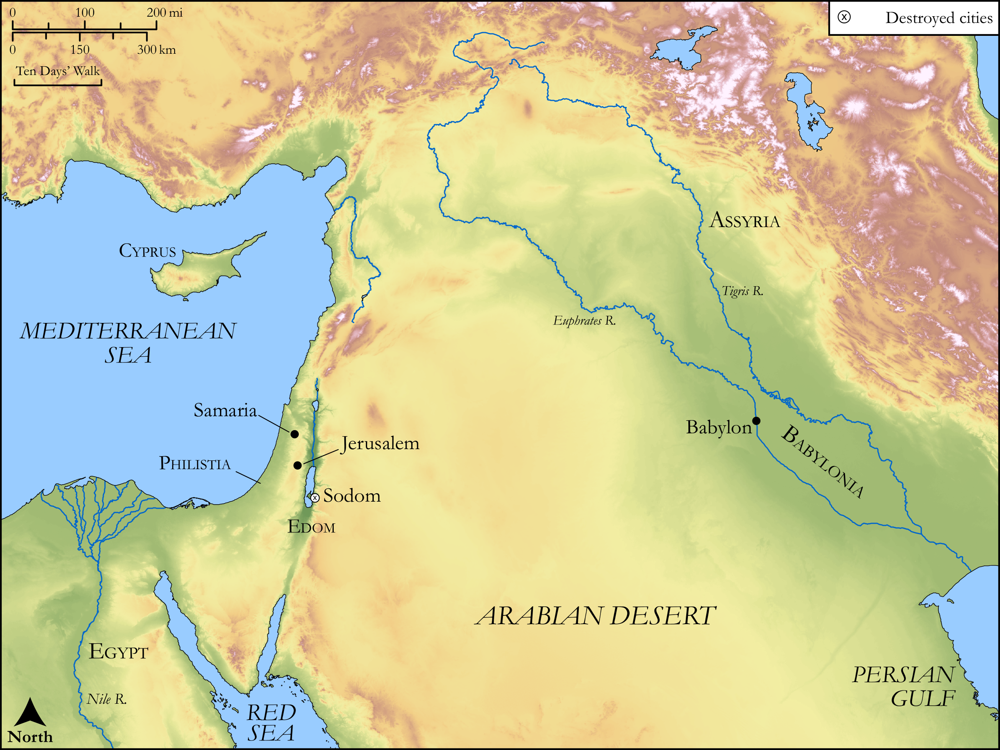

# Biblica Open Bible Maps

## License Information

Biblica Open Bible Maps, © 2023–2025 Biblica, Inc. This work is licensed under Creative Commons Attribution-ShareAlike 4.0 International (https://creativecommons.org/licenses/by-sa/4.0/). More Information: https://docs.google.com/document/d/1Pp44yZ0Zdnd59vJHTrt2rPYq0SppfX5rZbPBt6mz37U/edit?tab=t.0#heading=h.oev9aj1ksvk2

--------------------------------

## Wisdom & Prophets: Jerusalem the Adulterous Wife (id: OT203)

### Image Content

[link](images/OT203.png)

Original: [Wisdom \& Prophets: Jerusalem the Adulterous Wife](https://drive.google.com/file/d/1AO3foYpUIHsKuwSrqtYKrt9VEkX0yP8D/view?usp=drive_link)

* **Associated Passages:** Ezekiel 16:1-63

* **Associated ACAI Concepts:** LORD (ID: `deity:Lord`); Fornication (ID: `keyterm:Fornication`); Play the Prostitute (ID: `keyterm:PlayTheProstitute`); Sodom (ID: `place:Sodom`); Covenant (ID: `keyterm:Covenant`); Samaria (ID: `place:Samaria`); High Place (ID: `realia:HighPlace`); Love (ID: `keyterm:Love`); Passion (ID: `keyterm:Ardour`); Anointing Oil (ID: `realia:AnointingOil`); Olive Oil (ID: `realia:OliveOil`); Canaan (ID: `place:Canaan`); Word of the Lord (ID: `keyterm:WordOfTheLord`); Philistines (ID: `group:Philistine`); Hittites (ID: `group:Hittite`); Philistia (ID: `place:Philistine`); Amorites (ID: `group:Amorites`); Heth (ID: `person:Heth`); To Sin (ID: `keyterm:Sin`); Be (Or Show Oneself) Just (ID: `keyterm:Just`); Jerusalem (ID: `place:Jerusalem`); Embroidered Cloth (ID: `realia:EmbroideredCloth`); Silk (ID: `realia:Silk`); Forgive (ID: `keyterm:Forgive`); Swear (ID: `keyterm:Swear`); Assyria (ID: `place:Assyria`); Woe (ID: `keyterm:Woe`); Canaanites (ID: `group:Canaan`); Egypt (ID: `place:Egypt`); Pleasing Odor (ID: `keyterm:PleasingOdor`)
