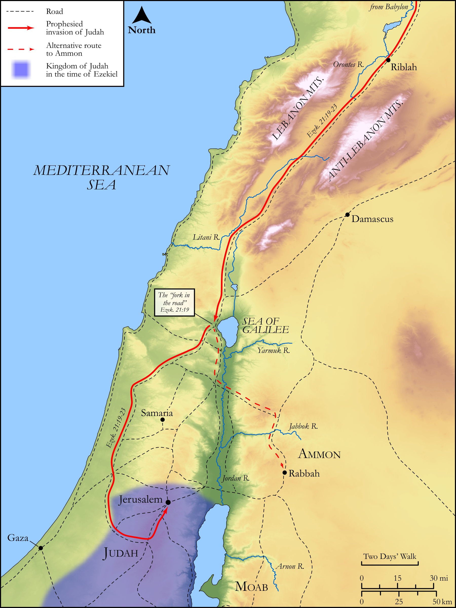

# Biblica Open Bible Maps

## License Information

Biblica Open Bible Maps, © 2023–2025 Biblica, Inc. This work is licensed under Creative Commons Attribution-ShareAlike 4.0 International (https://creativecommons.org/licenses/by-sa/4.0/). More Information: https://docs.google.com/document/d/1Pp44yZ0Zdnd59vJHTrt2rPYq0SppfX5rZbPBt6mz37U/edit?tab=t.0#heading=h.oev9aj1ksvk2

--------------------------------

## Wisdom & Prophets: The Sword and the Signpost (id: OT204)

### Image Content

[link](images/OT204.png)

Original: [Wisdom \& Prophets: The Sword and the Signpost](https://drive.google.com/file/d/1mWcPkjFmi9UcZ6TDMLe4wi_oNwOgolsf/view?usp=drive_link)

* **Associated Passages:** Ezekiel 21:1-37

* **Associated ACAI Concepts:** LORD (ID: `deity:Lord`); Sword (ID: `realia:Sword`); Speak as a Prophet (ID: `keyterm:Speak`); Passion (ID: `keyterm:Ardour`); Israel (ID: `person:Israel`); Sheath (ID: `realia:Sheath`); Word of the Lord (ID: `keyterm:WordOfTheLord`); Jerusalem (ID: `place:Jerusalem`); Practice Divination (ID: `keyterm:PracticeDivination`); Ammon (ID: `place:Ammon`); Ammonites (ID: `group:Ammon`); Babylon (ID: `place:Babylon`); Fee for Divination (ID: `keyterm:FeeForDivination`); To Sin (ID: `keyterm:Sin`); Judah (ID: `person:Judah.4`); Tribe of Judah (ID: `group:Judah`); Have a Vision (ID: `keyterm:HaveAVision`); Rebel (ID: `keyterm:Rebel`); Teraphim (ID: `deity:Teraphim`); Turban (ID: `realia:Turban`); Siege-Works (ID: `realia:Siege-works`); Battering-Ram (ID: `realia:Battering-ram`); Crown (ID: `realia:Crown`); Household Idols (ID: `realia:HouseholdIdols`); Arrow (ID: `realia:Arrow`); Siege Ramp (ID: `realia:SiegeRamp`)
