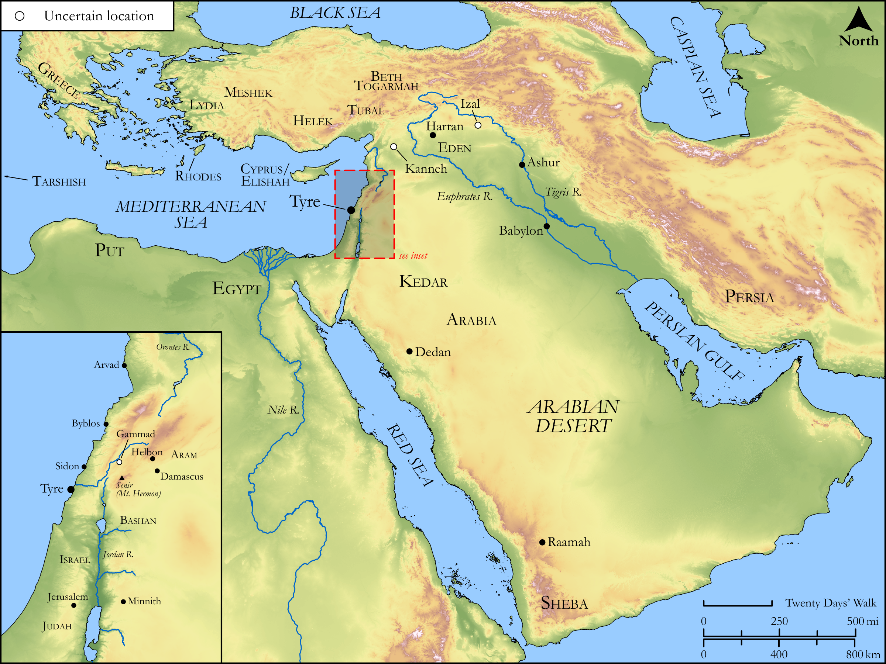

# Biblica Open Bible Maps

## License Information

Biblica Open Bible Maps, © 2023–2025 Biblica, Inc. This work is licensed under Creative Commons Attribution-ShareAlike 4.0 International (https://creativecommons.org/licenses/by-sa/4.0/). More Information: https://docs.google.com/document/d/1Pp44yZ0Zdnd59vJHTrt2rPYq0SppfX5rZbPBt6mz37U/edit?tab=t.0#heading=h.oev9aj1ksvk2

--------------------------------

## Wisdom & Prophets: A Lament Over Tyre (id: OT207)

### Image Content

[link](images/OT207.png)

Original: [Wisdom \& Prophets: A Lament Over Tyre](https://drive.google.com/file/d/1yOHx9FzgWa0pievD7U0BYaMswVFJ8gug/view?usp=drive_link)

* **Associated Passages:** Ezekiel 26:1-28:26

* **Associated ACAI Concepts:** LORD (ID: `deity:Lord`); Tyre (ID: `place:Tyre`); Word of the Lord (ID: `keyterm:WordOfTheLord`); Ability (ID: `keyterm:Ability`); Lamentation (ID: `keyterm:Lamentation`); Sidon (ID: `place:Sidon`); Israel (ID: `person:Israel`); Embroidered Cloth (ID: `realia:EmbroideredCloth`); Horse (ID: `fauna:Horse`); Arvad (ID: `place:Arvad`); Cyprus (ID: `place:Cyprus`); To Dishonor (ID: `keyterm:Dishonor`); Tarshish (ID: `place:Tarshish`); Holy (ID: `keyterm:Holy`); Sheba (ID: `place:Sheba.2`); Dedan (ID: `place:Dedan`); Purple Cloth (ID: `realia:PurpleCloth`); Ship (ID: `realia:Ship`); Tower (ID: `realia:Tower`); Haran (ID: `place:Haran`); Gammad (ID: `place:Gamad`); Helbon (ID: `place:Helbon`); Raamah (ID: `place:Raamah`); Put (ID: `place:Put`); Zahar (ID: `place:Sahar`); Minnith (ID: `place:Minnith`); Calneh (ID: `place:Calneh`); Beth-togarmah (ID: `place:Beth-togarmah`); Lud (ID: `person:Lud`); Izal (ID: `place:Uzal`)
