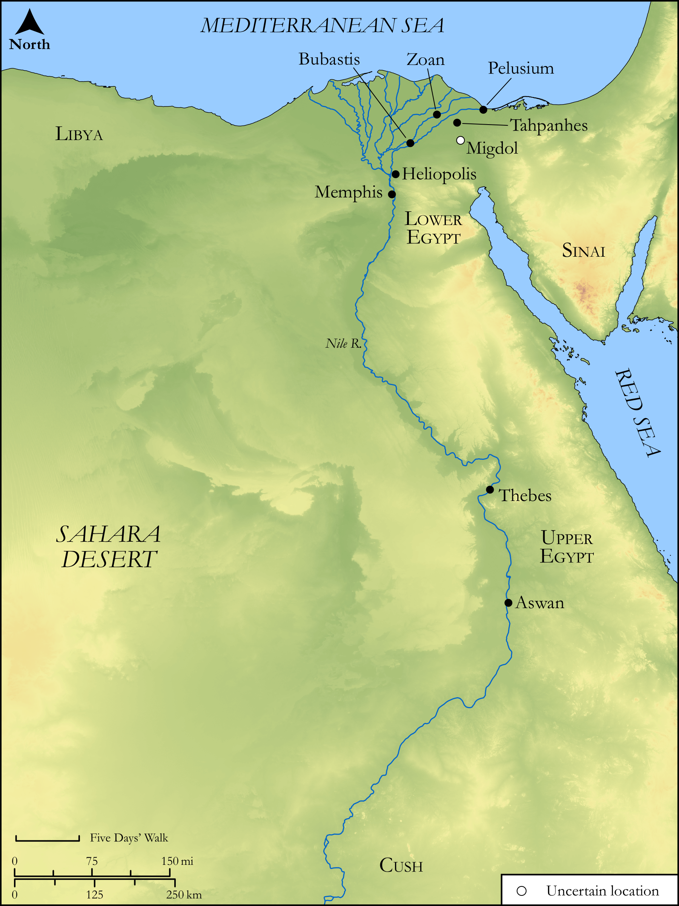

# Biblica Open Bible Maps

## License Information

Biblica Open Bible Maps, © 2023–2025 Biblica, Inc. This work is licensed under Creative Commons Attribution-ShareAlike 4.0 International (https://creativecommons.org/licenses/by-sa/4.0/). More Information: https://docs.google.com/document/d/1Pp44yZ0Zdnd59vJHTrt2rPYq0SppfX5rZbPBt6mz37U/edit?tab=t.0#heading=h.oev9aj1ksvk2

--------------------------------

## Wisdom & Prophets: A Lament Over Egypt (id: OT208)

### Image Content

[link](images/OT208.png)

Original: [Wisdom \& Prophets: A Lament Over Egypt](https://drive.google.com/open?id=1L3lrkFnXmycnHxKykVVbA_q7dJaC3F8M&usp=drive_copy)

* **Associated Passages:** Ezekiel 30:1-26

* **Associated ACAI Concepts:** Egypt (ID: `place:Egypt`); LORD (ID: `deity:Lord`); Hophra (ID: `person:Hophra`); Sword (ID: `realia:Sword`); Cush (ID: `place:Cush.2`); Babylon (ID: `place:Babylon`); Thebes (ID: `place:Thebes`); Pelusium (ID: `place:Pelusium`); Memphis (ID: `place:Memphis`); Word of the Lord (ID: `keyterm:WordOfTheLord`); Zoan (ID: `place:Zoan`); Libya (ID: `place:Libya`); Pi-beseth (ID: `place:Pi-beseth`); Pathros (ID: `place:Pathros`); Put (ID: `place:Put`); Syene (ID: `place:Syene`); Tahpanhes (ID: `place:Tahpanhes`); Lud (ID: `person:Lud`); Covenant (ID: `keyterm:Covenant`); An Angel (ID: `deity:Angel`); Arabia (ID: `place:Arabia`); Speak as a Prophet (ID: `keyterm:Speak`); Migdol (ID: `place:Migdol`); Mighty (ID: `keyterm:Mighty.2`); Fear (ID: `keyterm:Fear`); Safety (ID: `keyterm:Safety`); Nebuchadnezzar (ID: `person:Nebuchadnezzar`); Idol (ID: `keyterm:Idol`); Nile River (ID: `place:Nile`); On (ID: `place:On`); Fortress (ID: `realia:Fortress`); Image (ID: `realia:Image`); Ship (ID: `realia:Ship`); Yoke (ID: `realia:Yoke`)
