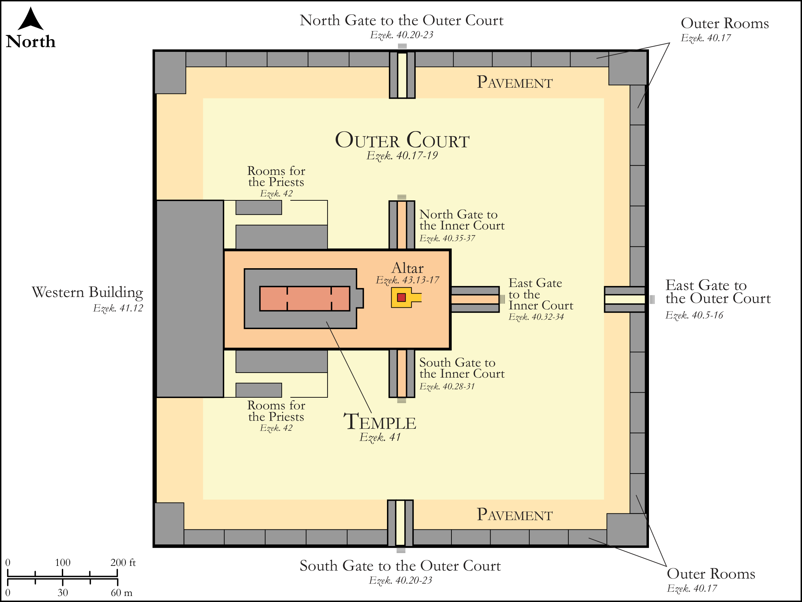

# Biblica Open Bible Maps

## License Information

Biblica Open Bible Maps, © 2023–2025 Biblica, Inc. This work is licensed under Creative Commons Attribution-ShareAlike 4.0 International (https://creativecommons.org/licenses/by-sa/4.0/). More Information: https://docs.google.com/document/d/1Pp44yZ0Zdnd59vJHTrt2rPYq0SppfX5rZbPBt6mz37U/edit?tab=t.0#heading=h.oev9aj1ksvk2

--------------------------------

## Wisdom & Prophets: Building Plan: Ezekiel's Temple (id: OT210)

### Image Content

[link](images/OT210.png)

Original: [Wisdom \& Prophets: Building Plan: Ezekiel's Temple](https://drive.google.com/open?id=1d9sB-RpPY9DzC6A2B2rwulyQ57Jqt61a&usp=drive_copy)

* **Associated Passages:** Ezekiel 40:1-43:27

* **Associated ACAI Concepts:** Cubit (ID: `realia:Cubit`); LORD (ID: `deity:Lord`); Offering (ID: `keyterm:Offering`); House (ID: `realia:House`); To Sin (ID: `keyterm:Sin`); Israel (ID: `person:Israel`); Entrance (ID: `realia:Entrance`); Reed (ID: `realia:Reed`); Date Palm (ID: `flora:DatePalm`); Measuring Reed (ID: `realia:MeasuringReed`); Reed (ID: `flora:Reed`); Stone Altar (ID: `realia:StoneAltar`); Window (ID: `realia:Window`); Temple Altar (ID: `realia:TempleAltar`); Tabernacle Altar (ID: `realia:TabernacleAltar`); Altar (ID: `realia:Altar`); Room (ID: `realia:Room`); Cattle (ID: `fauna:Bull`); Glory (ID: `keyterm:Glory`); Complete (ID: `keyterm:Complete`); To Cleanse (ID: `keyterm:Cleanse.2`); Holy Place (ID: `place:HolyPlace`); Doorstep (ID: `realia:Doorstep`); Appease (ID: `keyterm:Appease`); Zadok (ID: `person:Zadok.2`); Vision (ID: `keyterm:Vision`); Tribe of Levi (ID: `group:Levi`); Defilement (ID: `keyterm:Defilement`); Instruction (ID: `keyterm:Instruction`); Levi (ID: `person:Levi.3`)
