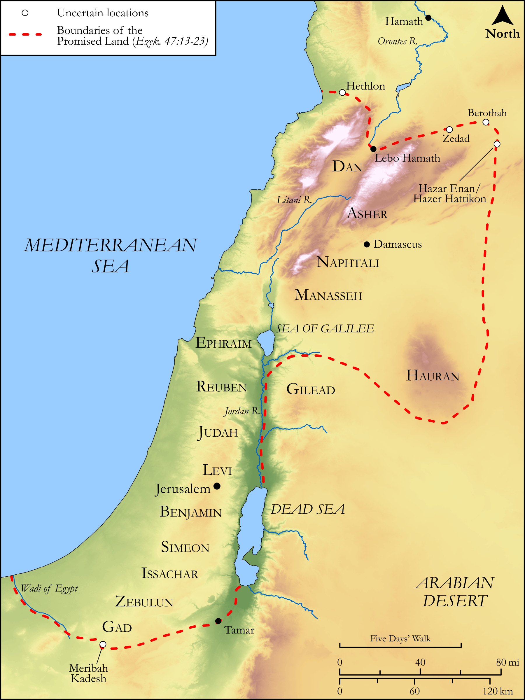

# Biblica Open Bible Maps

## License Information

Biblica Open Bible Maps, © 2023–2025 Biblica, Inc. This work is licensed under Creative Commons Attribution-ShareAlike 4.0 International (https://creativecommons.org/licenses/by-sa/4.0/). More Information: https://docs.google.com/document/d/1Pp44yZ0Zdnd59vJHTrt2rPYq0SppfX5rZbPBt6mz37U/edit?tab=t.0#heading=h.oev9aj1ksvk2

--------------------------------

## Wisdom & Prophets: Ezekiel’s Promised Land (id: OT211)

### Image Content

[link](images/OT211.png)

Original: [Wisdom \& Prophets: Ezekiel’s Promised Land](https://drive.google.com/open?id=1b-FXN8plg54eMiQdAdh7Fu7ILVclhSEV&usp=drive_copy)

* **Associated Passages:** Ezekiel 47:1-48:35

* **Associated ACAI Concepts:** Israel (ID: `person:Israel`); LORD (ID: `deity:Lord`); Offering (ID: `keyterm:Offering`); To Cause to Possess (ID: `keyterm:Possess`); Mediterranean Sea (ID: `place:GreatSea`); Levi (ID: `person:Levi.3`); Hamath (ID: `place:Hamath`); Tribe of Levi (ID: `group:Levi`); Damascus (ID: `place:Damascus`); Judah (ID: `person:Judah.4`); Benjamin (ID: `person:Benjamin`); Tribe of Benjamin (ID: `group:Benjamin`); Tribe of Judah (ID: `group:Judah`); Tribe of Naphtali (ID: `group:Naphtali`); Issachar (ID: `person:Issachar`); Tribe of Zebulun (ID: `group:Zebulun`); Tribe of Dan (ID: `group:Dan`); Tribe of Simeon (ID: `group:Simeon`); Tribe of Reuben (ID: `group:Reuben`); Tribe of Asher (ID: `group:Asher`); Simeon (ID: `person:Simeon.5`); Gad (ID: `person:Gad`); Reuben (ID: `person:Reuben`); Dan (ID: `place:Dan`); Tribe of Issachar (ID: `group:Issachar`); Asher (ID: `person:Asher`); Naphtali (ID: `person:Naphtali`); Zebulun (ID: `person:Zebulun`); Tamar (ID: `place:Tamar.2`); Hauran (ID: `place:Hauran`)
