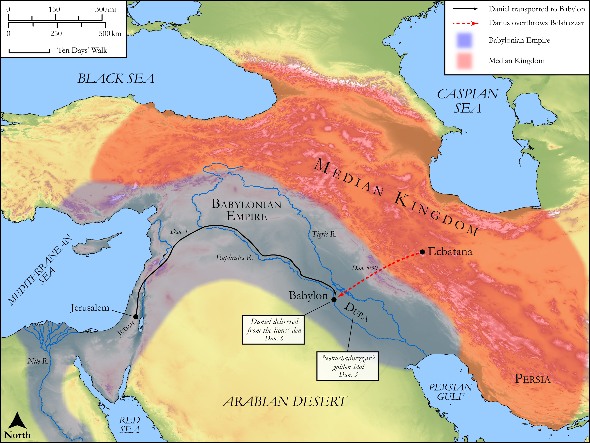

# Biblica Open Bible Maps

## License Information

Biblica Open Bible Maps, © 2023–2025 Biblica, Inc. This work is licensed under Creative Commons Attribution-ShareAlike 4.0 International (https://creativecommons.org/licenses/by-sa/4.0/). More Information: https://docs.google.com/document/d/1Pp44yZ0Zdnd59vJHTrt2rPYq0SppfX5rZbPBt6mz37U/edit?tab=t.0#heading=h.oev9aj1ksvk2

--------------------------------

## Wisdom & Prophets: Daniel in Babylon (id: OT212)

### Image Content

[link](images/OT212.png)

Original: [Wisdom \& Prophets: Daniel in Babylon](https://drive.google.com/open?id=1NpcOKW1jKuifjmapnqnAaVbZf6GhoklM&usp=drive_copy)

* **Associated Passages:** Daniel 1:1-6:29

* **Associated ACAI Concepts:** Daniel (ID: `person:Daniel.3`); Nebuchadnezzar (ID: `person:Nebuchadnezzar`); Azariah (ID: `person:Azariah.20`); Mishael (ID: `person:Mishael.3`); Hananiah (ID: `person:Hananiah.15`); Babylon (ID: `place:Babylon`); LORD (ID: `deity:Lord`); Chaldea (ID: `place:Chaldea`); Astrologers (ID: `group:Astrologer`); Belshazzar (ID: `person:Belshazzar`); Darius (ID: `person:Darius.3`); Judah (ID: `person:Judah.4`); Tribe of Judah (ID: `group:Judah`); Medes (ID: `group:Mede`); Medan (ID: `person:Medan`); Persia (ID: `place:Persia`); Persians (ID: `group:Persia`); House (ID: `realia:House`); Arioch (ID: `person:Arioch.2`); Jerusalem (ID: `place:Jerusalem`); Lion (ID: `fauna:Lion`); Money (ID: `realia:Money`); Chaldeans (ID: `group:Chaldea`); Ability (ID: `keyterm:Ability`); Flute (ID: `realia:Flute`); Rams Horn (ID: `realia:RamsHorn`); Lute (ID: `realia:Lute`); Lyre (ID: `realia:Lyre`); Melzar (ID: `person:Melzar`); Jehoiakim (ID: `person:Jehoiakim`)
