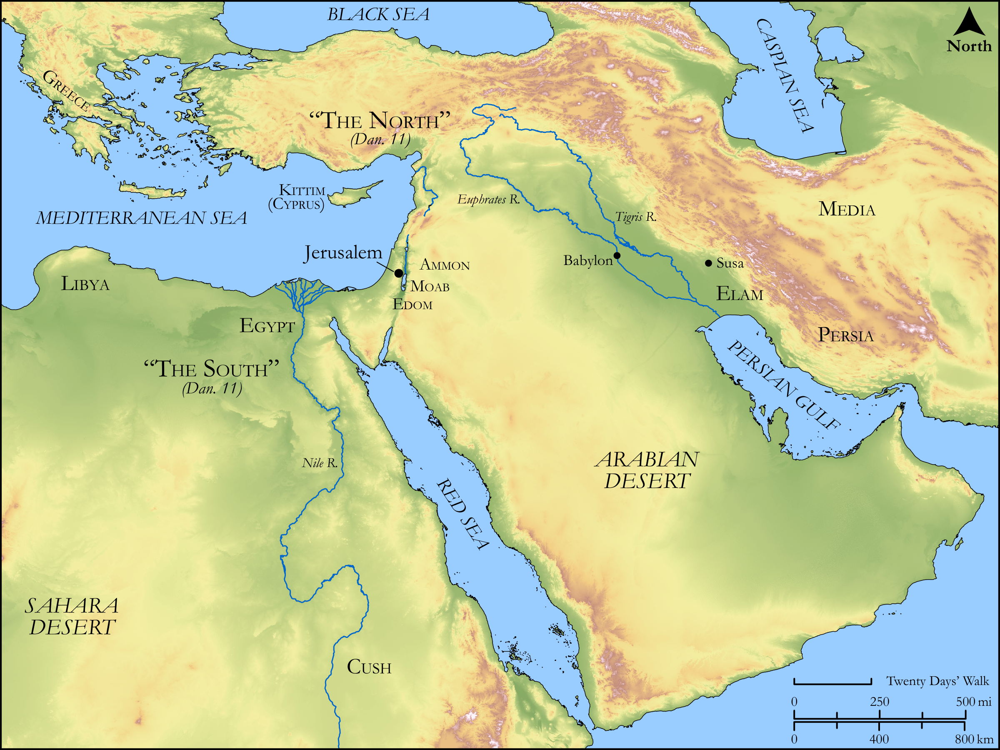

# Biblica Open Bible Maps

## License Information

Biblica Open Bible Maps, © 2023–2025 Biblica, Inc. This work is licensed under Creative Commons Attribution-ShareAlike 4.0 International (<a href="https://creativecommons.org/licenses/by-sa/4.0/">https://creativecommons.org/licenses/by-sa/4.0/</a>). More Information: <a href="https://docs.google.com/document/d/1Pp44yZ0Zdnd59vJHTrt2rPYq0SppfX5rZbPBt6mz37U/edit?tab=t.0#heading=h.oev9aj1ksvk2">https://docs.google.com/document/d/1Pp44yZ0Zdnd59vJHTrt2rPYq0SppfX5rZbPBt6mz37U/edit?tab=t.0#heading=h.oev9aj1ksvk2</a>

--------------------------------

## Wisdom & Prophets: Daniel’s Visions (id: OT213)

### Image Content

[link](images/OT213.png)

Original: [Wisdom \& Prophets: Daniel’s Visions](https://drive.google.com/open?id=1gy7S6hObsXPI4CdPJt4Jwm7if2uYmsRO&usp=drive_copy)

* **Associated Passages:** Daniel 7:1-12:13

* **Associated ACAI Concepts:** LORD (ID: `deity:Lord`); Daniel (ID: `person:Daniel.3`); Perceive (ID: `keyterm:Perceive`); Strength (ID: `keyterm:Strength`); To Sin (ID: `keyterm:Sin`); Have Insight (ID: `keyterm:HaveInsight`); Truth (ID: `keyterm:Truth`); Covenant (ID: `keyterm:Covenant`); Rebel (ID: `keyterm:Rebel`); Plea for Mercy (ID: `keyterm:Supplication`); Jerusalem (ID: `place:Jerusalem`); Persia (ID: `place:Persia`); Sheep (ID: `fauna:Lamb`); Delight (ID: `keyterm:Delight`); Egypt (ID: `place:Egypt`); Fortress (ID: `realia:Fortress`); Michael (ID: `person:Michael.11`); Greece (ID: `place:Greece`); Vision (ID: `keyterm:Vision`); Instruction (ID: `keyterm:Instruction`); Understanding (ID: `keyterm:Understanding`); Fear (ID: `keyterm:Fear`); Detested Thing (ID: `keyterm:DetestedThing`); Passion (ID: `keyterm:Ardour`); To Act Wickedly (ID: `keyterm:ActWickedly`); Israel (ID: `person:Israel`); Scroll (ID: `realia:Scroll`); Ulai (ID: `place:Ulai`); Darius (ID: `person:Darius.3`); Gabriel (ID: `deity:Gabriel`)
