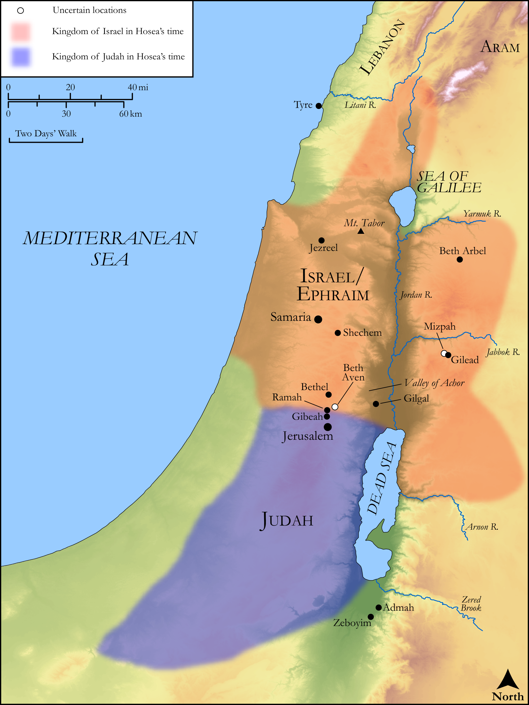

# Biblica Open Bible Maps

## License Information

Biblica Open Bible Maps, © 2023–2025 Biblica, Inc. This work is licensed under Creative Commons Attribution-ShareAlike 4.0 International (https://creativecommons.org/licenses/by-sa/4.0/). More Information: https://docs.google.com/document/d/1Pp44yZ0Zdnd59vJHTrt2rPYq0SppfX5rZbPBt6mz37U/edit?tab=t.0#heading=h.oev9aj1ksvk2

--------------------------------

## Wisdom & Prophets: Hosea (id: OT214)

### Image Content

[link](images/OT214.png)

Original: [Wisdom \& Prophets: Hosea](https://drive.google.com/open?id=1Hp619l1WxRCyj7lswKOP3z2opOUkiodr&usp=drive_copy)

* **Associated Passages:** Hosea 1:1-14:10

* **Associated ACAI Concepts:** LORD (ID: `deity:Lord`); Israel (ID: `person:Israel`); Tribe of Ephraim (ID: `group:Ephraim`); Ephraim (ID: `person:Ephraim`); Love (ID: `keyterm:Love`); Judah (ID: `person:Judah.4`); Tribe of Judah (ID: `group:Judah`); Egypt (ID: `place:Egypt`); Play the Prostitute (ID: `keyterm:PlayTheProstitute`); Passion (ID: `keyterm:Ardour`); Assyria (ID: `place:Assyria`); To Sin (ID: `keyterm:Sin`); Appoint (ID: `keyterm:Appoint`); Kindness (ID: `keyterm:Kindness`); Samaria (ID: `place:Samaria`); Baal (ID: `deity:Baal`); Slaughtering (ID: `keyterm:Slaughtering`); Covenant (ID: `keyterm:Covenant`); Vine (ID: `flora:Vine`); Cattle (ID: `fauna:Bull`); Rebel (ID: `keyterm:Rebel`); Defilement (ID: `keyterm:Defilement`); Grain (ID: `flora:Grain`); Must (ID: `realia:Must`); Molten Image (ID: `realia:MoltenImage`); Temple Altar (ID: `realia:TempleAltar`); Tabernacle Altar (ID: `realia:TabernacleAltar`); Altar (ID: `realia:Altar`); Image (ID: `realia:Image`); Stone Altar (ID: `realia:StoneAltar`)
