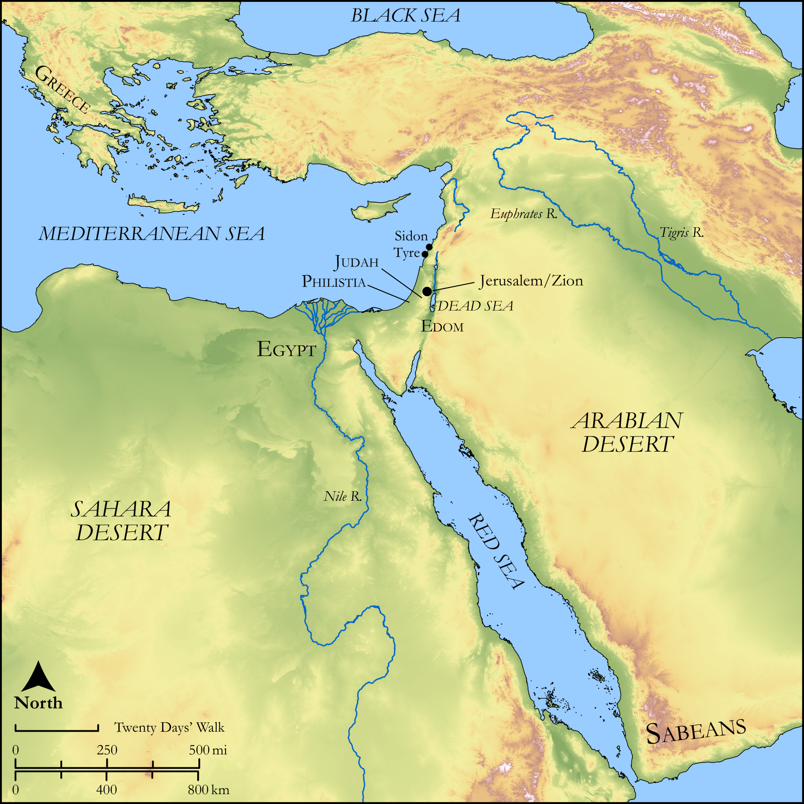

# Biblica Open Bible Maps

## License Information

Biblica Open Bible Maps, © 2023–2025 Biblica, Inc. This work is licensed under Creative Commons Attribution-ShareAlike 4.0 International (https://creativecommons.org/licenses/by-sa/4.0/). More Information: https://docs.google.com/document/d/1Pp44yZ0Zdnd59vJHTrt2rPYq0SppfX5rZbPBt6mz37U/edit?tab=t.0#heading=h.oev9aj1ksvk2

--------------------------------

## Wisdom & Prophets: Joel (id: OT215)

### Image Content

[link](images/OT215.png)

Original: [Wisdom \& Prophets: Joel](https://drive.google.com/open?id=1dQ59h43iQU0CbKFAIEM7z3QGhEofllr-&usp=drive_copy)

* **Associated Passages:** Joel 1:1-4:21

* **Associated ACAI Concepts:** LORD (ID: `deity:Lord`); Jerusalem (ID: `place:Jerusalem`); Judah (ID: `person:Judah.4`); Tribe of Judah (ID: `group:Judah`); Vine (ID: `flora:Vine`); House (ID: `realia:House`); Fear (ID: `keyterm:Fear`); Holy (ID: `keyterm:Holy`); Wine (ID: `realia:Wine`); Offering (ID: `keyterm:Offering`); Israel (ID: `person:Israel`); Must (ID: `realia:Must`); To Cause to Possess (ID: `keyterm:Possess`); Kidron (ID: `place:Kidron`); Olive Tree (ID: `flora:OliveTree`); Anointing Oil (ID: `realia:AnointingOil`); Mule (ID: `fauna:Mule`); Fig (ID: `flora:Fig`); Olive Oil (ID: `realia:OliveOil`); Grain (ID: `flora:Grain`); Sabeans (ID: `group:Sabean`); Joel (ID: `person:Joel.14`); Pethuel (ID: `person:Pethuel`); Valley of Shittim (ID: `place:ShittimValley`); Greeks (ID: `group:Greek`); Javan (ID: `person:Javan`); Egypt (ID: `place:Egypt`); Garden of Eden (ID: `place:Eden.2`); Sidon (ID: `place:Sidon`); Gentiles (ID: `group:Gentile`)
