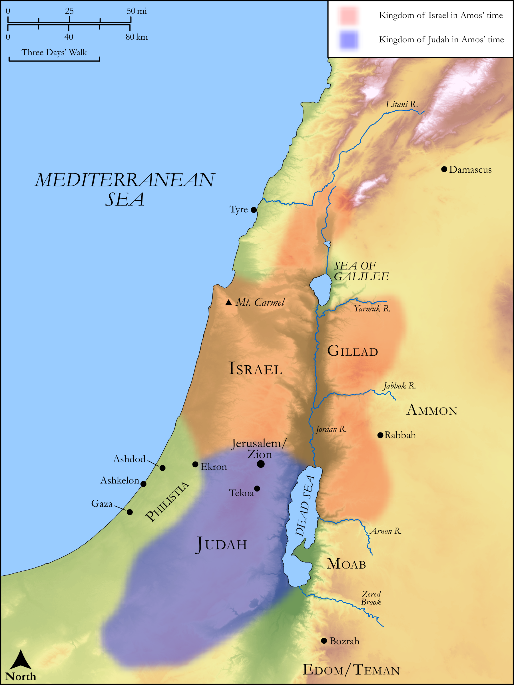

# Biblica Open Bible Maps

## License Information

Biblica Open Bible Maps, © 2023–2025 Biblica, Inc. This work is licensed under Creative Commons Attribution-ShareAlike 4.0 International (https://creativecommons.org/licenses/by-sa/4.0/). More Information: https://docs.google.com/document/d/1Pp44yZ0Zdnd59vJHTrt2rPYq0SppfX5rZbPBt6mz37U/edit?tab=t.0#heading=h.oev9aj1ksvk2

--------------------------------

## Wisdom & Prophets: Prophecies Against Foreign Nations (id: OT216)

### Image Content

[link](images/OT216.png)

Original: [Wisdom \& Prophets: Prophecies Against Foreign Nations](https://drive.google.com/open?id=1FCu-xMn-WSmaOAir6XN9ZEI4WkYBkILv&usp=drive_copy)

* **Associated Passages:** Amos 1:1-2:16

* **Associated ACAI Concepts:** LORD (ID: `deity:Lord`); Rebel (ID: `keyterm:Rebel`); Edom (ID: `place:Edom`); Judah (ID: `person:Judah.4`); Tribe of Judah (ID: `group:Judah`); Israel (ID: `person:Israel`); Jerusalem (ID: `place:Jerusalem`); Nazirites (ID: `group:Nazirite`); Damascus (ID: `place:Damascus`); Ammon (ID: `place:Ammon`); Gilead (ID: `place:Gilead`); Tyre (ID: `place:Tyre`); Moab (ID: `place:Moab`); Amorites (ID: `group:Amorites`); Gaza (ID: `place:Gaza`); Kir (ID: `place:Kir`); Amos (ID: `person:Amos.3`); Have a Vision (ID: `keyterm:HaveAVision`); Hazael (ID: `person:Hazael`); Valley of Aven (ID: `place:AvenValley`); Tekoa (ID: `place:Tekoa`); Beth-eden (ID: `place:Beth-eden`); Wine (ID: `realia:Wine`); Staff (ID: `realia:Staff`); Vine (ID: `flora:Vine`); Rod (ID: `realia:Rod`); House (ID: `realia:House`); Ashkelon (ID: `place:Ashkelon`); Bozrah (ID: `place:Bozrah.2`); To Dishonor (ID: `keyterm:Dishonor`); Covenant (ID: `keyterm:Covenant`); Philistines (ID: `group:Philistine`); Jeroboam (ID: `person:Jeroboam.2`); Uzziah (ID: `person:Uzziah`); Carmel (ID: `place:Carmel`); Speak as a Prophet (ID: `keyterm:Speak`); Ekron (ID: `place:Ekron`); Instruction (ID: `keyterm:Instruction`); Egypt (ID: `place:Egypt`); Decree (ID: `keyterm:Decree`); Kiriathaim (ID: `place:Kiriathaim`); Strength (ID: `keyterm:Strength`); Ben-hadad (ID: `person:Ben-hadad.3`); Ashdod (ID: `place:Ashdod`); Philistia (ID: `place:Philistine`); Poor (ID: `keyterm:Poor`); Teman (ID: `place:Teman`); Ammonites (ID: `group:Ammon`); Dispossess (ID: `keyterm:Dispossess`); Joash (ID: `person:Joash.4`); Oak (ID: `flora:Oak`); Rams Horn (ID: `realia:RamsHorn`); Sheep (ID: `fauna:Lamb`); Bow (ID: `realia:Bow`); Flock (ID: `fauna:Flock`); Sheaf (ID: `realia:Sheaf`); Wagon (ID: `realia:Wagon`); Cedar (ID: `flora:Cedar`); Horse (ID: `fauna:Horse`); Threshing-Sledge (ID: `realia:Threshing-sledge`); Money (ID: `realia:Money`); Temple Altar (ID: `realia:TempleAltar`); Goat (ID: `fauna:Goat`); Tabernacle Altar (ID: `realia:TabernacleAltar`); Altar (ID: `realia:Altar`); Grain (ID: `flora:Grain`); Stone Altar (ID: `realia:StoneAltar`)
