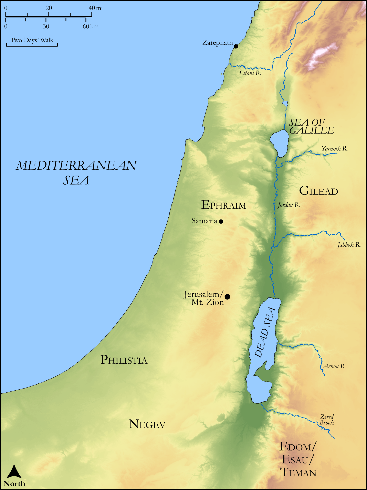

# Biblica Open Bible Maps

## License Information

Biblica Open Bible Maps, © 2023–2025 Biblica, Inc. This work is licensed under Creative Commons Attribution-ShareAlike 4.0 International (https://creativecommons.org/licenses/by-sa/4.0/). More Information: https://docs.google.com/document/d/1Pp44yZ0Zdnd59vJHTrt2rPYq0SppfX5rZbPBt6mz37U/edit?tab=t.0#heading=h.oev9aj1ksvk2

--------------------------------

## Wisdom & Prophets: Prophecy Against Edom (id: OT218)

### Image Content

[link](images/OT218.png)

Original: [Wisdom \& Prophets: Prophecy Against Edom](https://drive.google.com/open?id=12RB7qDcAOzWVhWY1PrpNNGkBu49gO0gD&usp=drive_copy)

* **Associated Passages:** Obadiah 1:1-21

* **Associated ACAI Concepts:** LORD (ID: `deity:Lord`); Israel (ID: `person:Israel`); Edom (ID: `place:Edom`); Mount Esau (ID: `place:EsauMount`); Jerusalem (ID: `place:Jerusalem`); Dispossess (ID: `keyterm:Dispossess`); Negev (ID: `place:Negeb`); Edomites (ID: `group:Edom`); Understanding (ID: `keyterm:Understanding`); Obadiah (ID: `person:Obadiah.12`); Canaan (ID: `place:Canaan`); Peace (ID: `keyterm:IntactState`); Philistines (ID: `group:Philistine`); Tribe of Benjamin (ID: `group:Benjamin`); Tribe of Ephraim (ID: `group:Ephraim`); Tribe of Judah (ID: `group:Judah`); Judah (ID: `person:Judah.4`); Benjamin (ID: `person:Benjamin`); Philistia (ID: `place:Philistine`); Canaanites (ID: `group:Canaan`); Samaria (ID: `place:Samaria`); Joseph (ID: `person:Joseph.10`); Sardis (ID: `place:Sardis`); Teman (ID: `place:Teman`); Lot (ID: `keyterm:Lot`); Gilead (ID: `place:Gilead`); Zarephath (ID: `place:Zarephath`); Covenant (ID: `keyterm:Covenant`); Shephelah (ID: `place:Shephelah`); Ephraim (ID: `person:Ephraim`); Trap (ID: `realia:Trap`); Vulture (ID: `fauna:Vulture`)
