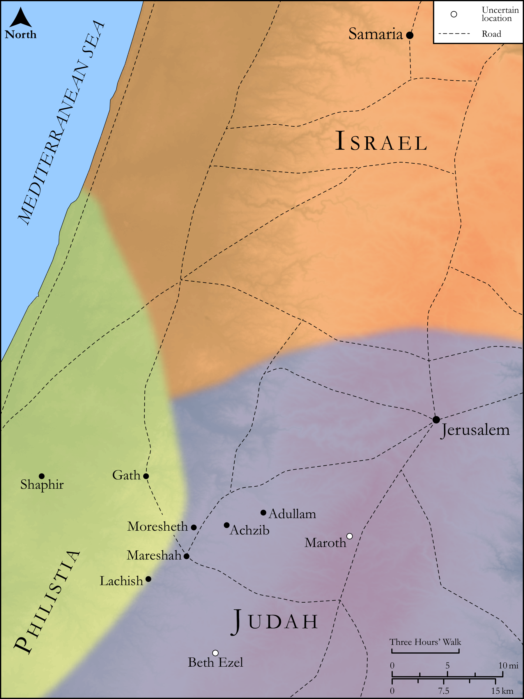

# Biblica Open Bible Maps

## License Information

Biblica Open Bible Maps, © 2023–2025 Biblica, Inc. This work is licensed under Creative Commons Attribution-ShareAlike 4.0 International (https://creativecommons.org/licenses/by-sa/4.0/). More Information: https://docs.google.com/document/d/1Pp44yZ0Zdnd59vJHTrt2rPYq0SppfX5rZbPBt6mz37U/edit?tab=t.0#heading=h.oev9aj1ksvk2

--------------------------------

## Wisdom & Prophets: Prophecies against Samaria and Jerusalem (id: OT220)

### Image Content

[link](images/OT220.png)

Original: [Wisdom \& Prophets: Prophecies against Samaria and Jerusalem](https://drive.google.com/open?id=1JFNMQ03SXp23rXDE2Hkif-gGfg6Pp-nB&usp=drive_copy)

* **Associated Passages:** Micah 1:1-16

* **Associated ACAI Concepts:** Jerusalem (ID: `place:Jerusalem`); LORD (ID: `deity:Lord`); Israel (ID: `person:Israel`); Judah (ID: `person:Judah.4`); Tribe of Judah (ID: `group:Judah`); Samaria (ID: `place:Samaria`); To Sin (ID: `keyterm:Sin`); Rebel (ID: `keyterm:Rebel`); Moresheth-gath (ID: `place:Moresheth-gath`); Moresheth (ID: `place:Moresheth`); Shaphir (ID: `place:Shaphir`); Maroth (ID: `place:Maroth`); Achzib (ID: `place:Achzib`); Beth-ezel (ID: `place:Beth-ezel`); Zaanan (ID: `place:Zaanan`); Micah (ID: `person:Micah.6`); Hezekiah (ID: `person:Hezekiah`); Ophrah (ID: `place:Ophrah`); Word of the Lord (ID: `keyterm:WordOfTheLord`); Ahaz (ID: `person:Ahaz`); Jotham (ID: `person:Jotham.2`); Glory (ID: `keyterm:Glory`); Adullam (ID: `place:Adullam`); Lachish (ID: `place:Lachish`); Gath (ID: `place:Gath`); Mareshah (ID: `place:Mareshah`); Have a Vision (ID: `keyterm:HaveAVision`); Dispossess (ID: `keyterm:Dispossess`); Stone Pine (ID: `flora:Pine`); Image (ID: `realia:Image`); Ostrich (ID: `fauna:Ostrich`); High Place (ID: `realia:HighPlace`); Vine (ID: `flora:Vine`); Graven Image (ID: `realia:GravenImage`); Horse (ID: `fauna:Horse`); Jackal (ID: `fauna:Jackal`); Vulture (ID: `fauna:Vulture`); House (ID: `realia:House`); Foundation (ID: `realia:Foundation`); Chariot (ID: `realia:Chariot`); Owl (ID: `fauna:Owl`)
