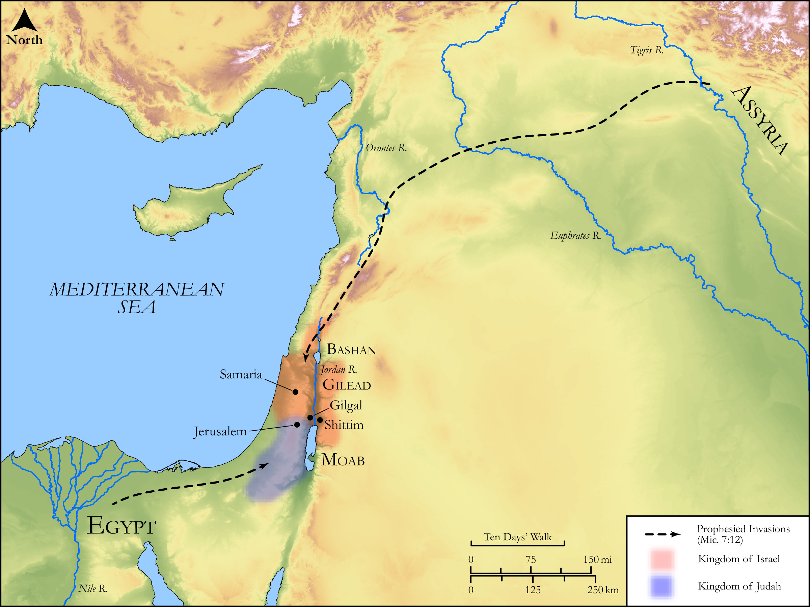

# Biblica Open Bible Maps

## License Information

Biblica Open Bible Maps, © 2023–2025 Biblica, Inc. This work is licensed under Creative Commons Attribution-ShareAlike 4.0 International (https://creativecommons.org/licenses/by-sa/4.0/). More Information: https://docs.google.com/document/d/1Pp44yZ0Zdnd59vJHTrt2rPYq0SppfX5rZbPBt6mz37U/edit?tab=t.0#heading=h.oev9aj1ksvk2

--------------------------------

## Wisdom & Prophets: God’s Controversy with Israel (id: OT221)

### Image Content

[link](images/OT221.png)

Original: [Wisdom \& Prophets: God’s Controversy with Israel](https://drive.google.com/open?id=1mw8eskM3gm8825duM9o7qEMZ8lWkowNf&usp=drive_copy)

* **Associated Passages:** Micah 6:1-7:20

* **Associated ACAI Concepts:** LORD (ID: `deity:Lord`); To Sin (ID: `keyterm:Sin`); Egypt (ID: `place:Egypt`); Kindness (ID: `keyterm:Kindness`); Israel (ID: `person:Israel`); Rebel (ID: `keyterm:Rebel`); To Cause to Possess (ID: `keyterm:Possess`); Deceit (ID: `keyterm:Deceit`); Passion (ID: `keyterm:Ardour`); Olive Oil (ID: `realia:OliveOil`); Vine (ID: `flora:Vine`); Sheep (ID: `fauna:Lamb`); Anointing Oil (ID: `realia:AnointingOil`); Beor (ID: `person:Beor.2`); Abraham (ID: `person:Abraham`); Balak (ID: `person:Balak`); Forgive (ID: `keyterm:Forgive`); Ahab (ID: `person:Ahab`); Swear (ID: `keyterm:Swear`); Sound Wisdom (ID: `keyterm:SoundWisdom`); Assyria (ID: `place:Assyria`); Balaam (ID: `person:Balaam`); Shittim (ID: `place:Shittim`); Miriam (ID: `person:Miriam`); Truth (ID: `keyterm:Truth`); Offering (ID: `keyterm:Offering`); Salvation (ID: `keyterm:Salvation`); Believe In (ID: `keyterm:BelieveIn`); Redeem (ID: `keyterm:Redeem`); Moses (ID: `person:Moses`); Bashan (ID: `place:Bashan`); Love (ID: `keyterm:Love`); Visitation (ID: `keyterm:Visitation`); Aaron (ID: `person:Aaron`); Gilgal (ID: `place:Gilgal.2`); Decree (ID: `keyterm:Decree`); Moab (ID: `place:Moab`); Fear (ID: `keyterm:Fear`); Loyal Person (ID: `keyterm:LoyalPerson`); Gilead (ID: `place:Gilead`); Trust (ID: `keyterm:LeanOn`); Omri (ID: `person:Omri`); Euphrates River (ID: `place:Euphrates`); Balance (ID: `realia:Balance`); Net (ID: `realia:Net`); Flock (ID: `fauna:Flock`); Olive Tree (ID: `flora:OliveTree`); Rod (ID: `realia:Rod`); Barley (ID: `flora:Barley`); Dragnet (ID: `realia:Dragnet`); Ephah (ID: `realia:Ephah`); Molten Image (ID: `realia:MoltenImage`); Sandalwood (ID: `flora:Sandalwood`); Wine (ID: `realia:Wine`); Goat (ID: `fauna:Goat`); Brier (ID: `flora:Brier`); Fig (ID: `flora:Fig`); Bag (ID: `realia:Bag`); Cattle (ID: `fauna:Bull`); Foundation (ID: `realia:Foundation`); Must (ID: `realia:Must`); Staff (ID: `realia:Staff`); House (ID: `realia:House`); Thorn Hedge (ID: `realia:ThornHedge`); Mule (ID: `fauna:Mule`); Snake (ID: `fauna:Snake`)
