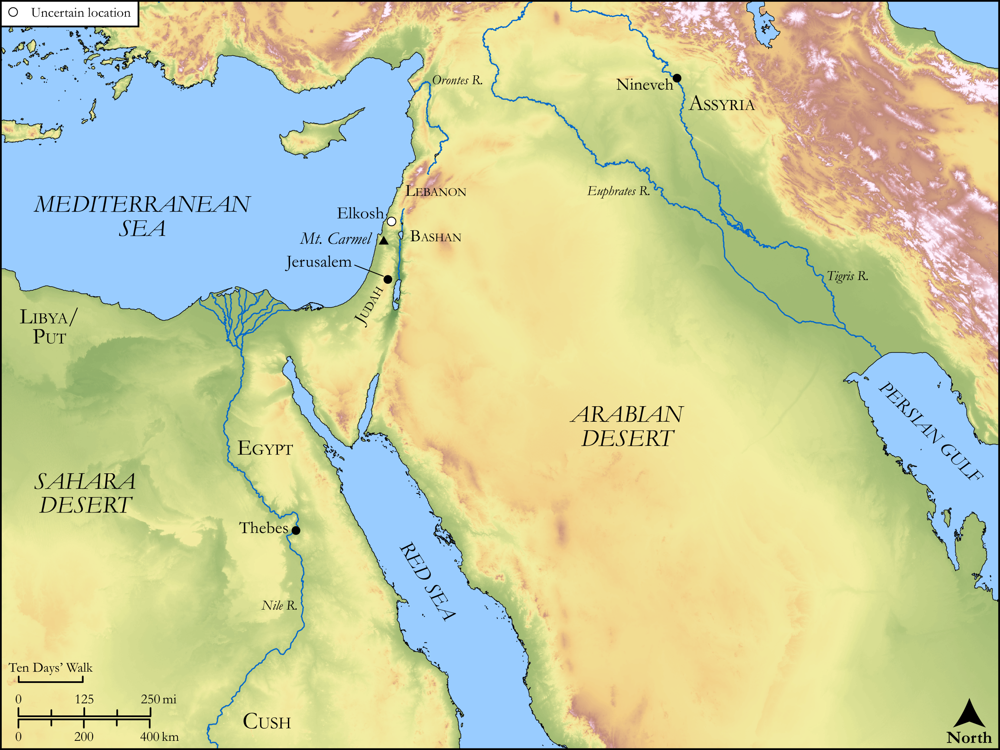

# Biblica Open Bible Maps

## License Information

Biblica Open Bible Maps, © 2023–2025 Biblica, Inc. This work is licensed under Creative Commons Attribution-ShareAlike 4.0 International (https://creativecommons.org/licenses/by-sa/4.0/). More Information: https://docs.google.com/document/d/1Pp44yZ0Zdnd59vJHTrt2rPYq0SppfX5rZbPBt6mz37U/edit?tab=t.0#heading=h.oev9aj1ksvk2

--------------------------------

## Wisdom & Prophets: Prophecy Against Nineveh (id: OT222)

### Image Content

[link](images/OT222.png)

Original: [Wisdom \& Prophets: Prophecy Against Nineveh](https://drive.google.com/open?id=1URvSinz-UlYglEYASXXnBRYFL4idtX0V&usp=drive_copy)

* **Associated Passages:** Nahum 1:1-3:19

* **Associated ACAI Concepts:** LORD (ID: `deity:Lord`); Nineveh (ID: `place:Nineveh`); Chariot (ID: `realia:Chariot`); Strength (ID: `keyterm:Strength`); Wickedness (ID: `keyterm:Wickedness`); Lion (ID: `fauna:Lion`); Locust (ID: `fauna:Locust`); Nahum (ID: `person:Nahum.2`); Thebes (ID: `place:Thebes`); Amon (ID: `deity:Amon`); Elkosh (ID: `place:Elkosh`); Israel (ID: `person:Israel`); Peace (ID: `keyterm:IntactState`); An Angel (ID: `deity:Angel`); Seek Refugue (ID: `keyterm:SeekfindRefuge`); Detested Thing (ID: `keyterm:DetestedThing`); Glory (ID: `keyterm:Glory`); Vow (ID: `keyterm:Vow`); Carmel (ID: `place:Carmel`); Utterance (ID: `keyterm:Utterance`); Tribe of Judah (ID: `group:Judah`); Assyria (ID: `place:Assyria`); The Way (ID: `keyterm:TheWay`); Zealous (ID: `keyterm:Zealous.3`); Woe (ID: `keyterm:Woe.2`); Judah (ID: `person:Judah.4`); Libya (ID: `place:Libya`); Egypt (ID: `place:Egypt`); Cush (ID: `place:Cush.2`); Pronounce Innocent (ID: `keyterm:PronounceInnocent`); Put (ID: `place:Put`); Bashan (ID: `place:Bashan`); Under Siege (ID: `keyterm:StateOfBeingUnderSiege`); Lebanon (ID: `place:Lebanon`); Nile River (ID: `place:Nile`); Bring Honor and Glory on Oneself (ID: `keyterm:BringHonorAndGloryOnOneself`); Lot (ID: `keyterm:Lot`); Incantations (ID: `keyterm:Incantations`); Flock (ID: `fauna:Flock`); Goat (ID: `fauna:Goat`); Fortress (ID: `realia:Fortress`); Brick Mold (ID: `realia:BrickMold`); Protective Shield (ID: `realia:ProtectiveShield`); Dove (ID: `fauna:Dove`); Wagon (ID: `realia:Wagon`); Phoenician Juniper (ID: `flora:JuniperTree`); Molten Image (ID: `realia:MoltenImage`); Grass (ID: `flora:Grass`); Graven Image (ID: `realia:GravenImage`); Strong Drink (ID: `realia:StrongDrink`); Fortification (ID: `realia:Fortification`); Fir (ID: `flora:Fir`); Money (ID: `realia:Money`); Grecian Juniper (ID: `flora:Juniper`); Train (ID: `realia:Train`); Brier (ID: `flora:Brier`); Sheep (ID: `fauna:Lamb`); Spear (ID: `realia:Spear`); Dyed Cloth (ID: `realia:DyedCloth`); Small Shield (ID: `realia:SmallShield`); Fig (ID: `flora:Fig`); Whip (ID: `realia:Whip`); Scroll (ID: `realia:Scroll`); House (ID: `realia:House`); Yoke (ID: `realia:Yoke`); Horse (ID: `fauna:Horse`); Cypress (ID: `flora:Cypress`); Sword (ID: `realia:Sword`)
