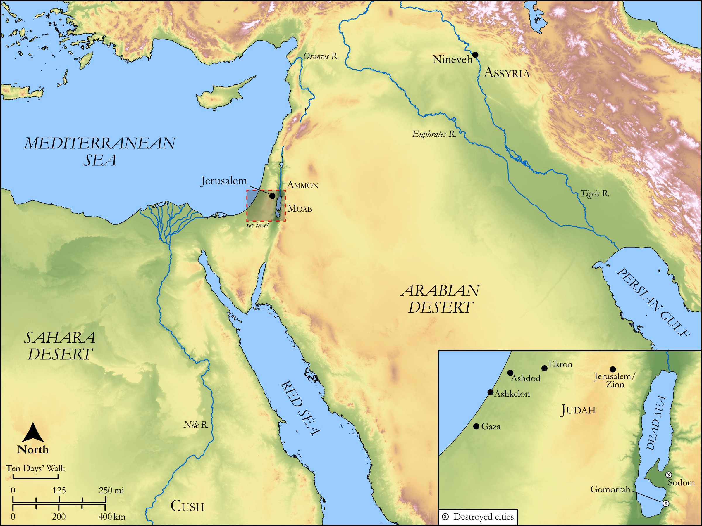

# Biblica Open Bible Maps

## License Information

Biblica Open Bible Maps, © 2023–2025 Biblica, Inc. This work is licensed under Creative Commons Attribution-ShareAlike 4.0 International (https://creativecommons.org/licenses/by-sa/4.0/). More Information: https://docs.google.com/document/d/1Pp44yZ0Zdnd59vJHTrt2rPYq0SppfX5rZbPBt6mz37U/edit?tab=t.0#heading=h.oev9aj1ksvk2

--------------------------------

## Wisdom & Prophets: The Vision of Zephaniah (id: OT223)

### Image Content

[link](images/OT223.png)

Original: [Wisdom \& Prophets: The Vision of Zephaniah](https://drive.google.com/open?id=1xxMrh3QrCTryvQvIEZzSDVCnY7Rk_D-D&usp=drive_copy)

* **Associated Passages:** Zephaniah 1:1-3:20

* **Associated ACAI Concepts:** LORD (ID: `deity:Lord`); Appoint (ID: `keyterm:Appoint`); Fear (ID: `keyterm:Fear`); Jerusalem (ID: `place:Jerusalem`); Israel (ID: `person:Israel`); Judah (ID: `person:Judah.4`); Tribe of Judah (ID: `group:Judah`); Ashkelon (ID: `place:Ashkelon`); Word of the Lord (ID: `keyterm:WordOfTheLord`); Cush (ID: `place:Cush.2`); Ammon (ID: `place:Ammon`); Passion (ID: `keyterm:Ardour`); Slaughtering (ID: `keyterm:Slaughtering`); Woe (ID: `keyterm:Woe.2`); Deceit (ID: `keyterm:Deceit`); Moab (ID: `place:Moab`); Ammonites (ID: `group:Ammon`); House (ID: `realia:House`); Cushi (ID: `person:Cushi`); The Hollow (ID: `place:Mortar`); Defile (ID: `keyterm:Stain`); Amariah (ID: `person:Amariah.9`); Fish Gate (ID: `place:FishGate`); Hezekiah (ID: `person:Hezekiah.4`); Zephaniah (ID: `person:Zephaniah.3`); Second District (ID: `place:SecondQuarter`); Gedaliah (ID: `person:Gedaliah.3`); Swear (ID: `keyterm:Swear`); Canaan (ID: `place:Canaan`); Josiah (ID: `person:Josiah`)
