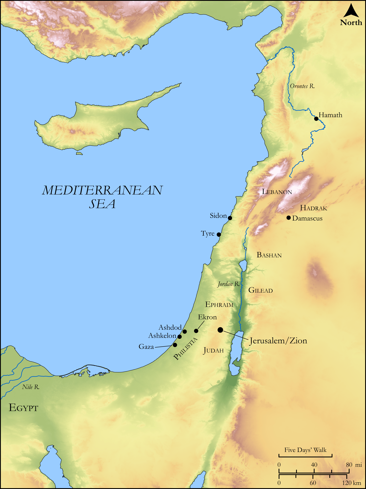

# Biblica Open Bible Maps

## License Information

Biblica Open Bible Maps, © 2023–2025 Biblica, Inc. This work is licensed under Creative Commons Attribution-ShareAlike 4.0 International (https://creativecommons.org/licenses/by-sa/4.0/). More Information: https://docs.google.com/document/d/1Pp44yZ0Zdnd59vJHTrt2rPYq0SppfX5rZbPBt6mz37U/edit?tab=t.0#heading=h.oev9aj1ksvk2

--------------------------------

## Wisdom & Prophets: Prophecies Against Foreign Nations (id: OT224)

### Image Content

[link](images/OT224.png)

Original: [Wisdom \& Prophets: Prophecies Against Foreign Nations](https://drive.google.com/open?id=1IX38kIqzmgZIGAMtacD1UxdL-I9WVXwX&usp=drive_copy)

* **Associated Passages:** Zechariah 9:1-11:17

* **Associated ACAI Concepts:** LORD (ID: `deity:Lord`); Goat (ID: `fauna:Goat`); Flock (ID: `fauna:Flock`); Judah (ID: `person:Judah.4`); Tribe of Judah (ID: `group:Judah`); Sheep (ID: `fauna:Lamb`); Jerusalem (ID: `place:Jerusalem`); Tribe of Ephraim (ID: `group:Ephraim`); Ephraim (ID: `person:Ephraim`); Bow (ID: `realia:Bow`); Assyria (ID: `place:Assyria`); Appoint (ID: `keyterm:Appoint`); Word of the Lord (ID: `keyterm:WordOfTheLord`); Egypt (ID: `place:Egypt`); Tyre (ID: `place:Tyre`); Lebanon (ID: `place:Lebanon`); Covenant (ID: `keyterm:Covenant`); Israel (ID: `person:Israel`); Ekron (ID: `place:Ekron`); Rod (ID: `realia:Rod`); Staff (ID: `realia:Staff`); Vine (ID: `flora:Vine`); Money (ID: `realia:Money`); Horse (ID: `fauna:Horse`); Teraphim (ID: `deity:Teraphim`); Hadrach (ID: `place:Hadrach`); Cedar (ID: `flora:Cedar`); Arrow (ID: `keyterm:Arrow`); Hamath (ID: `place:Hamath`); Foolish (ID: `keyterm:Foolish`); Ashkelon (ID: `place:Ashkelon`); Practice Divination (ID: `keyterm:PracticeDivination`); Mischief (ID: `keyterm:Mischief`); Philistines (ID: `group:Philistine`); Greece (ID: `place:Greece`); Woe (ID: `keyterm:Woe.2`); Majesty (ID: `keyterm:Majesty`); Damascus (ID: `place:Damascus`); Nile River (ID: `place:Nile`); Jordan River (ID: `place:Jordan`); Peace (ID: `keyterm:IntactState`); Philistia (ID: `place:Philistine`); Joseph (ID: `person:Joseph.10`); Gilead (ID: `place:Gilead`); Mighty (ID: `keyterm:Mighty`); Detested Thing (ID: `keyterm:DetestedThing`); Ashdod (ID: `place:Ashdod`); Hope (ID: `keyterm:Hope`); Utterance (ID: `keyterm:Utterance`); Sidon (ID: `place:Sidon`); Redeem (ID: `keyterm:Redeem`); Bless (ID: `keyterm:Bless`); Gaza (ID: `place:Gaza`); Bashan (ID: `place:Bashan`); Have a Vision (ID: `keyterm:HaveAVision`); Fear (ID: `keyterm:Fear`); Dispossess (ID: `keyterm:Dispossess`); Jebusites (ID: `group:Jebusites`); Euphrates River (ID: `place:Euphrates`); Wine (ID: `realia:Wine`); Sword (ID: `realia:Sword`); House (ID: `realia:House`); Fir (ID: `flora:Fir`); Donkey (ID: `fauna:Donkey`); Temple Altar (ID: `realia:TempleAltar`); Rams Horn (ID: `realia:RamsHorn`); Peg (ID: `realia:Peg.2`); Tabernacle Altar (ID: `realia:TabernacleAltar`); Peg (ID: `realia:Peg`); Altar (ID: `realia:Altar`); Sandalwood (ID: `flora:Sandalwood`); Lion (ID: `fauna:Lion`); Sling (ID: `realia:Sling`); Stone Altar (ID: `realia:StoneAltar`); Crown (ID: `realia:Crown`); Household Idols (ID: `realia:HouseholdIdols`); Fortification (ID: `realia:Fortification`); Must (ID: `realia:Must`); Pit (ID: `realia:Pit`); Grass (ID: `flora:Grass`); Oak (ID: `flora:Oak`); Grain (ID: `flora:Grain`); Grecian Juniper (ID: `flora:Juniper`); Chariot (ID: `realia:Chariot`); Cypress (ID: `flora:Cypress`)
