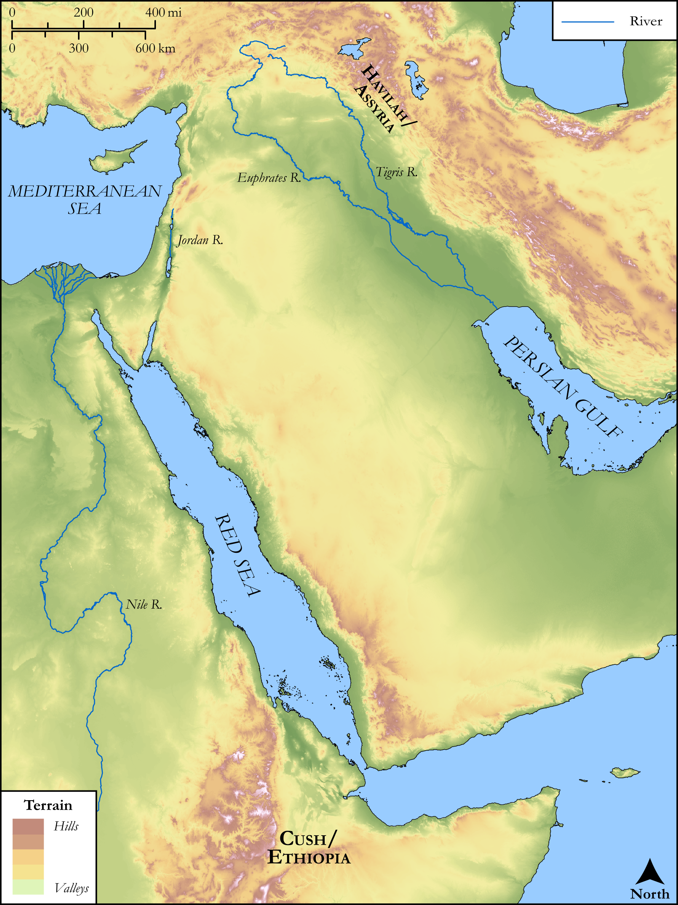

# Biblica Open Bible Maps

## License Information

Biblica Open Bible Maps, © 2023–2025 Biblica, Inc. This work is licensed under Creative Commons Attribution-ShareAlike 4.0 International (https://creativecommons.org/licenses/by-sa/4.0/). More Information: https://docs.google.com/document/d/1Pp44yZ0Zdnd59vJHTrt2rPYq0SppfX5rZbPBt6mz37U/edit?tab=t.0#heading=h.oev9aj1ksvk2

--------------------------------

## SRV Genesis: Gen. 2:4–24 (id: OT250)

### Image Content

[link](images/OT250.png)

Original: [SRV Genesis: Gen. 2:4\-24](https://drive.google.com/open?id=1fy8ijuW13024UaRtg82AnXXgOfEaYHVQ&usp=drive_copy)

* **Associated Passages:** Genesis 2:1-25

* **Associated ACAI Concepts:** LORD (ID: `deity:Lord`); Adam (ID: `person:Adam`); Garden of Eden (ID: `place:Eden.2`); Intention (ID: `keyterm:Intention`); Gihon (ID: `place:Gihon`); Cush (ID: `place:Cush`); Tigris River (ID: `place:Tigris`); Havilah (ID: `place:Havilah`); Euphrates River (ID: `place:Euphrates`); Assyria (ID: `place:Assyria`); Bless (ID: `keyterm:Bless`); Holy (ID: `keyterm:Holy`); Cush (ID: `place:Cush.2`); Grass (ID: `flora:Grass`); Cattle (ID: `fauna:Bull`)
