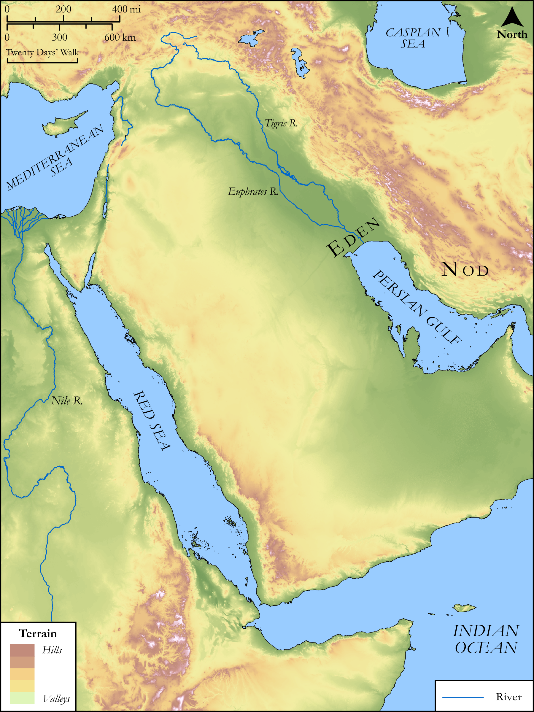

# Biblica Open Bible Maps

## License Information

Biblica Open Bible Maps, © 2023–2025 Biblica, Inc. This work is licensed under Creative Commons Attribution-ShareAlike 4.0 International (https://creativecommons.org/licenses/by-sa/4.0/). More Information: https://docs.google.com/document/d/1Pp44yZ0Zdnd59vJHTrt2rPYq0SppfX5rZbPBt6mz37U/edit?tab=t.0#heading=h.oev9aj1ksvk2

--------------------------------

## SRV Genesis: Gen. 4:1–15 (id: OT251)

### Image Content

[link](images/OT251.png)

Original: [SRV Genesis: Gen. 4:1\-15](https://drive.google.com/open?id=13bPbmS6NHXlMMl-EEoh12H7TY6uPSkZF&usp=drive_copy)

* **Associated Passages:** Genesis 4:1-26

* **Associated ACAI Concepts:** Cain (ID: `person:Cain`); LORD (ID: `deity:Lord`); Abel (ID: `person:Abel`); Lamech (ID: `person:Lamech`); Adah (ID: `person:Adah`); Zillah (ID: `person:Zillah`); Offering (ID: `keyterm:Offering`); Enoch (ID: `person:Enoch`); Seth (ID: `person:Seth`); Adam (ID: `person:Adam`); Flock (ID: `fauna:Flock`); Nod (ID: `place:Nod`); Mehujael (ID: `person:Mehujael`); To Sin (ID: `keyterm:Sin`); Methushael (ID: `person:Methushael`); Eve (ID: `person:Eve`); Jubal (ID: `person:Jubal`); Jabal (ID: `person:Jabal`); Enosh (ID: `person:Enosh`); Irad (ID: `person:Irad`); Tubal-cain (ID: `person:Tubal-cain`); Naamah (ID: `person:Naamah.2`); Goat (ID: `fauna:Goat`); To Curse (ID: `keyterm:Curse`); Passion (ID: `keyterm:Ardour`); Strength (ID: `keyterm:Strength`); Garden of Eden (ID: `place:Eden.2`); Bear the Consequences Of (ID: `keyterm:BearTheConsequencesOf`); Flute (ID: `realia:Flute`); Lute (ID: `realia:Lute`); Sheep (ID: `fauna:Lamb`); Tent (ID: `realia:Tent`); Wheat (ID: `flora:Wheat`); Sorghum (ID: `flora:Sorghum`)
