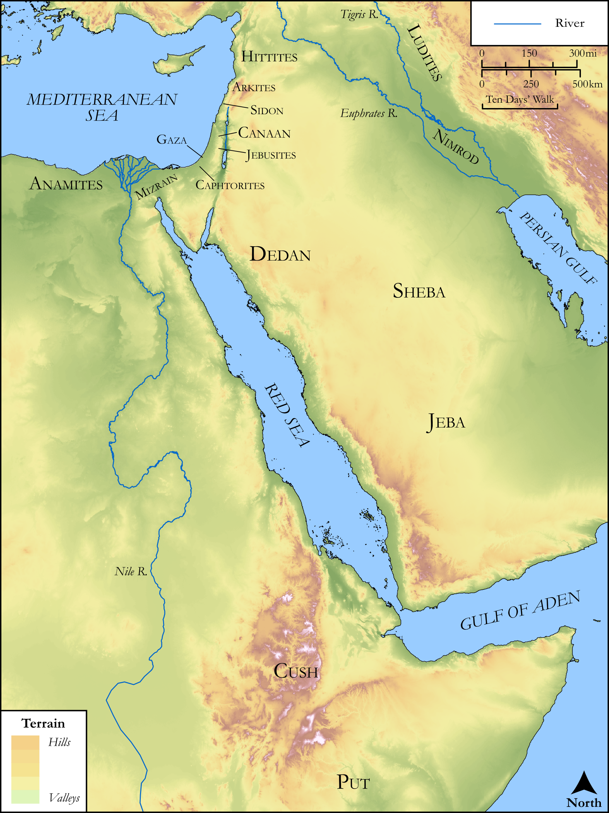

# Biblica Open Bible Maps

## License Information

Biblica Open Bible Maps, © 2023–2025 Biblica, Inc. This work is licensed under Creative Commons Attribution-ShareAlike 4.0 International (https://creativecommons.org/licenses/by-sa/4.0/). More Information: https://docs.google.com/document/d/1Pp44yZ0Zdnd59vJHTrt2rPYq0SppfX5rZbPBt6mz37U/edit?tab=t.0#heading=h.oev9aj1ksvk2

--------------------------------

## SRV Genesis: Gen. 10:1–31 (id: OT254)

### Image Content

[link](images/OT254.png)

Original: [SRV Genesis: Gen. 10:1\-31](https://drive.google.com/open?id=1FF_B84ZGAotZMT7pcXpRHpCOUe1d7-Tv&usp=drive_copy)

* **Associated Passages:** Genesis 10:1-32

* **Associated ACAI Concepts:** Shem (ID: `person:Shem`); Eber (ID: `person:Eber`); Cush (ID: `person:Cush.2`); Joktan (ID: `person:Joktan`); Ham (ID: `person:Ham`); Japheth (ID: `person:Japheth`); Nimrod (ID: `person:Nimrod`); Calah (ID: `place:Calah`); Javan (ID: `person:Javan`); Aram (ID: `person:Aram`); Egypt (ID: `person:Egypt`); Canaan (ID: `place:Canaan`); Lud (ID: `person:Lud`); Canaanites (ID: `group:Canaan`); Nineveh (ID: `place:Nineveh`); Gomer (ID: `person:Gomer`); Canaan (ID: `person:Canaan`); Arpachshad (ID: `person:Arpachshad`); Noah (ID: `person:Noah`); Heth (ID: `person:Heth`); Girgashites (ID: `group:Girgashites`); Philistine (ID: `person:Philistine`); Seba (ID: `person:Seba`); Gomorrah (ID: `place:Gomorrah`); Ashkenaz (ID: `person:Ashkenaz`); Sephar (ID: `place:Sephar`); Zemarites (ID: `group:Zemarites`); Tarshish (ID: `person:Tarshish`); Sabtah (ID: `person:Sabtah`); Naphtuhim (ID: `group:Naphtuhim`); Elishah (ID: `person:Elishah`); Sheleph (ID: `person:Sheleph`); Hazarmaveth (ID: `person:Hazarmaveth`); Zeboiim (ID: `place:Zeboiim`); Sinites (ID: `group:Sinites`); Arkites (ID: `group:Arkites`); Anamim (ID: `group:Anamim`); Havilah (ID: `person:Havilah`); Sidon (ID: `person:Sidon`); Dodanim (ID: `group:Dodanim`); Uz (ID: `person:Uz`); Sheba (ID: `person:Sheba`); Mesha (ID: `place:Mesha`); Asshur (ID: `person:Asshur`); Ophir (ID: `person:Ophir`); Abimael (ID: `person:Abimael`); Caphtorim (ID: `group:Caphtorim`); Hadoram (ID: `person:Hadoram.2`); Arvadites (ID: `group:Arvadites`); Hul (ID: `person:Hul`); Elam (ID: `person:Elam.2`); Sodom (ID: `place:Sodom`); Meshech (ID: `person:Meshech.2`); Ludim (ID: `group:Ludim`); Pathrusim (ID: `group:Pathrusim`); Togarmah (ID: `person:Togarmah`); Kittim (ID: `group:Kittim`); Dedan (ID: `person:Dedan`); Tiras (ID: `person:Tiras`); Casluhim (ID: `group:Casluhim`); Sheba (ID: `person:Sheba.2`); Riphath (ID: `person:Riphath`); Lasha (ID: `place:Lasha`); Jobab (ID: `person:Jobab`); Uzal (ID: `person:Uzal`); Gether (ID: `person:Gether`); Put (ID: `person:Put`); Jerah (ID: `person:Jerah`); Calneh (ID: `place:Calneh`); Raamah (ID: `person:Raamah`); Magog (ID: `person:Magog`); Admah (ID: `place:Admah`); Hamathites (ID: `group:Hamathites`); Erech (ID: `place:Erech`); Tubal (ID: `person:Tubal`); Accad (ID: `place:Accad`); Lehabim (ID: `group:Lehabim`); Havilah (ID: `person:Havilah.2`); Mash (ID: `person:Mash`); Diklah (ID: `person:Diklah`); Amorites (ID: `group:Amorites`); Sidon (ID: `place:Sidon`); Peleg (ID: `person:Peleg`); Hivites (ID: `group:Hivites`); Resen (ID: `place:Resen`); Gaza (ID: `place:Gaza`); Madai (ID: `person:Madai`); Obal (ID: `person:Obal`); Sabteca (ID: `person:Sabteca`); Jebusites (ID: `group:Jebusites`); Almodad (ID: `person:Almodad`); Shelah (ID: `person:Shelah.2`); LORD (ID: `deity:Lord`); Assyria (ID: `place:Assyria`); Gerar (ID: `place:Gerar`); Gentiles (ID: `group:Gentile`); Babylon (ID: `place:Babylon`); Shinar (ID: `place:Shinar`)
