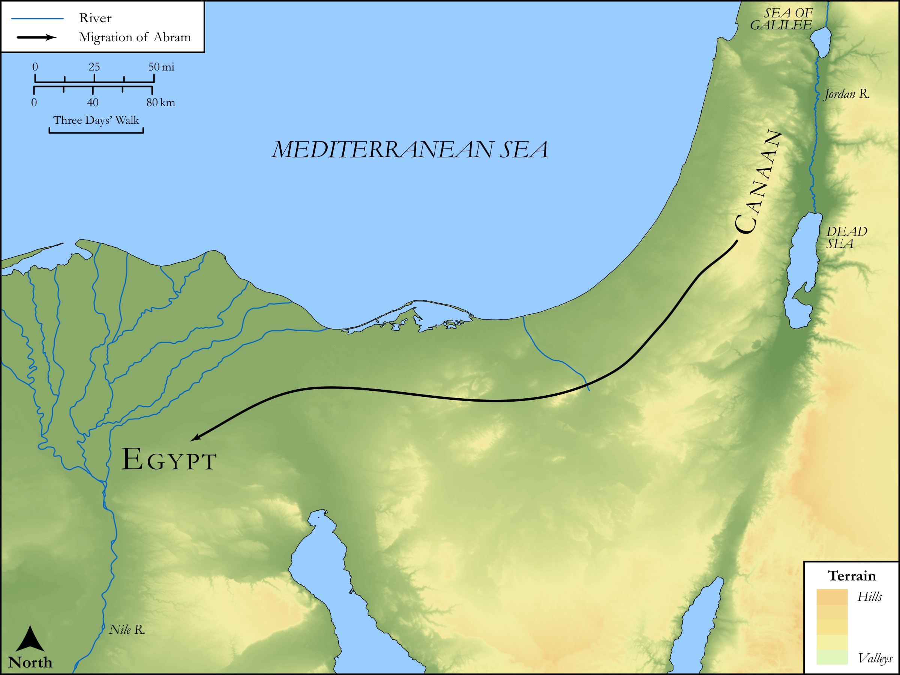

# Biblica Open Bible Maps

## License Information

Biblica Open Bible Maps, © 2023–2025 Biblica, Inc. This work is licensed under Creative Commons Attribution-ShareAlike 4.0 International (https://creativecommons.org/licenses/by-sa/4.0/). More Information: https://docs.google.com/document/d/1Pp44yZ0Zdnd59vJHTrt2rPYq0SppfX5rZbPBt6mz37U/edit?tab=t.0#heading=h.oev9aj1ksvk2

--------------------------------

## SRV Genesis: Gen. 12:10–19 (id: OT261)

### Image Content

[link](images/OT261.png)

Original: [SRV Genesis: Gen. 12:10\-19](https://drive.google.com/open?id=1agZi2O9-ux5yHj20HAmETmGtM569ia7y&usp=drive_copy)

* **Associated Passages:** Genesis 12:1-20

* **Associated ACAI Concepts:** Abraham (ID: `person:Abraham`); LORD (ID: `deity:Lord`); Pharaoh (ID: `person:Pharaoh.3`); Egypt (ID: `place:Egypt`); Sarah (ID: `person:Sarah`); Haran (ID: `place:Haran`); Canaan (ID: `place:Canaan`); Bless (ID: `keyterm:Bless`); Egyptians (ID: `group:Egypt`); Lot (ID: `person:Lot`); Temple Altar (ID: `realia:TempleAltar`); Tabernacle Altar (ID: `realia:TabernacleAltar`); Altar (ID: `realia:Altar`); Stone Altar (ID: `realia:StoneAltar`); Shechem (ID: `place:Shechem`); Ai (ID: `place:Ai`); Canaanites (ID: `group:Canaan`); Oak of Moreh (ID: `place:Moreh`); Bethel (ID: `place:Bethel`); To Curse (ID: `keyterm:Curse`); Negev (ID: `place:Negeb`); Oak (ID: `flora:Oak`); Flock (ID: `fauna:Flock`); Donkey (ID: `fauna:Donkey`); Tent (ID: `realia:Tent`); Goat (ID: `fauna:Goat`); Cattle (ID: `fauna:Bull`); Camel (ID: `fauna:Camel`)
