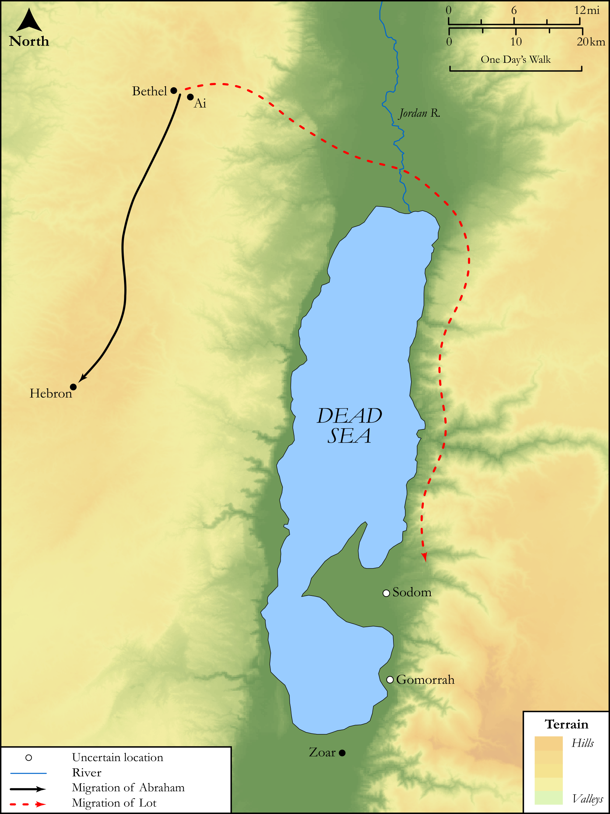

# Biblica Open Bible Maps

## License Information

Biblica Open Bible Maps, © 2023–2025 Biblica, Inc. This work is licensed under Creative Commons Attribution-ShareAlike 4.0 International (https://creativecommons.org/licenses/by-sa/4.0/). More Information: https://docs.google.com/document/d/1Pp44yZ0Zdnd59vJHTrt2rPYq0SppfX5rZbPBt6mz37U/edit?tab=t.0#heading=h.oev9aj1ksvk2

--------------------------------

## SRV Genesis: Gen. 13:1–17 (id: OT262)

### Image Content

[link](images/OT262.png)

Original: [SRV Genesis: Gen. 13:1\-17](https://drive.google.com/open?id=1Um2_gqvDYL7KlanXo0C-KF5xVxHV-JEE&usp=drive_copy)

* **Associated Passages:** Genesis 13:1-18

* **Associated ACAI Concepts:** Abraham (ID: `person:Abraham`); Lot (ID: `person:Lot`); LORD (ID: `deity:Lord`); Sodom (ID: `place:Sodom`); Flock (ID: `fauna:Flock`); Goat (ID: `fauna:Goat`); Canaan (ID: `place:Canaan`); Egypt (ID: `place:Egypt`); Negev (ID: `place:Negeb`); Jordan River (ID: `place:Jordan`); Stone Altar (ID: `realia:StoneAltar`); Temple Altar (ID: `realia:TempleAltar`); Sheep (ID: `fauna:Lamb`); Tent (ID: `realia:Tent`); Tabernacle Altar (ID: `realia:TabernacleAltar`); Altar (ID: `realia:Altar`); Hebron (ID: `place:Hebron`); Ai (ID: `place:Ai`); Gomorrah (ID: `place:Gomorrah`); Canaanites (ID: `group:Canaan`); Bethel (ID: `place:Bethel`); Mamre (ID: `place:Mamre`); To Sin (ID: `keyterm:Sin`); Perizzites (ID: `group:Perizzites`); Zoar (ID: `place:Zoar`); Oak (ID: `flora:Oak`); Money (ID: `realia:Money`); Cattle (ID: `fauna:Bull`)
