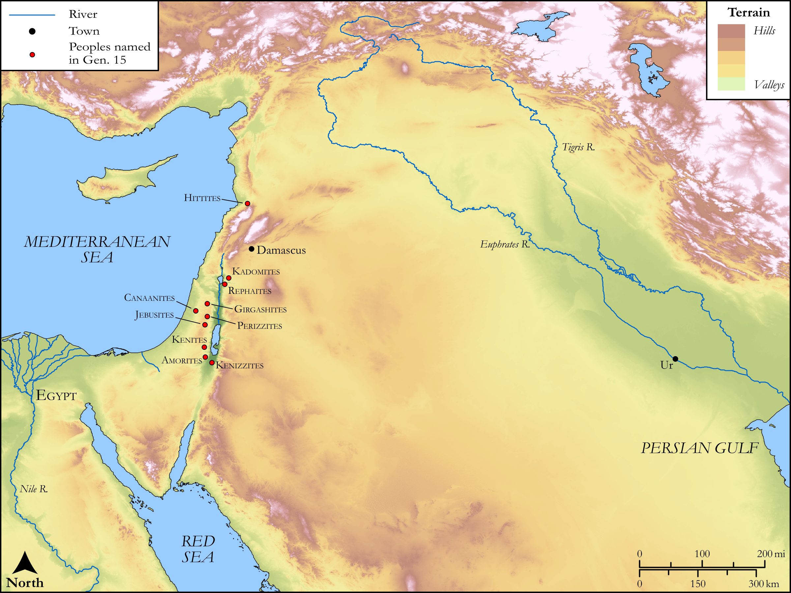

# Biblica Open Bible Maps

## License Information

Biblica Open Bible Maps, © 2023–2025 Biblica, Inc. This work is licensed under Creative Commons Attribution-ShareAlike 4.0 International (https://creativecommons.org/licenses/by-sa/4.0/). More Information: https://docs.google.com/document/d/1Pp44yZ0Zdnd59vJHTrt2rPYq0SppfX5rZbPBt6mz37U/edit?tab=t.0#heading=h.oev9aj1ksvk2

--------------------------------

## SRV Genesis: Gen. 15:1–21 (id: OT267)

### Image Content

[link](images/OT267.png)

Original: [SRV Genesis: Gen. 15:1\-21](https://drive.google.com/open?id=1C5hNmubIzy_smxWLYUPBkL1_4ZtJRPhb&usp=drive_copy)

* **Associated Passages:** Genesis 15:1-21

* **Associated ACAI Concepts:** LORD (ID: `deity:Lord`); Abraham (ID: `person:Abraham`); Dispossess (ID: `keyterm:Dispossess`); Word of the Lord (ID: `keyterm:WordOfTheLord`); Force to Serve (ID: `keyterm:EnticedToServe`); Amorites (ID: `group:Amorites`); Shield (ID: `keyterm:Shield`); Kenizzites (ID: `group:Kenizzites`); Eliezer (ID: `person:Eliezer.2`); Chaldeans (ID: `group:Chaldea`); Kadmonites (ID: `group:Kadmonites`); Fear (ID: `keyterm:Fear`); Believe In (ID: `keyterm:BelieveIn`); Euphrates River (ID: `place:Euphrates`); Canaan (ID: `place:Canaan`); Perizzites (ID: `group:Perizzites`); Covenant (ID: `keyterm:Covenant`); Peace (ID: `keyterm:IntactState`); Jebusites (ID: `group:Jebusites`); Hittites (ID: `group:Hittite`); Damascus (ID: `place:Damascus`); Ur (ID: `place:Ur`); Canaanites (ID: `group:Canaan`); Rephaim (ID: `group:Rephaim`); Passion (ID: `keyterm:Ardour`); Kenites (ID: `group:Kenite`); Chaldea (ID: `place:Chaldea`); Egypt (ID: `place:Egypt`); Heth (ID: `person:Heth`); Girgashites (ID: `group:Girgashites`); Terror (ID: `keyterm:Terror`); Goat (ID: `fauna:Goat`); Dove (ID: `fauna:Dove`); Sheep (ID: `fauna:Lamb`); Flock (ID: `fauna:Flock`); Small Shield (ID: `realia:SmallShield`); Vulture (ID: `fauna:Vulture`); Molten Image (ID: `realia:MoltenImage`); Cattle (ID: `fauna:Bull`); Bird (ID: `fauna:Bird`)
