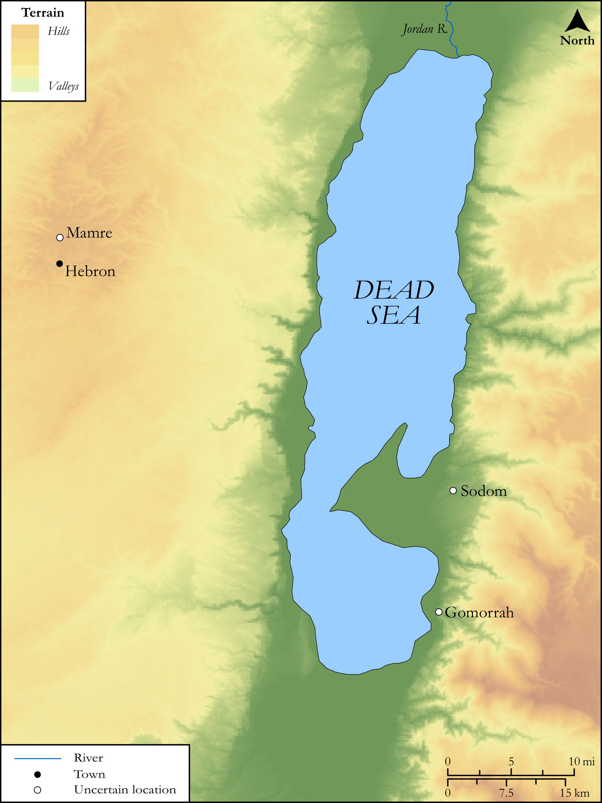

# Biblica Open Bible Maps

## License Information

Biblica Open Bible Maps, © 2023–2025 Biblica, Inc. This work is licensed under Creative Commons Attribution-ShareAlike 4.0 International (https://creativecommons.org/licenses/by-sa/4.0/). More Information: https://docs.google.com/document/d/1Pp44yZ0Zdnd59vJHTrt2rPYq0SppfX5rZbPBt6mz37U/edit?tab=t.0#heading=h.oev9aj1ksvk2

--------------------------------

## SRV Genesis: Gen. 18:1–14 (id: OT270)

### Image Content

[link](images/OT270.png)

Original: [SRV Genesis: Gen. 18:1\-14](https://drive.google.com/open?id=1MH0v7IwSCDLDx0ea9L_ZHk3OHg4f1A82&usp=drive_copy)

* **Associated Passages:** Genesis 18:1-33

* **Associated ACAI Concepts:** LORD (ID: `deity:Lord`); Abraham (ID: `person:Abraham`); Sarah (ID: `person:Sarah`); Tent (ID: `realia:Tent`); Sodom (ID: `place:Sodom`); Forgive (ID: `keyterm:Forgive`); Gomorrah (ID: `place:Gomorrah`); Cattle (ID: `fauna:Bull`); Bless (ID: `keyterm:Bless`); Mamre (ID: `place:Mamre`); Favor (ID: `keyterm:Favor`); Fear (ID: `keyterm:Fear`); To Sin (ID: `keyterm:Sin`); The Way (ID: `keyterm:TheWay`); Seah (ID: `realia:Seah`); Oak (ID: `flora:Oak`)
