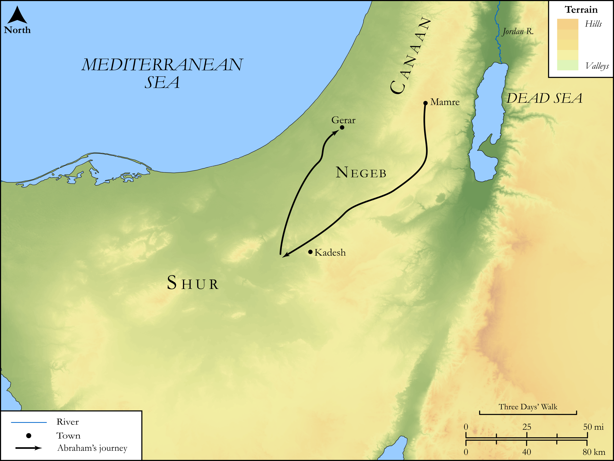

# Biblica Open Bible Maps

## License Information

Biblica Open Bible Maps, © 2023–2025 Biblica, Inc. This work is licensed under Creative Commons Attribution-ShareAlike 4.0 International (<a href="https://creativecommons.org/licenses/by-sa/4.0/">https://creativecommons.org/licenses/by-sa/4.0/</a>). More Information: <a href="https://docs.google.com/document/d/1Pp44yZ0Zdnd59vJHTrt2rPYq0SppfX5rZbPBt6mz37U/edit?tab=t.0#heading=h.oev9aj1ksvk2">https://docs.google.com/document/d/1Pp44yZ0Zdnd59vJHTrt2rPYq0SppfX5rZbPBt6mz37U/edit?tab=t.0#heading=h.oev9aj1ksvk2</a>

--------------------------------

## SRV Genesis: Gen. 20:1–17 (id: OT272)

### Image Content

[link](images/OT272.png)

Original: [SRV Genesis: Gen. 20:1\-17](https://drive.google.com/open?id=1IkIoKgVcj5L2X20mma46DKjv1keExrBv&usp=drive_copy)

* **Associated Passages:** Genesis 20:1-18

* **Associated ACAI Concepts:** Abimelech (ID: `person:Abimelech`); Abraham (ID: `person:Abraham`); LORD (ID: `deity:Lord`); Sarah (ID: `person:Sarah`); Gerar (ID: `place:Gerar`); To Sin (ID: `keyterm:Sin`); Fear (ID: `keyterm:Fear`); Innocence (ID: `keyterm:Innocence`); Negev (ID: `place:Negeb`); Shur (ID: `place:Shur`); Kindness (ID: `keyterm:Kindness`); Kadesh-barnea (ID: `place:Kadesh-barnea`); Goat (ID: `fauna:Goat`); Flock (ID: `fauna:Flock`); Money (ID: `realia:Money`); Cattle (ID: `fauna:Bull`)
